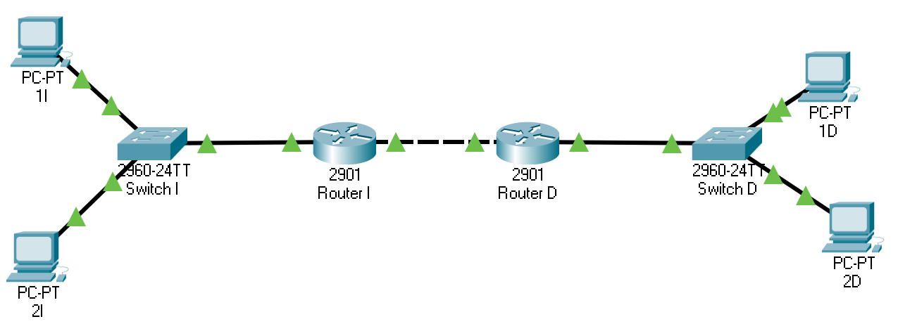

Anexo: ejercicios de enrutamiento
=========================================
Ejercicios con dos router
-----------------------------------
Para todos estos casos se puede asumir una arquitectura como la siguiente:

Ejercicio 1
~~~~~~~~~~~~~~~~~~~~~~~~~~~~~~~~~~~~~~~~~~~~

Dada la arquitectura de la red de la figura, asignar direcciones IP, máscaras, puertas de enlace y tablas de rutas de manera que haya conectividad entre todos
los nodos de la red. Se desean utilizar las siguientes redes:

* Red 133.225.128.0/20 en el área izquierda.
* Red 142.104.81.64/28 en el área central.
* Red 78.51.90.0/23 en el área derecha

Aparte de eso, se desean respetar unos ciertos estándares:

* Los routers de acceso a red deben tener siempre la última IP de la red.
* Los ordenadores se empezarán a númerar por la primera IP de la red.
* Los routers de distribución (los centrales) deberán tener la primera IP en el punto izquierdo y la última en el derecho.

        

Ejercicio 2
~~~~~~~~~~~~~~~~~~~~~~~~~~~~~~~~~~~~~~~~~~~~

Dada la arquitectura de la red de la figura, asignar direcciones IP, máscaras, puertas de enlace y tablas de rutas de manera que haya conectividad entre todos
los nodos de la red. Se desean utilizar las siguientes redes:

* Red 165.241.64.0/18 en el área izquierda.
* Red 22.248.0.0/14 en el área central.
* Red 121.17.128.0/18 en el área derecha

Aparte de eso, se desean respetar unos ciertos estándares:

* Los routers de acceso a red deben tener siempre la última IP de la red.
* Los ordenadores se empezarán a númerar por la primera IP de la red.
* Los routers de distribución (los centrales) deberán tener la primera IP en el punto izquierdo y la última en el derecho.

        

Ejercicio 3
~~~~~~~~~~~~~~~~~~~~~~~~~~~~~~~~~~~~~~~~~~~~

Dada la arquitectura de la red de la figura, asignar direcciones IP, máscaras, puertas de enlace y tablas de rutas de manera que haya conectividad entre todos
los nodos de la red. Se desean utilizar las siguientes redes:

* Red 56.176.0.0/12 en el área izquierda.
* Red 163.65.99.208/28 en el área central.
* Red 15.51.243.128/27 en el área derecha

Aparte de eso, se desean respetar unos ciertos estándares:

* Los routers de acceso a red deben tener siempre la última IP de la red.
* Los ordenadores se empezarán a númerar por la primera IP de la red.
* Los routers de distribución (los centrales) deberán tener la primera IP en el punto izquierdo y la última en el derecho.

        

Ejercicio 4
~~~~~~~~~~~~~~~~~~~~~~~~~~~~~~~~~~~~~~~~~~~~

Dada la arquitectura de la red de la figura, asignar direcciones IP, máscaras, puertas de enlace y tablas de rutas de manera que haya conectividad entre todos
los nodos de la red. Se desean utilizar las siguientes redes:

* Red 151.7.16.0/22 en el área izquierda.
* Red 84.32.0.0/11 en el área central.
* Red 63.39.200.192/26 en el área derecha

Aparte de eso, se desean respetar unos ciertos estándares:

* Los routers de acceso a red deben tener siempre la última IP de la red.
* Los ordenadores se empezarán a númerar por la primera IP de la red.
* Los routers de distribución (los centrales) deberán tener la primera IP en el punto izquierdo y la última en el derecho.

        

Ejercicio 5
~~~~~~~~~~~~~~~~~~~~~~~~~~~~~~~~~~~~~~~~~~~~

Dada la arquitectura de la red de la figura, asignar direcciones IP, máscaras, puertas de enlace y tablas de rutas de manera que haya conectividad entre todos
los nodos de la red. Se desean utilizar las siguientes redes:

* Red 33.48.0.0/12 en el área izquierda.
* Red 80.0.0.0/11 en el área central.
* Red 218.173.130.64/26 en el área derecha

Aparte de eso, se desean respetar unos ciertos estándares:

* Los routers de acceso a red deben tener siempre la última IP de la red.
* Los ordenadores se empezarán a númerar por la primera IP de la red.
* Los routers de distribución (los centrales) deberán tener la primera IP en el punto izquierdo y la última en el derecho.

        

Ejercicio 6
~~~~~~~~~~~~~~~~~~~~~~~~~~~~~~~~~~~~~~~~~~~~

Dada la arquitectura de la red de la figura, asignar direcciones IP, máscaras, puertas de enlace y tablas de rutas de manera que haya conectividad entre todos
los nodos de la red. Se desean utilizar las siguientes redes:

* Red 149.251.206.224/27 en el área izquierda.
* Red 47.224.0.0/14 en el área central.
* Red 145.133.198.0/25 en el área derecha

Aparte de eso, se desean respetar unos ciertos estándares:

* Los routers de acceso a red deben tener siempre la última IP de la red.
* Los ordenadores se empezarán a númerar por la primera IP de la red.
* Los routers de distribución (los centrales) deberán tener la primera IP en el punto izquierdo y la última en el derecho.

        

Ejercicio 7
~~~~~~~~~~~~~~~~~~~~~~~~~~~~~~~~~~~~~~~~~~~~

Dada la arquitectura de la red de la figura, asignar direcciones IP, máscaras, puertas de enlace y tablas de rutas de manera que haya conectividad entre todos
los nodos de la red. Se desean utilizar las siguientes redes:

* Red 5.32.226.0/23 en el área izquierda.
* Red 35.0.0.0/13 en el área central.
* Red 181.174.229.32/27 en el área derecha

Aparte de eso, se desean respetar unos ciertos estándares:

* Los routers de acceso a red deben tener siempre la última IP de la red.
* Los ordenadores se empezarán a númerar por la primera IP de la red.
* Los routers de distribución (los centrales) deberán tener la primera IP en el punto izquierdo y la última en el derecho.

        

Ejercicio 8
~~~~~~~~~~~~~~~~~~~~~~~~~~~~~~~~~~~~~~~~~~~~

Dada la arquitectura de la red de la figura, asignar direcciones IP, máscaras, puertas de enlace y tablas de rutas de manera que haya conectividad entre todos
los nodos de la red. Se desean utilizar las siguientes redes:

* Red 164.122.0.0/16 en el área izquierda.
* Red 71.192.0.0/11 en el área central.
* Red 91.128.0.0/10 en el área derecha

Aparte de eso, se desean respetar unos ciertos estándares:

* Los routers de acceso a red deben tener siempre la última IP de la red.
* Los ordenadores se empezarán a númerar por la primera IP de la red.
* Los routers de distribución (los centrales) deberán tener la primera IP en el punto izquierdo y la última en el derecho.

        

Ejercicio 9
~~~~~~~~~~~~~~~~~~~~~~~~~~~~~~~~~~~~~~~~~~~~

Dada la arquitectura de la red de la figura, asignar direcciones IP, máscaras, puertas de enlace y tablas de rutas de manera que haya conectividad entre todos
los nodos de la red. Se desean utilizar las siguientes redes:

* Red 110.240.0.0/12 en el área izquierda.
* Red 140.131.224.0/19 en el área central.
* Red 30.170.0.0/16 en el área derecha

Aparte de eso, se desean respetar unos ciertos estándares:

* Los routers de acceso a red deben tener siempre la última IP de la red.
* Los ordenadores se empezarán a númerar por la primera IP de la red.
* Los routers de distribución (los centrales) deberán tener la primera IP en el punto izquierdo y la última en el derecho.

        

Ejercicio 10
~~~~~~~~~~~~~~~~~~~~~~~~~~~~~~~~~~~~~~~~~~~~

Dada la arquitectura de la red de la figura, asignar direcciones IP, máscaras, puertas de enlace y tablas de rutas de manera que haya conectividad entre todos
los nodos de la red. Se desean utilizar las siguientes redes:

* Red 7.192.0.0/11 en el área izquierda.
* Red 220.190.42.0/27 en el área central.
* Red 79.215.237.0/25 en el área derecha

Aparte de eso, se desean respetar unos ciertos estándares:

* Los routers de acceso a red deben tener siempre la última IP de la red.
* Los ordenadores se empezarán a númerar por la primera IP de la red.
* Los routers de distribución (los centrales) deberán tener la primera IP en el punto izquierdo y la última en el derecho.

        

Ejercicio 11
~~~~~~~~~~~~~~~~~~~~~~~~~~~~~~~~~~~~~~~~~~~~

Dada la arquitectura de la red de la figura, asignar direcciones IP, máscaras, puertas de enlace y tablas de rutas de manera que haya conectividad entre todos
los nodos de la red. Se desean utilizar las siguientes redes:

* Red 74.224.0.0/13 en el área izquierda.
* Red 125.160.0.0/12 en el área central.
* Red 25.104.160.0/19 en el área derecha

Aparte de eso, se desean respetar unos ciertos estándares:

* Los routers de acceso a red deben tener siempre la última IP de la red.
* Los ordenadores se empezarán a númerar por la primera IP de la red.
* Los routers de distribución (los centrales) deberán tener la primera IP en el punto izquierdo y la última en el derecho.

        

Ejercicio 12
~~~~~~~~~~~~~~~~~~~~~~~~~~~~~~~~~~~~~~~~~~~~

Dada la arquitectura de la red de la figura, asignar direcciones IP, máscaras, puertas de enlace y tablas de rutas de manera que haya conectividad entre todos
los nodos de la red. Se desean utilizar las siguientes redes:

* Red 189.229.0.0/16 en el área izquierda.
* Red 150.73.80.0/20 en el área central.
* Red 182.0.0.0/17 en el área derecha

Aparte de eso, se desean respetar unos ciertos estándares:

* Los routers de acceso a red deben tener siempre la última IP de la red.
* Los ordenadores se empezarán a númerar por la primera IP de la red.
* Los routers de distribución (los centrales) deberán tener la primera IP en el punto izquierdo y la última en el derecho.

        

Ejercicio 13
~~~~~~~~~~~~~~~~~~~~~~~~~~~~~~~~~~~~~~~~~~~~

Dada la arquitectura de la red de la figura, asignar direcciones IP, máscaras, puertas de enlace y tablas de rutas de manera que haya conectividad entre todos
los nodos de la red. Se desean utilizar las siguientes redes:

* Red 182.23.38.176/28 en el área izquierda.
* Red 131.55.128.0/20 en el área central.
* Red 50.33.132.208/28 en el área derecha

Aparte de eso, se desean respetar unos ciertos estándares:

* Los routers de acceso a red deben tener siempre la última IP de la red.
* Los ordenadores se empezarán a númerar por la primera IP de la red.
* Los routers de distribución (los centrales) deberán tener la primera IP en el punto izquierdo y la última en el derecho.

        

Ejercicio 14
~~~~~~~~~~~~~~~~~~~~~~~~~~~~~~~~~~~~~~~~~~~~

Dada la arquitectura de la red de la figura, asignar direcciones IP, máscaras, puertas de enlace y tablas de rutas de manera que haya conectividad entre todos
los nodos de la red. Se desean utilizar las siguientes redes:

* Red 29.75.104.208/28 en el área izquierda.
* Red 179.249.12.0/24 en el área central.
* Red 81.159.0.0/16 en el área derecha

Aparte de eso, se desean respetar unos ciertos estándares:

* Los routers de acceso a red deben tener siempre la última IP de la red.
* Los ordenadores se empezarán a númerar por la primera IP de la red.
* Los routers de distribución (los centrales) deberán tener la primera IP en el punto izquierdo y la última en el derecho.

        

Ejercicio 15
~~~~~~~~~~~~~~~~~~~~~~~~~~~~~~~~~~~~~~~~~~~~

Dada la arquitectura de la red de la figura, asignar direcciones IP, máscaras, puertas de enlace y tablas de rutas de manera que haya conectividad entre todos
los nodos de la red. Se desean utilizar las siguientes redes:

* Red 218.249.112.0/24 en el área izquierda.
* Red 106.247.173.160/28 en el área central.
* Red 71.160.0.0/11 en el área derecha

Aparte de eso, se desean respetar unos ciertos estándares:

* Los routers de acceso a red deben tener siempre la última IP de la red.
* Los ordenadores se empezarán a númerar por la primera IP de la red.
* Los routers de distribución (los centrales) deberán tener la primera IP en el punto izquierdo y la última en el derecho.

        

Ejercicio 16
~~~~~~~~~~~~~~~~~~~~~~~~~~~~~~~~~~~~~~~~~~~~

Dada la arquitectura de la red de la figura, asignar direcciones IP, máscaras, puertas de enlace y tablas de rutas de manera que haya conectividad entre todos
los nodos de la red. Se desean utilizar las siguientes redes:

* Red 185.202.128.0/17 en el área izquierda.
* Red 132.160.168.0/21 en el área central.
* Red 198.54.10.64/26 en el área derecha

Aparte de eso, se desean respetar unos ciertos estándares:

* Los routers de acceso a red deben tener siempre la última IP de la red.
* Los ordenadores se empezarán a númerar por la primera IP de la red.
* Los routers de distribución (los centrales) deberán tener la primera IP en el punto izquierdo y la última en el derecho.

        

Ejercicio 17
~~~~~~~~~~~~~~~~~~~~~~~~~~~~~~~~~~~~~~~~~~~~

Dada la arquitectura de la red de la figura, asignar direcciones IP, máscaras, puertas de enlace y tablas de rutas de manera que haya conectividad entre todos
los nodos de la red. Se desean utilizar las siguientes redes:

* Red 147.127.0.0/18 en el área izquierda.
* Red 0.224.0.0/11 en el área central.
* Red 212.6.63.128/25 en el área derecha

Aparte de eso, se desean respetar unos ciertos estándares:

* Los routers de acceso a red deben tener siempre la última IP de la red.
* Los ordenadores se empezarán a númerar por la primera IP de la red.
* Los routers de distribución (los centrales) deberán tener la primera IP en el punto izquierdo y la última en el derecho.

        

Ejercicio 18
~~~~~~~~~~~~~~~~~~~~~~~~~~~~~~~~~~~~~~~~~~~~

Dada la arquitectura de la red de la figura, asignar direcciones IP, máscaras, puertas de enlace y tablas de rutas de manera que haya conectividad entre todos
los nodos de la red. Se desean utilizar las siguientes redes:

* Red 83.225.202.0/24 en el área izquierda.
* Red 40.43.224.0/19 en el área central.
* Red 166.4.160.0/19 en el área derecha

Aparte de eso, se desean respetar unos ciertos estándares:

* Los routers de acceso a red deben tener siempre la última IP de la red.
* Los ordenadores se empezarán a númerar por la primera IP de la red.
* Los routers de distribución (los centrales) deberán tener la primera IP en el punto izquierdo y la última en el derecho.

        

Ejercicio 19
~~~~~~~~~~~~~~~~~~~~~~~~~~~~~~~~~~~~~~~~~~~~

Dada la arquitectura de la red de la figura, asignar direcciones IP, máscaras, puertas de enlace y tablas de rutas de manera que haya conectividad entre todos
los nodos de la red. Se desean utilizar las siguientes redes:

* Red 180.74.0.0/18 en el área izquierda.
* Red 208.23.147.96/28 en el área central.
* Red 142.197.0.0/16 en el área derecha

Aparte de eso, se desean respetar unos ciertos estándares:

* Los routers de acceso a red deben tener siempre la última IP de la red.
* Los ordenadores se empezarán a númerar por la primera IP de la red.
* Los routers de distribución (los centrales) deberán tener la primera IP en el punto izquierdo y la última en el derecho.

        

Ejercicio 20
~~~~~~~~~~~~~~~~~~~~~~~~~~~~~~~~~~~~~~~~~~~~

Dada la arquitectura de la red de la figura, asignar direcciones IP, máscaras, puertas de enlace y tablas de rutas de manera que haya conectividad entre todos
los nodos de la red. Se desean utilizar las siguientes redes:

* Red 165.191.28.0/22 en el área izquierda.
* Red 0.110.16.0/20 en el área central.
* Red 126.128.0.0/11 en el área derecha

Aparte de eso, se desean respetar unos ciertos estándares:

* Los routers de acceso a red deben tener siempre la última IP de la red.
* Los ordenadores se empezarán a númerar por la primera IP de la red.
* Los routers de distribución (los centrales) deberán tener la primera IP en el punto izquierdo y la última en el derecho.

        

Solución al ejercicio 1 de enrutamiento
~~~~~~~~~~~~~~~~~~~~~~~~~~~~~~~~~~~~~~~~~~~~~~~~~~

Dada la arquitectura de la red de la figura, asignar direcciones IP, máscaras, puertas de enlace y tablas de rutas de manera que haya conectividad entre todos
los nodos de la red. Se desean utilizar las siguientes redes:

* Red 133.225.128.0/20 en el área izquierda.
* Red 142.104.81.64/28 en el área central.
* Red 78.51.90.0/23 en el área derecha

Aparte de eso, se desean respetar unos ciertos estándares:

* Los routers de acceso a red deben tener siempre la última IP de la red.
* Los ordenadores se empezarán a númerar por la primera IP de la red.
* Los routers de distribución (los centrales) deberán tener la primera IP en el punto izquierdo y la última en el derecho.

        

Las direcciones serían estas:

* PC 1I: IP 133.225.128.1, máscara 255.255.240.0, gateway 133.225.143.254
* PC 2I: IP 133.225.128.2, máscara 255.255.240.0, gateway 133.225.143.254
* Router I, interfaz izquierda: IP 133.225.143.254, máscara 255.255.240.0
* Router I, interfaz derecha: IP 142.104.81.65, máscara 255.255.255.240
* PC 1D: IP 78.51.90.1, máscara 255.255.254.0, gateway 78.51.91.254
* PC 2D: IP 78.51.90.2, máscara 255.255.254.0, gateway 78.51.91.254
* Router D, interfaz derecha: IP 78.51.91.254, máscara 255.255.254.0
* Router D, interfaz izquierda: IP 142.104.81.78, máscara 255.255.255.240

La tabla de rutas del Router I debería tener la entrada siguiente:

* Red 78.51.90.0/23, máscara 255.255.254.0, siguiente salto: 142.104.81.78

La tabla de rutas del Router D debería tener la entrada siguiente:

* Red 133.225.128.0/20, máscara 255.255.240.0, siguiente salto 142.104.81.65
        

Solución al ejercicio 2 de enrutamiento
~~~~~~~~~~~~~~~~~~~~~~~~~~~~~~~~~~~~~~~~~~~~~~~~~~

Dada la arquitectura de la red de la figura, asignar direcciones IP, máscaras, puertas de enlace y tablas de rutas de manera que haya conectividad entre todos
los nodos de la red. Se desean utilizar las siguientes redes:

* Red 165.241.64.0/18 en el área izquierda.
* Red 22.248.0.0/14 en el área central.
* Red 121.17.128.0/18 en el área derecha

Aparte de eso, se desean respetar unos ciertos estándares:

* Los routers de acceso a red deben tener siempre la última IP de la red.
* Los ordenadores se empezarán a númerar por la primera IP de la red.
* Los routers de distribución (los centrales) deberán tener la primera IP en el punto izquierdo y la última en el derecho.

        

Las direcciones serían estas:

* PC 1I: IP 165.241.64.1, máscara 255.255.192.0, gateway 165.241.127.254
* PC 2I: IP 165.241.64.2, máscara 255.255.192.0, gateway 165.241.127.254
* Router I, interfaz izquierda: IP 165.241.127.254, máscara 255.255.192.0
* Router I, interfaz derecha: IP 22.248.0.1, máscara 255.252.0.0
* PC 1D: IP 121.17.128.1, máscara 255.255.192.0, gateway 121.17.191.254
* PC 2D: IP 121.17.128.2, máscara 255.255.192.0, gateway 121.17.191.254
* Router D, interfaz derecha: IP 121.17.191.254, máscara 255.255.192.0
* Router D, interfaz izquierda: IP 22.251.255.254, máscara 255.252.0.0

La tabla de rutas del Router I debería tener la entrada siguiente:

* Red 121.17.128.0/18, máscara 255.255.192.0, siguiente salto: 22.251.255.254

La tabla de rutas del Router D debería tener la entrada siguiente:

* Red 165.241.64.0/18, máscara 255.255.192.0, siguiente salto 22.248.0.1
        

Solución al ejercicio 3 de enrutamiento
~~~~~~~~~~~~~~~~~~~~~~~~~~~~~~~~~~~~~~~~~~~~~~~~~~

Dada la arquitectura de la red de la figura, asignar direcciones IP, máscaras, puertas de enlace y tablas de rutas de manera que haya conectividad entre todos
los nodos de la red. Se desean utilizar las siguientes redes:

* Red 56.176.0.0/12 en el área izquierda.
* Red 163.65.99.208/28 en el área central.
* Red 15.51.243.128/27 en el área derecha

Aparte de eso, se desean respetar unos ciertos estándares:

* Los routers de acceso a red deben tener siempre la última IP de la red.
* Los ordenadores se empezarán a númerar por la primera IP de la red.
* Los routers de distribución (los centrales) deberán tener la primera IP en el punto izquierdo y la última en el derecho.

        

Las direcciones serían estas:

* PC 1I: IP 56.176.0.1, máscara 255.240.0.0, gateway 56.191.255.254
* PC 2I: IP 56.176.0.2, máscara 255.240.0.0, gateway 56.191.255.254
* Router I, interfaz izquierda: IP 56.191.255.254, máscara 255.240.0.0
* Router I, interfaz derecha: IP 163.65.99.209, máscara 255.255.255.240
* PC 1D: IP 15.51.243.129, máscara 255.255.255.224, gateway 15.51.243.158
* PC 2D: IP 15.51.243.130, máscara 255.255.255.224, gateway 15.51.243.158
* Router D, interfaz derecha: IP 15.51.243.158, máscara 255.255.255.224
* Router D, interfaz izquierda: IP 163.65.99.222, máscara 255.255.255.240

La tabla de rutas del Router I debería tener la entrada siguiente:

* Red 15.51.243.128/27, máscara 255.255.255.224, siguiente salto: 163.65.99.222

La tabla de rutas del Router D debería tener la entrada siguiente:

* Red 56.176.0.0/12, máscara 255.240.0.0, siguiente salto 163.65.99.209
        

Solución al ejercicio 4 de enrutamiento
~~~~~~~~~~~~~~~~~~~~~~~~~~~~~~~~~~~~~~~~~~~~~~~~~~

Dada la arquitectura de la red de la figura, asignar direcciones IP, máscaras, puertas de enlace y tablas de rutas de manera que haya conectividad entre todos
los nodos de la red. Se desean utilizar las siguientes redes:

* Red 151.7.16.0/22 en el área izquierda.
* Red 84.32.0.0/11 en el área central.
* Red 63.39.200.192/26 en el área derecha

Aparte de eso, se desean respetar unos ciertos estándares:

* Los routers de acceso a red deben tener siempre la última IP de la red.
* Los ordenadores se empezarán a númerar por la primera IP de la red.
* Los routers de distribución (los centrales) deberán tener la primera IP en el punto izquierdo y la última en el derecho.

        

Las direcciones serían estas:

* PC 1I: IP 151.7.16.1, máscara 255.255.252.0, gateway 151.7.19.254
* PC 2I: IP 151.7.16.2, máscara 255.255.252.0, gateway 151.7.19.254
* Router I, interfaz izquierda: IP 151.7.19.254, máscara 255.255.252.0
* Router I, interfaz derecha: IP 84.32.0.1, máscara 255.224.0.0
* PC 1D: IP 63.39.200.193, máscara 255.255.255.192, gateway 63.39.200.254
* PC 2D: IP 63.39.200.194, máscara 255.255.255.192, gateway 63.39.200.254
* Router D, interfaz derecha: IP 63.39.200.254, máscara 255.255.255.192
* Router D, interfaz izquierda: IP 84.63.255.254, máscara 255.224.0.0

La tabla de rutas del Router I debería tener la entrada siguiente:

* Red 63.39.200.192/26, máscara 255.255.255.192, siguiente salto: 84.63.255.254

La tabla de rutas del Router D debería tener la entrada siguiente:

* Red 151.7.16.0/22, máscara 255.255.252.0, siguiente salto 84.32.0.1
        

Solución al ejercicio 5 de enrutamiento
~~~~~~~~~~~~~~~~~~~~~~~~~~~~~~~~~~~~~~~~~~~~~~~~~~

Dada la arquitectura de la red de la figura, asignar direcciones IP, máscaras, puertas de enlace y tablas de rutas de manera que haya conectividad entre todos
los nodos de la red. Se desean utilizar las siguientes redes:

* Red 33.48.0.0/12 en el área izquierda.
* Red 80.0.0.0/11 en el área central.
* Red 218.173.130.64/26 en el área derecha

Aparte de eso, se desean respetar unos ciertos estándares:

* Los routers de acceso a red deben tener siempre la última IP de la red.
* Los ordenadores se empezarán a númerar por la primera IP de la red.
* Los routers de distribución (los centrales) deberán tener la primera IP en el punto izquierdo y la última en el derecho.

        

Las direcciones serían estas:

* PC 1I: IP 33.48.0.1, máscara 255.240.0.0, gateway 33.63.255.254
* PC 2I: IP 33.48.0.2, máscara 255.240.0.0, gateway 33.63.255.254
* Router I, interfaz izquierda: IP 33.63.255.254, máscara 255.240.0.0
* Router I, interfaz derecha: IP 80.0.0.1, máscara 255.224.0.0
* PC 1D: IP 218.173.130.65, máscara 255.255.255.192, gateway 218.173.130.126
* PC 2D: IP 218.173.130.66, máscara 255.255.255.192, gateway 218.173.130.126
* Router D, interfaz derecha: IP 218.173.130.126, máscara 255.255.255.192
* Router D, interfaz izquierda: IP 80.31.255.254, máscara 255.224.0.0

La tabla de rutas del Router I debería tener la entrada siguiente:

* Red 218.173.130.64/26, máscara 255.255.255.192, siguiente salto: 80.31.255.254

La tabla de rutas del Router D debería tener la entrada siguiente:

* Red 33.48.0.0/12, máscara 255.240.0.0, siguiente salto 80.0.0.1
        

Solución al ejercicio 6 de enrutamiento
~~~~~~~~~~~~~~~~~~~~~~~~~~~~~~~~~~~~~~~~~~~~~~~~~~

Dada la arquitectura de la red de la figura, asignar direcciones IP, máscaras, puertas de enlace y tablas de rutas de manera que haya conectividad entre todos
los nodos de la red. Se desean utilizar las siguientes redes:

* Red 149.251.206.224/27 en el área izquierda.
* Red 47.224.0.0/14 en el área central.
* Red 145.133.198.0/25 en el área derecha

Aparte de eso, se desean respetar unos ciertos estándares:

* Los routers de acceso a red deben tener siempre la última IP de la red.
* Los ordenadores se empezarán a númerar por la primera IP de la red.
* Los routers de distribución (los centrales) deberán tener la primera IP en el punto izquierdo y la última en el derecho.

        

Las direcciones serían estas:

* PC 1I: IP 149.251.206.225, máscara 255.255.255.224, gateway 149.251.206.254
* PC 2I: IP 149.251.206.226, máscara 255.255.255.224, gateway 149.251.206.254
* Router I, interfaz izquierda: IP 149.251.206.254, máscara 255.255.255.224
* Router I, interfaz derecha: IP 47.224.0.1, máscara 255.252.0.0
* PC 1D: IP 145.133.198.1, máscara 255.255.255.128, gateway 145.133.198.126
* PC 2D: IP 145.133.198.2, máscara 255.255.255.128, gateway 145.133.198.126
* Router D, interfaz derecha: IP 145.133.198.126, máscara 255.255.255.128
* Router D, interfaz izquierda: IP 47.227.255.254, máscara 255.252.0.0

La tabla de rutas del Router I debería tener la entrada siguiente:

* Red 145.133.198.0/25, máscara 255.255.255.128, siguiente salto: 47.227.255.254

La tabla de rutas del Router D debería tener la entrada siguiente:

* Red 149.251.206.224/27, máscara 255.255.255.224, siguiente salto 47.224.0.1
        

Solución al ejercicio 7 de enrutamiento
~~~~~~~~~~~~~~~~~~~~~~~~~~~~~~~~~~~~~~~~~~~~~~~~~~

Dada la arquitectura de la red de la figura, asignar direcciones IP, máscaras, puertas de enlace y tablas de rutas de manera que haya conectividad entre todos
los nodos de la red. Se desean utilizar las siguientes redes:

* Red 5.32.226.0/23 en el área izquierda.
* Red 35.0.0.0/13 en el área central.
* Red 181.174.229.32/27 en el área derecha

Aparte de eso, se desean respetar unos ciertos estándares:

* Los routers de acceso a red deben tener siempre la última IP de la red.
* Los ordenadores se empezarán a númerar por la primera IP de la red.
* Los routers de distribución (los centrales) deberán tener la primera IP en el punto izquierdo y la última en el derecho.

        

Las direcciones serían estas:

* PC 1I: IP 5.32.226.1, máscara 255.255.254.0, gateway 5.32.227.254
* PC 2I: IP 5.32.226.2, máscara 255.255.254.0, gateway 5.32.227.254
* Router I, interfaz izquierda: IP 5.32.227.254, máscara 255.255.254.0
* Router I, interfaz derecha: IP 35.0.0.1, máscara 255.248.0.0
* PC 1D: IP 181.174.229.33, máscara 255.255.255.224, gateway 181.174.229.62
* PC 2D: IP 181.174.229.34, máscara 255.255.255.224, gateway 181.174.229.62
* Router D, interfaz derecha: IP 181.174.229.62, máscara 255.255.255.224
* Router D, interfaz izquierda: IP 35.7.255.254, máscara 255.248.0.0

La tabla de rutas del Router I debería tener la entrada siguiente:

* Red 181.174.229.32/27, máscara 255.255.255.224, siguiente salto: 35.7.255.254

La tabla de rutas del Router D debería tener la entrada siguiente:

* Red 5.32.226.0/23, máscara 255.255.254.0, siguiente salto 35.0.0.1
        

Solución al ejercicio 8 de enrutamiento
~~~~~~~~~~~~~~~~~~~~~~~~~~~~~~~~~~~~~~~~~~~~~~~~~~

Dada la arquitectura de la red de la figura, asignar direcciones IP, máscaras, puertas de enlace y tablas de rutas de manera que haya conectividad entre todos
los nodos de la red. Se desean utilizar las siguientes redes:

* Red 164.122.0.0/16 en el área izquierda.
* Red 71.192.0.0/11 en el área central.
* Red 91.128.0.0/10 en el área derecha

Aparte de eso, se desean respetar unos ciertos estándares:

* Los routers de acceso a red deben tener siempre la última IP de la red.
* Los ordenadores se empezarán a númerar por la primera IP de la red.
* Los routers de distribución (los centrales) deberán tener la primera IP en el punto izquierdo y la última en el derecho.

        

Las direcciones serían estas:

* PC 1I: IP 164.122.0.1, máscara 255.255.0.0, gateway 164.122.255.254
* PC 2I: IP 164.122.0.2, máscara 255.255.0.0, gateway 164.122.255.254
* Router I, interfaz izquierda: IP 164.122.255.254, máscara 255.255.0.0
* Router I, interfaz derecha: IP 71.192.0.1, máscara 255.224.0.0
* PC 1D: IP 91.128.0.1, máscara 255.192.0.0, gateway 91.191.255.254
* PC 2D: IP 91.128.0.2, máscara 255.192.0.0, gateway 91.191.255.254
* Router D, interfaz derecha: IP 91.191.255.254, máscara 255.192.0.0
* Router D, interfaz izquierda: IP 71.223.255.254, máscara 255.224.0.0

La tabla de rutas del Router I debería tener la entrada siguiente:

* Red 91.128.0.0/10, máscara 255.192.0.0, siguiente salto: 71.223.255.254

La tabla de rutas del Router D debería tener la entrada siguiente:

* Red 164.122.0.0/16, máscara 255.255.0.0, siguiente salto 71.192.0.1
        

Solución al ejercicio 9 de enrutamiento
~~~~~~~~~~~~~~~~~~~~~~~~~~~~~~~~~~~~~~~~~~~~~~~~~~

Dada la arquitectura de la red de la figura, asignar direcciones IP, máscaras, puertas de enlace y tablas de rutas de manera que haya conectividad entre todos
los nodos de la red. Se desean utilizar las siguientes redes:

* Red 110.240.0.0/12 en el área izquierda.
* Red 140.131.224.0/19 en el área central.
* Red 30.170.0.0/16 en el área derecha

Aparte de eso, se desean respetar unos ciertos estándares:

* Los routers de acceso a red deben tener siempre la última IP de la red.
* Los ordenadores se empezarán a númerar por la primera IP de la red.
* Los routers de distribución (los centrales) deberán tener la primera IP en el punto izquierdo y la última en el derecho.

        

Las direcciones serían estas:

* PC 1I: IP 110.240.0.1, máscara 255.240.0.0, gateway 110.255.255.254
* PC 2I: IP 110.240.0.2, máscara 255.240.0.0, gateway 110.255.255.254
* Router I, interfaz izquierda: IP 110.255.255.254, máscara 255.240.0.0
* Router I, interfaz derecha: IP 140.131.224.1, máscara 255.255.224.0
* PC 1D: IP 30.170.0.1, máscara 255.255.0.0, gateway 30.170.255.254
* PC 2D: IP 30.170.0.2, máscara 255.255.0.0, gateway 30.170.255.254
* Router D, interfaz derecha: IP 30.170.255.254, máscara 255.255.0.0
* Router D, interfaz izquierda: IP 140.131.255.254, máscara 255.255.224.0

La tabla de rutas del Router I debería tener la entrada siguiente:

* Red 30.170.0.0/16, máscara 255.255.0.0, siguiente salto: 140.131.255.254

La tabla de rutas del Router D debería tener la entrada siguiente:

* Red 110.240.0.0/12, máscara 255.240.0.0, siguiente salto 140.131.224.1
        

Solución al ejercicio 10 de enrutamiento
~~~~~~~~~~~~~~~~~~~~~~~~~~~~~~~~~~~~~~~~~~~~~~~~~~

Dada la arquitectura de la red de la figura, asignar direcciones IP, máscaras, puertas de enlace y tablas de rutas de manera que haya conectividad entre todos
los nodos de la red. Se desean utilizar las siguientes redes:

* Red 7.192.0.0/11 en el área izquierda.
* Red 220.190.42.0/27 en el área central.
* Red 79.215.237.0/25 en el área derecha

Aparte de eso, se desean respetar unos ciertos estándares:

* Los routers de acceso a red deben tener siempre la última IP de la red.
* Los ordenadores se empezarán a númerar por la primera IP de la red.
* Los routers de distribución (los centrales) deberán tener la primera IP en el punto izquierdo y la última en el derecho.

        

Las direcciones serían estas:

* PC 1I: IP 7.192.0.1, máscara 255.224.0.0, gateway 7.223.255.254
* PC 2I: IP 7.192.0.2, máscara 255.224.0.0, gateway 7.223.255.254
* Router I, interfaz izquierda: IP 7.223.255.254, máscara 255.224.0.0
* Router I, interfaz derecha: IP 220.190.42.1, máscara 255.255.255.224
* PC 1D: IP 79.215.237.1, máscara 255.255.255.128, gateway 79.215.237.126
* PC 2D: IP 79.215.237.2, máscara 255.255.255.128, gateway 79.215.237.126
* Router D, interfaz derecha: IP 79.215.237.126, máscara 255.255.255.128
* Router D, interfaz izquierda: IP 220.190.42.30, máscara 255.255.255.224

La tabla de rutas del Router I debería tener la entrada siguiente:

* Red 79.215.237.0/25, máscara 255.255.255.128, siguiente salto: 220.190.42.30

La tabla de rutas del Router D debería tener la entrada siguiente:

* Red 7.192.0.0/11, máscara 255.224.0.0, siguiente salto 220.190.42.1
        

Solución al ejercicio 11 de enrutamiento
~~~~~~~~~~~~~~~~~~~~~~~~~~~~~~~~~~~~~~~~~~~~~~~~~~

Dada la arquitectura de la red de la figura, asignar direcciones IP, máscaras, puertas de enlace y tablas de rutas de manera que haya conectividad entre todos
los nodos de la red. Se desean utilizar las siguientes redes:

* Red 74.224.0.0/13 en el área izquierda.
* Red 125.160.0.0/12 en el área central.
* Red 25.104.160.0/19 en el área derecha

Aparte de eso, se desean respetar unos ciertos estándares:

* Los routers de acceso a red deben tener siempre la última IP de la red.
* Los ordenadores se empezarán a númerar por la primera IP de la red.
* Los routers de distribución (los centrales) deberán tener la primera IP en el punto izquierdo y la última en el derecho.

        

Las direcciones serían estas:

* PC 1I: IP 74.224.0.1, máscara 255.248.0.0, gateway 74.231.255.254
* PC 2I: IP 74.224.0.2, máscara 255.248.0.0, gateway 74.231.255.254
* Router I, interfaz izquierda: IP 74.231.255.254, máscara 255.248.0.0
* Router I, interfaz derecha: IP 125.160.0.1, máscara 255.240.0.0
* PC 1D: IP 25.104.160.1, máscara 255.255.224.0, gateway 25.104.191.254
* PC 2D: IP 25.104.160.2, máscara 255.255.224.0, gateway 25.104.191.254
* Router D, interfaz derecha: IP 25.104.191.254, máscara 255.255.224.0
* Router D, interfaz izquierda: IP 125.175.255.254, máscara 255.240.0.0

La tabla de rutas del Router I debería tener la entrada siguiente:

* Red 25.104.160.0/19, máscara 255.255.224.0, siguiente salto: 125.175.255.254

La tabla de rutas del Router D debería tener la entrada siguiente:

* Red 74.224.0.0/13, máscara 255.248.0.0, siguiente salto 125.160.0.1
        

Solución al ejercicio 12 de enrutamiento
~~~~~~~~~~~~~~~~~~~~~~~~~~~~~~~~~~~~~~~~~~~~~~~~~~

Dada la arquitectura de la red de la figura, asignar direcciones IP, máscaras, puertas de enlace y tablas de rutas de manera que haya conectividad entre todos
los nodos de la red. Se desean utilizar las siguientes redes:

* Red 189.229.0.0/16 en el área izquierda.
* Red 150.73.80.0/20 en el área central.
* Red 182.0.0.0/17 en el área derecha

Aparte de eso, se desean respetar unos ciertos estándares:

* Los routers de acceso a red deben tener siempre la última IP de la red.
* Los ordenadores se empezarán a númerar por la primera IP de la red.
* Los routers de distribución (los centrales) deberán tener la primera IP en el punto izquierdo y la última en el derecho.

        

Las direcciones serían estas:

* PC 1I: IP 189.229.0.1, máscara 255.255.0.0, gateway 189.229.255.254
* PC 2I: IP 189.229.0.2, máscara 255.255.0.0, gateway 189.229.255.254
* Router I, interfaz izquierda: IP 189.229.255.254, máscara 255.255.0.0
* Router I, interfaz derecha: IP 150.73.80.1, máscara 255.255.240.0
* PC 1D: IP 182.0.0.1, máscara 255.255.128.0, gateway 182.0.127.254
* PC 2D: IP 182.0.0.2, máscara 255.255.128.0, gateway 182.0.127.254
* Router D, interfaz derecha: IP 182.0.127.254, máscara 255.255.128.0
* Router D, interfaz izquierda: IP 150.73.95.254, máscara 255.255.240.0

La tabla de rutas del Router I debería tener la entrada siguiente:

* Red 182.0.0.0/17, máscara 255.255.128.0, siguiente salto: 150.73.95.254

La tabla de rutas del Router D debería tener la entrada siguiente:

* Red 189.229.0.0/16, máscara 255.255.0.0, siguiente salto 150.73.80.1
        

Solución al ejercicio 13 de enrutamiento
~~~~~~~~~~~~~~~~~~~~~~~~~~~~~~~~~~~~~~~~~~~~~~~~~~

Dada la arquitectura de la red de la figura, asignar direcciones IP, máscaras, puertas de enlace y tablas de rutas de manera que haya conectividad entre todos
los nodos de la red. Se desean utilizar las siguientes redes:

* Red 182.23.38.176/28 en el área izquierda.
* Red 131.55.128.0/20 en el área central.
* Red 50.33.132.208/28 en el área derecha

Aparte de eso, se desean respetar unos ciertos estándares:

* Los routers de acceso a red deben tener siempre la última IP de la red.
* Los ordenadores se empezarán a númerar por la primera IP de la red.
* Los routers de distribución (los centrales) deberán tener la primera IP en el punto izquierdo y la última en el derecho.

        

Las direcciones serían estas:

* PC 1I: IP 182.23.38.177, máscara 255.255.255.240, gateway 182.23.38.190
* PC 2I: IP 182.23.38.178, máscara 255.255.255.240, gateway 182.23.38.190
* Router I, interfaz izquierda: IP 182.23.38.190, máscara 255.255.255.240
* Router I, interfaz derecha: IP 131.55.128.1, máscara 255.255.240.0
* PC 1D: IP 50.33.132.209, máscara 255.255.255.240, gateway 50.33.132.222
* PC 2D: IP 50.33.132.210, máscara 255.255.255.240, gateway 50.33.132.222
* Router D, interfaz derecha: IP 50.33.132.222, máscara 255.255.255.240
* Router D, interfaz izquierda: IP 131.55.143.254, máscara 255.255.240.0

La tabla de rutas del Router I debería tener la entrada siguiente:

* Red 50.33.132.208/28, máscara 255.255.255.240, siguiente salto: 131.55.143.254

La tabla de rutas del Router D debería tener la entrada siguiente:

* Red 182.23.38.176/28, máscara 255.255.255.240, siguiente salto 131.55.128.1
        

Solución al ejercicio 14 de enrutamiento
~~~~~~~~~~~~~~~~~~~~~~~~~~~~~~~~~~~~~~~~~~~~~~~~~~

Dada la arquitectura de la red de la figura, asignar direcciones IP, máscaras, puertas de enlace y tablas de rutas de manera que haya conectividad entre todos
los nodos de la red. Se desean utilizar las siguientes redes:

* Red 29.75.104.208/28 en el área izquierda.
* Red 179.249.12.0/24 en el área central.
* Red 81.159.0.0/16 en el área derecha

Aparte de eso, se desean respetar unos ciertos estándares:

* Los routers de acceso a red deben tener siempre la última IP de la red.
* Los ordenadores se empezarán a númerar por la primera IP de la red.
* Los routers de distribución (los centrales) deberán tener la primera IP en el punto izquierdo y la última en el derecho.

        

Las direcciones serían estas:

* PC 1I: IP 29.75.104.209, máscara 255.255.255.240, gateway 29.75.104.222
* PC 2I: IP 29.75.104.210, máscara 255.255.255.240, gateway 29.75.104.222
* Router I, interfaz izquierda: IP 29.75.104.222, máscara 255.255.255.240
* Router I, interfaz derecha: IP 179.249.12.1, máscara 255.255.255.0
* PC 1D: IP 81.159.0.1, máscara 255.255.0.0, gateway 81.159.255.254
* PC 2D: IP 81.159.0.2, máscara 255.255.0.0, gateway 81.159.255.254
* Router D, interfaz derecha: IP 81.159.255.254, máscara 255.255.0.0
* Router D, interfaz izquierda: IP 179.249.12.254, máscara 255.255.255.0

La tabla de rutas del Router I debería tener la entrada siguiente:

* Red 81.159.0.0/16, máscara 255.255.0.0, siguiente salto: 179.249.12.254

La tabla de rutas del Router D debería tener la entrada siguiente:

* Red 29.75.104.208/28, máscara 255.255.255.240, siguiente salto 179.249.12.1
        

Solución al ejercicio 15 de enrutamiento
~~~~~~~~~~~~~~~~~~~~~~~~~~~~~~~~~~~~~~~~~~~~~~~~~~

Dada la arquitectura de la red de la figura, asignar direcciones IP, máscaras, puertas de enlace y tablas de rutas de manera que haya conectividad entre todos
los nodos de la red. Se desean utilizar las siguientes redes:

* Red 218.249.112.0/24 en el área izquierda.
* Red 106.247.173.160/28 en el área central.
* Red 71.160.0.0/11 en el área derecha

Aparte de eso, se desean respetar unos ciertos estándares:

* Los routers de acceso a red deben tener siempre la última IP de la red.
* Los ordenadores se empezarán a númerar por la primera IP de la red.
* Los routers de distribución (los centrales) deberán tener la primera IP en el punto izquierdo y la última en el derecho.

        

Las direcciones serían estas:

* PC 1I: IP 218.249.112.1, máscara 255.255.255.0, gateway 218.249.112.254
* PC 2I: IP 218.249.112.2, máscara 255.255.255.0, gateway 218.249.112.254
* Router I, interfaz izquierda: IP 218.249.112.254, máscara 255.255.255.0
* Router I, interfaz derecha: IP 106.247.173.161, máscara 255.255.255.240
* PC 1D: IP 71.160.0.1, máscara 255.224.0.0, gateway 71.191.255.254
* PC 2D: IP 71.160.0.2, máscara 255.224.0.0, gateway 71.191.255.254
* Router D, interfaz derecha: IP 71.191.255.254, máscara 255.224.0.0
* Router D, interfaz izquierda: IP 106.247.173.174, máscara 255.255.255.240

La tabla de rutas del Router I debería tener la entrada siguiente:

* Red 71.160.0.0/11, máscara 255.224.0.0, siguiente salto: 106.247.173.174

La tabla de rutas del Router D debería tener la entrada siguiente:

* Red 218.249.112.0/24, máscara 255.255.255.0, siguiente salto 106.247.173.161
        

Solución al ejercicio 16 de enrutamiento
~~~~~~~~~~~~~~~~~~~~~~~~~~~~~~~~~~~~~~~~~~~~~~~~~~

Dada la arquitectura de la red de la figura, asignar direcciones IP, máscaras, puertas de enlace y tablas de rutas de manera que haya conectividad entre todos
los nodos de la red. Se desean utilizar las siguientes redes:

* Red 185.202.128.0/17 en el área izquierda.
* Red 132.160.168.0/21 en el área central.
* Red 198.54.10.64/26 en el área derecha

Aparte de eso, se desean respetar unos ciertos estándares:

* Los routers de acceso a red deben tener siempre la última IP de la red.
* Los ordenadores se empezarán a númerar por la primera IP de la red.
* Los routers de distribución (los centrales) deberán tener la primera IP en el punto izquierdo y la última en el derecho.

        

Las direcciones serían estas:

* PC 1I: IP 185.202.128.1, máscara 255.255.128.0, gateway 185.202.255.254
* PC 2I: IP 185.202.128.2, máscara 255.255.128.0, gateway 185.202.255.254
* Router I, interfaz izquierda: IP 185.202.255.254, máscara 255.255.128.0
* Router I, interfaz derecha: IP 132.160.168.1, máscara 255.255.248.0
* PC 1D: IP 198.54.10.65, máscara 255.255.255.192, gateway 198.54.10.126
* PC 2D: IP 198.54.10.66, máscara 255.255.255.192, gateway 198.54.10.126
* Router D, interfaz derecha: IP 198.54.10.126, máscara 255.255.255.192
* Router D, interfaz izquierda: IP 132.160.175.254, máscara 255.255.248.0

La tabla de rutas del Router I debería tener la entrada siguiente:

* Red 198.54.10.64/26, máscara 255.255.255.192, siguiente salto: 132.160.175.254

La tabla de rutas del Router D debería tener la entrada siguiente:

* Red 185.202.128.0/17, máscara 255.255.128.0, siguiente salto 132.160.168.1
        

Solución al ejercicio 17 de enrutamiento
~~~~~~~~~~~~~~~~~~~~~~~~~~~~~~~~~~~~~~~~~~~~~~~~~~

Dada la arquitectura de la red de la figura, asignar direcciones IP, máscaras, puertas de enlace y tablas de rutas de manera que haya conectividad entre todos
los nodos de la red. Se desean utilizar las siguientes redes:

* Red 147.127.0.0/18 en el área izquierda.
* Red 0.224.0.0/11 en el área central.
* Red 212.6.63.128/25 en el área derecha

Aparte de eso, se desean respetar unos ciertos estándares:

* Los routers de acceso a red deben tener siempre la última IP de la red.
* Los ordenadores se empezarán a númerar por la primera IP de la red.
* Los routers de distribución (los centrales) deberán tener la primera IP en el punto izquierdo y la última en el derecho.

        

Las direcciones serían estas:

* PC 1I: IP 147.127.0.1, máscara 255.255.192.0, gateway 147.127.63.254
* PC 2I: IP 147.127.0.2, máscara 255.255.192.0, gateway 147.127.63.254
* Router I, interfaz izquierda: IP 147.127.63.254, máscara 255.255.192.0
* Router I, interfaz derecha: IP 0.224.0.1, máscara 255.224.0.0
* PC 1D: IP 212.6.63.129, máscara 255.255.255.128, gateway 212.6.63.254
* PC 2D: IP 212.6.63.130, máscara 255.255.255.128, gateway 212.6.63.254
* Router D, interfaz derecha: IP 212.6.63.254, máscara 255.255.255.128
* Router D, interfaz izquierda: IP 0.255.255.254, máscara 255.224.0.0

La tabla de rutas del Router I debería tener la entrada siguiente:

* Red 212.6.63.128/25, máscara 255.255.255.128, siguiente salto: 0.255.255.254

La tabla de rutas del Router D debería tener la entrada siguiente:

* Red 147.127.0.0/18, máscara 255.255.192.0, siguiente salto 0.224.0.1
        

Solución al ejercicio 18 de enrutamiento
~~~~~~~~~~~~~~~~~~~~~~~~~~~~~~~~~~~~~~~~~~~~~~~~~~

Dada la arquitectura de la red de la figura, asignar direcciones IP, máscaras, puertas de enlace y tablas de rutas de manera que haya conectividad entre todos
los nodos de la red. Se desean utilizar las siguientes redes:

* Red 83.225.202.0/24 en el área izquierda.
* Red 40.43.224.0/19 en el área central.
* Red 166.4.160.0/19 en el área derecha

Aparte de eso, se desean respetar unos ciertos estándares:

* Los routers de acceso a red deben tener siempre la última IP de la red.
* Los ordenadores se empezarán a númerar por la primera IP de la red.
* Los routers de distribución (los centrales) deberán tener la primera IP en el punto izquierdo y la última en el derecho.

        

Las direcciones serían estas:

* PC 1I: IP 83.225.202.1, máscara 255.255.255.0, gateway 83.225.202.254
* PC 2I: IP 83.225.202.2, máscara 255.255.255.0, gateway 83.225.202.254
* Router I, interfaz izquierda: IP 83.225.202.254, máscara 255.255.255.0
* Router I, interfaz derecha: IP 40.43.224.1, máscara 255.255.224.0
* PC 1D: IP 166.4.160.1, máscara 255.255.224.0, gateway 166.4.191.254
* PC 2D: IP 166.4.160.2, máscara 255.255.224.0, gateway 166.4.191.254
* Router D, interfaz derecha: IP 166.4.191.254, máscara 255.255.224.0
* Router D, interfaz izquierda: IP 40.43.255.254, máscara 255.255.224.0

La tabla de rutas del Router I debería tener la entrada siguiente:

* Red 166.4.160.0/19, máscara 255.255.224.0, siguiente salto: 40.43.255.254

La tabla de rutas del Router D debería tener la entrada siguiente:

* Red 83.225.202.0/24, máscara 255.255.255.0, siguiente salto 40.43.224.1
        

Solución al ejercicio 19 de enrutamiento
~~~~~~~~~~~~~~~~~~~~~~~~~~~~~~~~~~~~~~~~~~~~~~~~~~

Dada la arquitectura de la red de la figura, asignar direcciones IP, máscaras, puertas de enlace y tablas de rutas de manera que haya conectividad entre todos
los nodos de la red. Se desean utilizar las siguientes redes:

* Red 180.74.0.0/18 en el área izquierda.
* Red 208.23.147.96/28 en el área central.
* Red 142.197.0.0/16 en el área derecha

Aparte de eso, se desean respetar unos ciertos estándares:

* Los routers de acceso a red deben tener siempre la última IP de la red.
* Los ordenadores se empezarán a númerar por la primera IP de la red.
* Los routers de distribución (los centrales) deberán tener la primera IP en el punto izquierdo y la última en el derecho.

        

Las direcciones serían estas:

* PC 1I: IP 180.74.0.1, máscara 255.255.192.0, gateway 180.74.63.254
* PC 2I: IP 180.74.0.2, máscara 255.255.192.0, gateway 180.74.63.254
* Router I, interfaz izquierda: IP 180.74.63.254, máscara 255.255.192.0
* Router I, interfaz derecha: IP 208.23.147.97, máscara 255.255.255.240
* PC 1D: IP 142.197.0.1, máscara 255.255.0.0, gateway 142.197.255.254
* PC 2D: IP 142.197.0.2, máscara 255.255.0.0, gateway 142.197.255.254
* Router D, interfaz derecha: IP 142.197.255.254, máscara 255.255.0.0
* Router D, interfaz izquierda: IP 208.23.147.110, máscara 255.255.255.240

La tabla de rutas del Router I debería tener la entrada siguiente:

* Red 142.197.0.0/16, máscara 255.255.0.0, siguiente salto: 208.23.147.110

La tabla de rutas del Router D debería tener la entrada siguiente:

* Red 180.74.0.0/18, máscara 255.255.192.0, siguiente salto 208.23.147.97
        

Solución al ejercicio 20 de enrutamiento
~~~~~~~~~~~~~~~~~~~~~~~~~~~~~~~~~~~~~~~~~~~~~~~~~~

Dada la arquitectura de la red de la figura, asignar direcciones IP, máscaras, puertas de enlace y tablas de rutas de manera que haya conectividad entre todos
los nodos de la red. Se desean utilizar las siguientes redes:

* Red 165.191.28.0/22 en el área izquierda.
* Red 0.110.16.0/20 en el área central.
* Red 126.128.0.0/11 en el área derecha

Aparte de eso, se desean respetar unos ciertos estándares:

* Los routers de acceso a red deben tener siempre la última IP de la red.
* Los ordenadores se empezarán a númerar por la primera IP de la red.
* Los routers de distribución (los centrales) deberán tener la primera IP en el punto izquierdo y la última en el derecho.

        

Las direcciones serían estas:

* PC 1I: IP 165.191.28.1, máscara 255.255.252.0, gateway 165.191.31.254
* PC 2I: IP 165.191.28.2, máscara 255.255.252.0, gateway 165.191.31.254
* Router I, interfaz izquierda: IP 165.191.31.254, máscara 255.255.252.0
* Router I, interfaz derecha: IP 0.110.16.1, máscara 255.255.240.0
* PC 1D: IP 126.128.0.1, máscara 255.224.0.0, gateway 126.159.255.254
* PC 2D: IP 126.128.0.2, máscara 255.224.0.0, gateway 126.159.255.254
* Router D, interfaz derecha: IP 126.159.255.254, máscara 255.224.0.0
* Router D, interfaz izquierda: IP 0.110.31.254, máscara 255.255.240.0

La tabla de rutas del Router I debería tener la entrada siguiente:

* Red 126.128.0.0/11, máscara 255.224.0.0, siguiente salto: 0.110.31.254

La tabla de rutas del Router D debería tener la entrada siguiente:

* Red 165.191.28.0/22, máscara 255.255.252.0, siguiente salto 0.110.16.1
        
