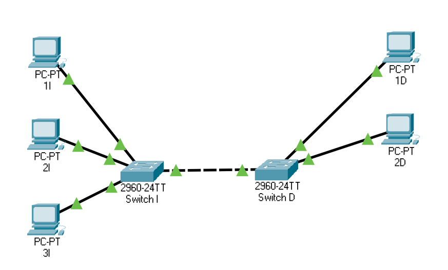
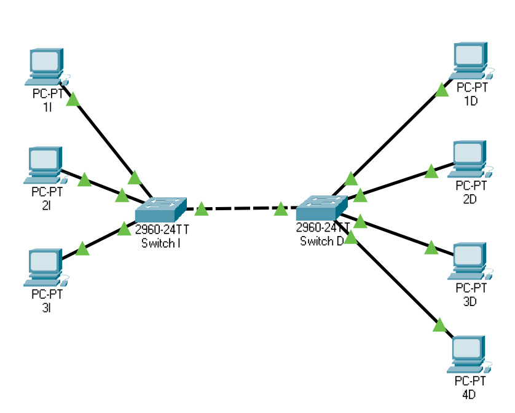
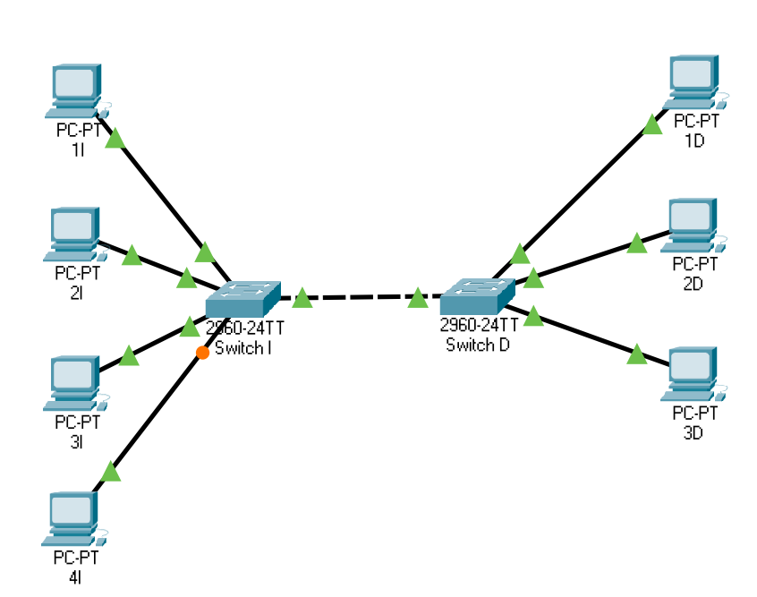
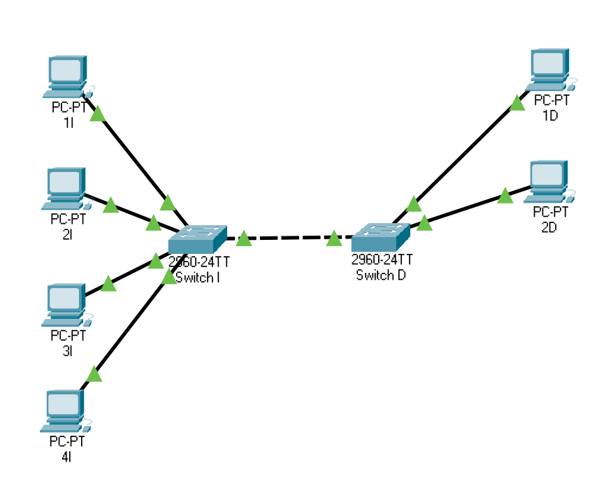
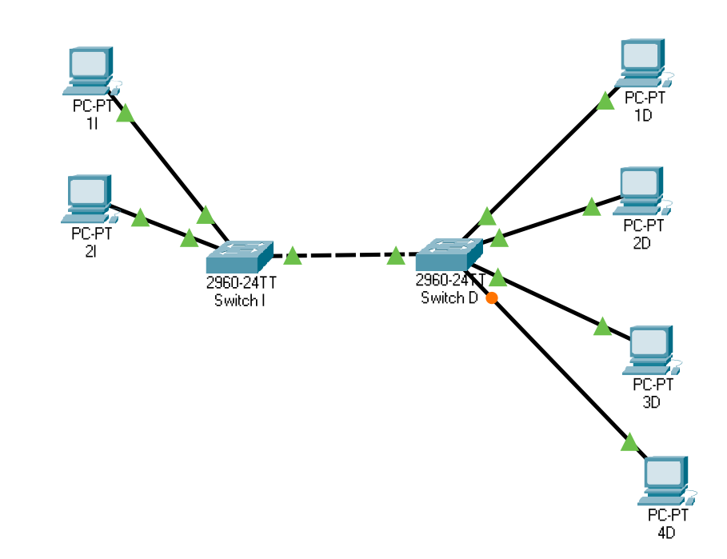
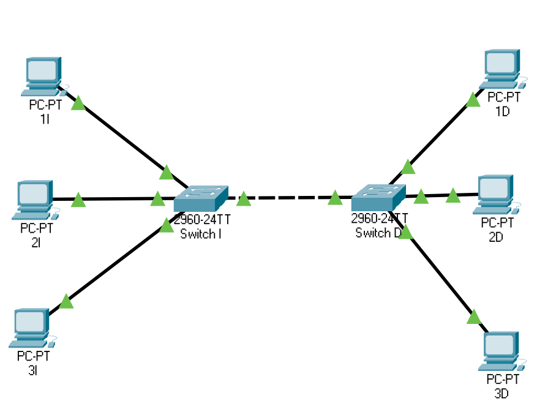
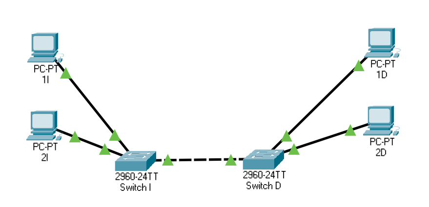
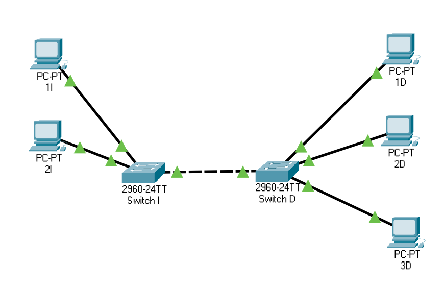

Anexo: ejercicios con tablas MAC de switches
================================================

Ejercicio 1 de switches
----------------------------------

Dada la red de la figura, en la que el switch izquierdo (I) tiene un cable en el puerto 2 que va al puerto 7 del switch derecho (D). Se pretende enviar desde ``6d51`` a ``fe19`` sabiendo lo siguiente:

* Ordenador 1I tiene la MAC ``6d51``.
* Ordenador 2I tiene la MAC ``5282``.
* Ordenador 3I tiene la MAC ``96c3``.
* Ordenador 1D tiene la MAC ``eeab``.
* Ordenador 2D tiene la MAC ``fe19``.

.. table:: Tabla MAC de Switch izquierdo

    ================  ========
    Numero de puerto    MAC   
    ================  ========
                   0  --      
                   1  --      
                   2  ``fe19``
                   3  ``96c3``
                   4  --      
                   5  --      
                   6  --      
                   7  ``5282``
    ================  ========

.. table:: Tabla MAC de Switch derecho

    ================  ========
    Numero de puerto    MAC   
    ================  ========
                   0  --      
                   1  --      
                   2  --      
                   3  --      
                   4  --      
                   5  --      
                   6  --      
                   7  ``96c3``
    ================  ========

Indica si las siguientes afirmaciones son verdaderas o falsas:

1. El Switch izquierdo apunta en su tabla de MACS  la MAC de origen ``6d51``.
2. El Switch derecho envía el mensaje por el puerto 2.
3. El Switch derecho envía el mensaje por todos los puertos menos por donde vino.
4. El Switch izquierdo envía el mensaje por el puerto 2.
5. El Switch izquierdo no modifica su tabla de MACS, no aprende nada nuevo.
6. El Switch izquierdo envía el mensaje por todos los puertos menos por donde vino.
7. El Switch derecho no modifica su tabla de MACS, no aprende nada nuevo.
8. El Switch derecho apunta en su tabla de MACS  la MAC de origen ``6d51``.

Ejercicio 2 de switches
----------------------------------

Dada la red de la figura, en la que el switch izquierdo (I) tiene un cable en el puerto 5 que va al puerto 4 del switch derecho (D). Se pretende enviar desde ``b48d`` a ``42d3`` sabiendo lo siguiente:

* Ordenador 1I tiene la MAC ``42d3``.
* Ordenador 2I tiene la MAC ``d626``.
* Ordenador 3I tiene la MAC ``9e62``.
* Ordenador 1D tiene la MAC ``b48d``.
* Ordenador 2D tiene la MAC ``af35``.

.. table:: Tabla MAC de Switch izquierdo

    ================  ========
    Numero de puerto    MAC   
    ================  ========
                   0  ``9e62``
                   1  --      
                   2  ``42d3``
                   3  --      
                   4  --      
                   5  --      
                   6  --      
                   7  --      
    ================  ========

.. table:: Tabla MAC de Switch derecho

    ================  ===
    Numero de puerto  MAC
    ================  ===
                   0  -- 
                   1  -- 
                   2  -- 
                   3  -- 
                   4  -- 
                   5  -- 
                   6  -- 
                   7  -- 
    ================  ===

Indica si las siguientes afirmaciones son verdaderas o falsas:

1. El Switch izquierdo no modifica su tabla de MACS, no aprende nada nuevo.
2. El Switch izquierdo apunta en su tabla de MACS  la MAC de origen ``b48d``.
3. El Switch derecho envía el mensaje por todos los puertos menos por donde vino.
4. El Switch derecho envía el mensaje por el puerto 6.
5. El Switch derecho no modifica su tabla de MACS, no aprende nada nuevo.
6. El Switch derecho apunta en su tabla de MACS  la MAC de origen ``b48d``.
7. El Switch izquierdo envía el mensaje por el puerto 2.
8. El Switch izquierdo envía el mensaje por todos los puertos menos por donde vino.

Ejercicio 3 de switches
----------------------------------

Dada la red de la figura, en la que el switch izquierdo (I) tiene un cable en el puerto 5 que va al puerto 0 del switch derecho (D). Se pretende enviar desde ``c3c6`` a ``a47b`` sabiendo lo siguiente:

* Ordenador 1I tiene la MAC ``5277``.
* Ordenador 2I tiene la MAC ``7ede``.
* Ordenador 3I tiene la MAC ``c3c6``.
* Ordenador 1D tiene la MAC ``c9d9``.
* Ordenador 2D tiene la MAC ``45b1``.
* Ordenador 3D tiene la MAC ``c44d``.
* Ordenador 4D tiene la MAC ``a47b``.

.. table:: Tabla MAC de Switch izquierdo

    ================  ========
    Numero de puerto    MAC   
    ================  ========
                   0  --      
                   1  ``5277``
                   2  --      
                   3  --      
                   4  --      
                   5  --      
                   6  --      
                   7  --      
    ================  ========

.. table:: Tabla MAC de Switch derecho

    ================  ========
    Numero de puerto    MAC   
    ================  ========
                   0  ``7ede``
                   1  --      
                   2  --      
                   3  --      
                   4  ``c44d``
                   5  --      
                   6  --      
                   7  --      
    ================  ========

Indica si las siguientes afirmaciones son verdaderas o falsas:

1. El Switch derecho envía el mensaje por el puerto 7.
2. El Switch izquierdo envía el mensaje por el puerto 0.
3. El Switch izquierdo no modifica su tabla de MACS, no aprende nada nuevo.
4. El Switch derecho no modifica su tabla de MACS, no aprende nada nuevo.
5. El Switch derecho envía el mensaje por todos los puertos menos por donde vino.
6. El Switch derecho apunta en su tabla de MACS  la MAC de origen ``c3c6``.
7. El Switch izquierdo apunta en su tabla de MACS  la MAC de origen ``c3c6``.
8. El Switch izquierdo envía el mensaje por todos los puertos menos por donde vino.

Ejercicio 4 de switches
----------------------------------

Dada la red de la figura, en la que el switch izquierdo (I) tiene un cable en el puerto 3 que va al puerto 4 del switch derecho (D). Se pretende enviar desde ``9b34`` a ``8fd4`` sabiendo lo siguiente:

* Ordenador 1I tiene la MAC ``64db``.
* Ordenador 2I tiene la MAC ``d687``.
* Ordenador 3I tiene la MAC ``8fd4``.
* Ordenador 1D tiene la MAC ``cd0c``.
* Ordenador 2D tiene la MAC ``b4af``.
* Ordenador 3D tiene la MAC ``9b34``.
* Ordenador 4D tiene la MAC ``489e``.

.. table:: Tabla MAC de Switch izquierdo

    ================  =============
    Numero de puerto       MAC     
    ================  =============
                   0  ``64db``     
                   1  --           
                   2  --           
                   3  ``b4af,489e``
                   4  --           
                   5  --           
                   6  --           
                   7  ``d687``     
    ================  =============

.. table:: Tabla MAC de Switch derecho

    ================  ========
    Numero de puerto    MAC   
    ================  ========
                   0  ``9b34``
                   1  --      
                   2  --      
                   3  --      
                   4  ``8fd4``
                   5  --      
                   6  --      
                   7  --      
    ================  ========

Indica si las siguientes afirmaciones son verdaderas o falsas:

1. El Switch derecho envía el mensaje por todos los puertos menos por donde vino.
2. El Switch izquierdo apunta en su tabla de MACS  la MAC de origen ``9b34``.
3. El Switch izquierdo envía el mensaje por todos los puertos menos por donde vino.
4. El Switch derecho apunta en su tabla de MACS  la MAC de origen ``9b34``.
5. El Switch derecho envía el mensaje por el puerto 4.
6. El Switch derecho no modifica su tabla de MACS, no aprende nada nuevo.
7. El Switch izquierdo envía el mensaje por el puerto 4.
8. El Switch izquierdo no modifica su tabla de MACS, no aprende nada nuevo.

Ejercicio 5 de switches
----------------------------------

Dada la red de la figura, en la que el switch izquierdo (I) tiene un cable en el puerto 5 que va al puerto 3 del switch derecho (D). Se pretende enviar desde ``e8c6`` a ``5b80`` sabiendo lo siguiente:

.. figure:: Switches4-4.png

* Ordenador 1I tiene la MAC ``dacb``.
* Ordenador 2I tiene la MAC ``94f3``.
* Ordenador 3I tiene la MAC ``5b80``.
* Ordenador 4I tiene la MAC ``b2fe``.
* Ordenador 1D tiene la MAC ``c6ab``.
* Ordenador 2D tiene la MAC ``e49e``.
* Ordenador 3D tiene la MAC ``e8c6``.
* Ordenador 4D tiene la MAC ``f6fd``.

.. table:: Tabla MAC de Switch izquierdo

    ================  =============
    Numero de puerto       MAC     
    ================  =============
                   0  ``5b80``     
                   1  --           
                   2  --           
                   3  --           
                   4  ``dacb``     
                   5  ``c6ab,e8c6``
                   6  ``b2fe``     
                   7  --           
    ================  =============

.. table:: Tabla MAC de Switch derecho

    ================  ========
    Numero de puerto    MAC   
    ================  ========
                   0  ``e8c6``
                   1  ``c6ab``
                   2  ``f6fd``
                   3  ``b2fe``
                   4  --      
                   5  --      
                   6  --      
                   7  --      
    ================  ========

Indica si las siguientes afirmaciones son verdaderas o falsas:

1. El Switch derecho envía el mensaje por todos los puertos menos por donde vino.
2. El Switch izquierdo envía el mensaje por el puerto 0.
3. El Switch derecho no modifica su tabla de MACS, no aprende nada nuevo.
4. El Switch izquierdo apunta en su tabla de MACS  la MAC de origen ``e8c6``.
5. El Switch derecho apunta en su tabla de MACS  la MAC de origen ``e8c6``.
6. El Switch izquierdo no modifica su tabla de MACS, no aprende nada nuevo.
7. El Switch izquierdo envía el mensaje por todos los puertos menos por donde vino.
8. El Switch derecho envía el mensaje por el puerto 7.

Ejercicio 6 de switches
----------------------------------

Dada la red de la figura, en la que el switch izquierdo (I) tiene un cable en el puerto 0 que va al puerto 2 del switch derecho (D). Se pretende enviar desde ``7352`` a ``f397`` sabiendo lo siguiente:

* Ordenador 1I tiene la MAC ``4b30``.
* Ordenador 2I tiene la MAC ``9f7e``.
* Ordenador 3I tiene la MAC ``7352``.
* Ordenador 1D tiene la MAC ``f397``.
* Ordenador 2D tiene la MAC ``d3dd``.
* Ordenador 3D tiene la MAC ``fdfb``.
* Ordenador 4D tiene la MAC ``9a2e``.

.. table:: Tabla MAC de Switch izquierdo

    ================  =============
    Numero de puerto       MAC     
    ================  =============
                   0  ``f397,9a2e``
                   1  --           
                   2  --           
                   3  --           
                   4  --           
                   5  --           
                   6  --           
                   7  --           
    ================  =============

.. table:: Tabla MAC de Switch derecho

    ================  ========
    Numero de puerto    MAC   
    ================  ========
                   0  ``f397``
                   1  ``fdfb``
                   2  ``4b30``
                   3  --      
                   4  ``d3dd``
                   5  --      
                   6  ``9a2e``
                   7  --      
    ================  ========

Indica si las siguientes afirmaciones son verdaderas o falsas:

1. El Switch izquierdo envía el mensaje por el puerto 0.
2. El Switch izquierdo apunta en su tabla de MACS  la MAC de origen ``7352``.
3. El Switch derecho apunta en su tabla de MACS  la MAC de origen ``7352``.
4. El Switch derecho no modifica su tabla de MACS, no aprende nada nuevo.
5. El Switch izquierdo no modifica su tabla de MACS, no aprende nada nuevo.
6. El Switch derecho envía el mensaje por todos los puertos menos por donde vino.
7. El Switch izquierdo envía el mensaje por todos los puertos menos por donde vino.
8. El Switch derecho envía el mensaje por el puerto 0.

Ejercicio 7 de switches
----------------------------------

Dada la red de la figura, en la que el switch izquierdo (I) tiene un cable en el puerto 7 que va al puerto 7 del switch derecho (D). Se pretende enviar desde ``c3b2`` a ``e009`` sabiendo lo siguiente:

* Ordenador 1I tiene la MAC ``8530``.
* Ordenador 2I tiene la MAC ``ae60``.
* Ordenador 3I tiene la MAC ``c3b2``.
* Ordenador 1D tiene la MAC ``e009``.
* Ordenador 2D tiene la MAC ``a92f``.
* Ordenador 3D tiene la MAC ``fc64``.
* Ordenador 4D tiene la MAC ``565b``.

.. table:: Tabla MAC de Switch izquierdo

    ================  ========
    Numero de puerto    MAC   
    ================  ========
                   0  ``8530``
                   1  --      
                   2  --      
                   3  --      
                   4  ``c3b2``
                   5  --      
                   6  --      
                   7  ``a92f``
    ================  ========

.. table:: Tabla MAC de Switch derecho

    ================  ========
    Numero de puerto    MAC   
    ================  ========
                   0  --      
                   1  --      
                   2  --      
                   3  --      
                   4  --      
                   5  --      
                   6  ``a92f``
                   7  --      
    ================  ========

Indica si las siguientes afirmaciones son verdaderas o falsas:

1. El Switch derecho envía el mensaje por el puerto 4.
2. El Switch izquierdo envía el mensaje por el puerto 2.
3. El Switch izquierdo no modifica su tabla de MACS, no aprende nada nuevo.
4. El Switch derecho no modifica su tabla de MACS, no aprende nada nuevo.
5. El Switch derecho envía el mensaje por todos los puertos menos por donde vino.
6. El Switch izquierdo envía el mensaje por todos los puertos menos por donde vino.
7. El Switch derecho apunta en su tabla de MACS  la MAC de origen ``c3b2``.
8. El Switch izquierdo apunta en su tabla de MACS  la MAC de origen ``c3b2``.

Ejercicio 8 de switches
----------------------------------

Dada la red de la figura, en la que el switch izquierdo (I) tiene un cable en el puerto 2 que va al puerto 2 del switch derecho (D). Se pretende enviar desde ``dcc0`` a ``da68`` sabiendo lo siguiente:

* Ordenador 1I tiene la MAC ``6a64``.
* Ordenador 2I tiene la MAC ``6b65``.
* Ordenador 3I tiene la MAC ``c269``.
* Ordenador 4I tiene la MAC ``da68``.
* Ordenador 1D tiene la MAC ``a5b1``.
* Ordenador 2D tiene la MAC ``f4d8``.
* Ordenador 3D tiene la MAC ``dcc0``.

.. table:: Tabla MAC de Switch izquierdo

    ================  ========
    Numero de puerto    MAC   
    ================  ========
                   0  --      
                   1  --      
                   2  ``6a64``
                   3  --      
                   4  ``da68``
                   5  --      
                   6  --      
                   7  --      
    ================  ========

.. table:: Tabla MAC de Switch derecho

    ================  ========
    Numero de puerto    MAC   
    ================  ========
                   0  --      
                   1  ``dcc0``
                   2  --      
                   3  --      
                   4  --      
                   5  ``a5b1``
                   6  --      
                   7  --      
    ================  ========

Indica si las siguientes afirmaciones son verdaderas o falsas:

1. El Switch izquierdo envía el mensaje por el puerto 4.
2. El Switch derecho apunta en su tabla de MACS  la MAC de origen ``dcc0``.
3. El Switch izquierdo envía el mensaje por todos los puertos menos por donde vino.
4. El Switch izquierdo no modifica su tabla de MACS, no aprende nada nuevo.
5. El Switch derecho no modifica su tabla de MACS, no aprende nada nuevo.
6. El Switch izquierdo apunta en su tabla de MACS  la MAC de origen ``dcc0``.
7. El Switch derecho envía el mensaje por el puerto 3.
8. El Switch derecho envía el mensaje por todos los puertos menos por donde vino.

Ejercicio 9 de switches
----------------------------------

Dada la red de la figura, en la que el switch izquierdo (I) tiene un cable en el puerto 7 que va al puerto 7 del switch derecho (D). Se pretende enviar desde ``f18e`` a ``74b6`` sabiendo lo siguiente:

* Ordenador 1I tiene la MAC ``f18e``.
* Ordenador 2I tiene la MAC ``a415``.
* Ordenador 3I tiene la MAC ``5b92``.
* Ordenador 4I tiene la MAC ``5b59``.
* Ordenador 1D tiene la MAC ``74b6``.
* Ordenador 2D tiene la MAC ``8480``.

.. table:: Tabla MAC de Switch izquierdo

    ================  ===
    Numero de puerto  MAC
    ================  ===
                   0  -- 
                   1  -- 
                   2  -- 
                   3  -- 
                   4  -- 
                   5  -- 
                   6  -- 
                   7  -- 
    ================  ===

.. table:: Tabla MAC de Switch derecho

    ================  =============
    Numero de puerto       MAC     
    ================  =============
                   0  ``74b6``     
                   1  --           
                   2  --           
                   3  --           
                   4  --           
                   5  ``8480``     
                   6  --           
                   7  ``a415,5b59``
    ================  =============

Indica si las siguientes afirmaciones son verdaderas o falsas:

1. El Switch derecho no modifica su tabla de MACS, no aprende nada nuevo.
2. El Switch izquierdo no modifica su tabla de MACS, no aprende nada nuevo.
3. El Switch derecho envía el mensaje por el puerto 0.
4. El Switch derecho envía el mensaje por todos los puertos menos por donde vino.
5. El Switch derecho apunta en su tabla de MACS  la MAC de origen ``f18e``.
6. El Switch izquierdo envía el mensaje por el puerto 6.
7. El Switch izquierdo apunta en su tabla de MACS  la MAC de origen ``f18e``.
8. El Switch izquierdo envía el mensaje por todos los puertos menos por donde vino.

Ejercicio 10 de switches
----------------------------------

Dada la red de la figura, en la que el switch izquierdo (I) tiene un cable en el puerto 7 que va al puerto 5 del switch derecho (D). Se pretende enviar desde ``9f58`` a ``8e5a`` sabiendo lo siguiente:

* Ordenador 1I tiene la MAC ``91ce``.
* Ordenador 2I tiene la MAC ``e58b``.
* Ordenador 3I tiene la MAC ``ac9f``.
* Ordenador 4I tiene la MAC ``8e5a``.
* Ordenador 1D tiene la MAC ``be75``.
* Ordenador 2D tiene la MAC ``aa81``.
* Ordenador 3D tiene la MAC ``9f58``.

.. table:: Tabla MAC de Switch izquierdo

    ================  ========
    Numero de puerto    MAC   
    ================  ========
                   0  --      
                   1  --      
                   2  --      
                   3  ``8e5a``
                   4  ``91ce``
                   5  --      
                   6  --      
                   7  ``9f58``
    ================  ========

.. table:: Tabla MAC de Switch derecho

    ================  =============
    Numero de puerto       MAC     
    ================  =============
                   0  --           
                   1  --           
                   2  --           
                   3  --           
                   4  ``9f58``     
                   5  ``e58b,8e5a``
                   6  --           
                   7  ``be75``     
    ================  =============

Indica si las siguientes afirmaciones son verdaderas o falsas:

1. El Switch izquierdo envía el mensaje por el puerto 3.
2. El Switch derecho apunta en su tabla de MACS  la MAC de origen ``9f58``.
3. El Switch izquierdo apunta en su tabla de MACS  la MAC de origen ``9f58``.
4. El Switch derecho envía el mensaje por todos los puertos menos por donde vino.
5. El Switch izquierdo no modifica su tabla de MACS, no aprende nada nuevo.
6. El Switch derecho envía el mensaje por el puerto 5.
7. El Switch izquierdo envía el mensaje por todos los puertos menos por donde vino.
8. El Switch derecho no modifica su tabla de MACS, no aprende nada nuevo.

Ejercicio 11 de switches
----------------------------------

Dada la red de la figura, en la que el switch izquierdo (I) tiene un cable en el puerto 6 que va al puerto 2 del switch derecho (D). Se pretende enviar desde ``600c`` a ``4760`` sabiendo lo siguiente:

* Ordenador 1I tiene la MAC ``600c``.
* Ordenador 2I tiene la MAC ``6f57``.
* Ordenador 1D tiene la MAC ``4760``.
* Ordenador 2D tiene la MAC ``98c5``.
* Ordenador 3D tiene la MAC ``5ff2``.
* Ordenador 4D tiene la MAC ``d12d``.

.. table:: Tabla MAC de Switch izquierdo

    ================  ========
    Numero de puerto    MAC   
    ================  ========
                   0  --      
                   1  --      
                   2  --      
                   3  --      
                   4  --      
                   5  ``600c``
                   6  --      
                   7  --      
    ================  ========

.. table:: Tabla MAC de Switch derecho

    ================  ========
    Numero de puerto    MAC   
    ================  ========
                   0  --      
                   1  --      
                   2  --      
                   3  --      
                   4  ``4760``
                   5  --      
                   6  --      
                   7  --      
    ================  ========

Indica si las siguientes afirmaciones son verdaderas o falsas:

1. El Switch derecho apunta en su tabla de MACS  la MAC de origen ``600c``.
2. El Switch izquierdo apunta en su tabla de MACS  la MAC de origen ``600c``.
3. El Switch derecho envía el mensaje por todos los puertos menos por donde vino.
4. El Switch derecho envía el mensaje por el puerto 4.
5. El Switch izquierdo envía el mensaje por el puerto 7.
6. El Switch izquierdo envía el mensaje por todos los puertos menos por donde vino.
7. El Switch izquierdo no modifica su tabla de MACS, no aprende nada nuevo.
8. El Switch derecho no modifica su tabla de MACS, no aprende nada nuevo.

Ejercicio 12 de switches
----------------------------------

Dada la red de la figura, en la que el switch izquierdo (I) tiene un cable en el puerto 1 que va al puerto 5 del switch derecho (D). Se pretende enviar desde ``5731`` a ``ae7d`` sabiendo lo siguiente:

* Ordenador 1I tiene la MAC ``ace2``.
* Ordenador 2I tiene la MAC ``ae7d``.
* Ordenador 3I tiene la MAC ``d477``.
* Ordenador 1D tiene la MAC ``8d3e``.
* Ordenador 2D tiene la MAC ``5731``.
* Ordenador 3D tiene la MAC ``55e2``.

.. table:: Tabla MAC de Switch izquierdo

    ================  =============
    Numero de puerto       MAC     
    ================  =============
                   0  --           
                   1  ``8d3e,5731``
                   2  --           
                   3  --           
                   4  ``ae7d``     
                   5  --           
                   6  ``d477``     
                   7  --           
    ================  =============

.. table:: Tabla MAC de Switch derecho

    ================  ========
    Numero de puerto    MAC   
    ================  ========
                   0  --      
                   1  --      
                   2  ``8d3e``
                   3  --      
                   4  --      
                   5  --      
                   6  --      
                   7  --      
    ================  ========

Indica si las siguientes afirmaciones son verdaderas o falsas:

1. El Switch derecho envía el mensaje por el puerto 4.
2. El Switch izquierdo no modifica su tabla de MACS, no aprende nada nuevo.
3. El Switch izquierdo apunta en su tabla de MACS  la MAC de origen ``5731``.
4. El Switch izquierdo envía el mensaje por el puerto 4.
5. El Switch derecho apunta en su tabla de MACS  la MAC de origen ``5731``.
6. El Switch derecho no modifica su tabla de MACS, no aprende nada nuevo.
7. El Switch izquierdo envía el mensaje por todos los puertos menos por donde vino.
8. El Switch derecho envía el mensaje por todos los puertos menos por donde vino.

Ejercicio 13 de switches
----------------------------------

Dada la red de la figura, en la que el switch izquierdo (I) tiene un cable en el puerto 4 que va al puerto 7 del switch derecho (D). Se pretende enviar desde ``b16e`` a ``aaf5`` sabiendo lo siguiente:

* Ordenador 1I tiene la MAC ``eee5``.
* Ordenador 2I tiene la MAC ``628b``.
* Ordenador 3I tiene la MAC ``aaf5``.
* Ordenador 1D tiene la MAC ``b16e``.
* Ordenador 2D tiene la MAC ``b9b2``.

.. table:: Tabla MAC de Switch izquierdo

    ================  ========
    Numero de puerto    MAC   
    ================  ========
                   0  --      
                   1  --      
                   2  --      
                   3  --      
                   4  ``eee5``
                   5  --      
                   6  --      
                   7  ``aaf5``
    ================  ========

.. table:: Tabla MAC de Switch derecho

    ================  ========
    Numero de puerto    MAC   
    ================  ========
                   0  --      
                   1  --      
                   2  ``b16e``
                   3  --      
                   4  --      
                   5  --      
                   6  --      
                   7  ``628b``
    ================  ========

Indica si las siguientes afirmaciones son verdaderas o falsas:

1. El Switch izquierdo envía el mensaje por el puerto 7.
2. El Switch derecho apunta en su tabla de MACS  la MAC de origen ``b16e``.
3. El Switch izquierdo no modifica su tabla de MACS, no aprende nada nuevo.
4. El Switch izquierdo envía el mensaje por todos los puertos menos por donde vino.
5. El Switch derecho envía el mensaje por el puerto 0.
6. El Switch derecho no modifica su tabla de MACS, no aprende nada nuevo.
7. El Switch izquierdo apunta en su tabla de MACS  la MAC de origen ``b16e``.
8. El Switch derecho envía el mensaje por todos los puertos menos por donde vino.

Ejercicio 14 de switches
----------------------------------

Dada la red de la figura, en la que el switch izquierdo (I) tiene un cable en el puerto 2 que va al puerto 3 del switch derecho (D). Se pretende enviar desde ``75f8`` a ``f0a8`` sabiendo lo siguiente:

* Ordenador 1I tiene la MAC ``6dc0``.
* Ordenador 2I tiene la MAC ``f0a8``.
* Ordenador 3I tiene la MAC ``8f2d``.
* Ordenador 1D tiene la MAC ``defa``.
* Ordenador 2D tiene la MAC ``75f8``.

.. table:: Tabla MAC de Switch izquierdo

    ================  =============
    Numero de puerto       MAC     
    ================  =============
                   0  --           
                   1  --           
                   2  ``defa,75f8``
                   3  --           
                   4  ``6dc0``     
                   5  --           
                   6  --           
                   7  --           
    ================  =============

.. table:: Tabla MAC de Switch derecho

    ================  =============
    Numero de puerto       MAC     
    ================  =============
                   0  --           
                   1  --           
                   2  ``defa``     
                   3  ``f0a8,8f2d``
                   4  --           
                   5  --           
                   6  --           
                   7  --           
    ================  =============

Indica si las siguientes afirmaciones son verdaderas o falsas:

1. El Switch derecho apunta en su tabla de MACS  la MAC de origen ``75f8``.
2. El Switch izquierdo apunta en su tabla de MACS  la MAC de origen ``75f8``.
3. El Switch izquierdo no modifica su tabla de MACS, no aprende nada nuevo.
4. El Switch derecho envía el mensaje por el puerto 3.
5. El Switch izquierdo envía el mensaje por todos los puertos menos por donde vino.
6. El Switch derecho no modifica su tabla de MACS, no aprende nada nuevo.
7. El Switch izquierdo envía el mensaje por el puerto 7.
8. El Switch derecho envía el mensaje por todos los puertos menos por donde vino.

Ejercicio 15 de switches
----------------------------------

Dada la red de la figura, en la que el switch izquierdo (I) tiene un cable en el puerto 2 que va al puerto 2 del switch derecho (D). Se pretende enviar desde ``a51c`` a ``bc02`` sabiendo lo siguiente:

* Ordenador 1I tiene la MAC ``6b1a``.
* Ordenador 2I tiene la MAC ``8222``.
* Ordenador 3I tiene la MAC ``a51c``.
* Ordenador 1D tiene la MAC ``bc02``.
* Ordenador 2D tiene la MAC ``df6b``.
* Ordenador 3D tiene la MAC ``747a``.

.. table:: Tabla MAC de Switch izquierdo

    ================  ========
    Numero de puerto    MAC   
    ================  ========
                   0  --      
                   1  --      
                   2  --      
                   3  ``6b1a``
                   4  --      
                   5  --      
                   6  --      
                   7  ``8222``
    ================  ========

.. table:: Tabla MAC de Switch derecho

    ================  ===
    Numero de puerto  MAC
    ================  ===
                   0  -- 
                   1  -- 
                   2  -- 
                   3  -- 
                   4  -- 
                   5  -- 
                   6  -- 
                   7  -- 
    ================  ===

Indica si las siguientes afirmaciones son verdaderas o falsas:

1. El Switch izquierdo apunta en su tabla de MACS  la MAC de origen ``a51c``.
2. El Switch derecho no modifica su tabla de MACS, no aprende nada nuevo.
3. El Switch izquierdo envía el mensaje por el puerto 0.
4. El Switch izquierdo envía el mensaje por todos los puertos menos por donde vino.
5. El Switch izquierdo no modifica su tabla de MACS, no aprende nada nuevo.
6. El Switch derecho envía el mensaje por todos los puertos menos por donde vino.
7. El Switch derecho apunta en su tabla de MACS  la MAC de origen ``a51c``.
8. El Switch derecho envía el mensaje por el puerto 0.

Ejercicio 16 de switches
----------------------------------

Dada la red de la figura, en la que el switch izquierdo (I) tiene un cable en el puerto 1 que va al puerto 6 del switch derecho (D). Se pretende enviar desde ``f782`` a ``52d3`` sabiendo lo siguiente:

* Ordenador 1I tiene la MAC ``7d02``.
* Ordenador 2I tiene la MAC ``50eb``.
* Ordenador 3I tiene la MAC ``52d3``.
* Ordenador 1D tiene la MAC ``4329``.
* Ordenador 2D tiene la MAC ``f075``.
* Ordenador 3D tiene la MAC ``c41d``.
* Ordenador 4D tiene la MAC ``f782``.

.. table:: Tabla MAC de Switch izquierdo

    ================  ========
    Numero de puerto    MAC   
    ================  ========
                   0  --      
                   1  --      
                   2  --      
                   3  --      
                   4  ``50eb``
                   5  --      
                   6  --      
                   7  --      
    ================  ========

.. table:: Tabla MAC de Switch derecho

    ================  ========
    Numero de puerto    MAC   
    ================  ========
                   0  --      
                   1  --      
                   2  ``f782``
                   3  --      
                   4  ``c41d``
                   5  --      
                   6  ``52d3``
                   7  ``4329``
    ================  ========

Indica si las siguientes afirmaciones son verdaderas o falsas:

1. El Switch derecho envía el mensaje por el puerto 6.
2. El Switch izquierdo envía el mensaje por el puerto 0.
3. El Switch derecho apunta en su tabla de MACS  la MAC de origen ``f782``.
4. El Switch izquierdo envía el mensaje por todos los puertos menos por donde vino.
5. El Switch derecho no modifica su tabla de MACS, no aprende nada nuevo.
6. El Switch derecho envía el mensaje por todos los puertos menos por donde vino.
7. El Switch izquierdo no modifica su tabla de MACS, no aprende nada nuevo.
8. El Switch izquierdo apunta en su tabla de MACS  la MAC de origen ``f782``.

Ejercicio 17 de switches
----------------------------------

Dada la red de la figura, en la que el switch izquierdo (I) tiene un cable en el puerto 2 que va al puerto 6 del switch derecho (D). Se pretende enviar desde ``9cfc`` a ``878f`` sabiendo lo siguiente:

* Ordenador 1I tiene la MAC ``ed53``.
* Ordenador 2I tiene la MAC ``878f``.
* Ordenador 1D tiene la MAC ``9cfc``.
* Ordenador 2D tiene la MAC ``baf8``.

.. table:: Tabla MAC de Switch izquierdo

    ================  ========
    Numero de puerto    MAC   
    ================  ========
                   0  --      
                   1  ``ed53``
                   2  --      
                   3  --      
                   4  --      
                   5  --      
                   6  --      
                   7  --      
    ================  ========

.. table:: Tabla MAC de Switch derecho

    ================  ========
    Numero de puerto    MAC   
    ================  ========
                   0  --      
                   1  --      
                   2  --      
                   3  --      
                   4  --      
                   5  --      
                   6  ``878f``
                   7  --      
    ================  ========

Indica si las siguientes afirmaciones son verdaderas o falsas:

1. El Switch izquierdo apunta en su tabla de MACS  la MAC de origen ``9cfc``.
2. El Switch derecho envía el mensaje por el puerto 6.
3. El Switch derecho envía el mensaje por todos los puertos menos por donde vino.
4. El Switch derecho no modifica su tabla de MACS, no aprende nada nuevo.
5. El Switch izquierdo envía el mensaje por todos los puertos menos por donde vino.
6. El Switch izquierdo no modifica su tabla de MACS, no aprende nada nuevo.
7. El Switch derecho apunta en su tabla de MACS  la MAC de origen ``9cfc``.
8. El Switch izquierdo envía el mensaje por el puerto 5.

Ejercicio 18 de switches
----------------------------------

Dada la red de la figura, en la que el switch izquierdo (I) tiene un cable en el puerto 2 que va al puerto 4 del switch derecho (D). Se pretende enviar desde ``cd55`` a ``7f23`` sabiendo lo siguiente:

* Ordenador 1I tiene la MAC ``88c5``.
* Ordenador 2I tiene la MAC ``7cd8``.
* Ordenador 3I tiene la MAC ``7f23``.
* Ordenador 1D tiene la MAC ``b009``.
* Ordenador 2D tiene la MAC ``ddbd``.
* Ordenador 3D tiene la MAC ``cd55``.
* Ordenador 4D tiene la MAC ``8f3d``.

.. table:: Tabla MAC de Switch izquierdo

    ================  ========
    Numero de puerto    MAC   
    ================  ========
                   0  --      
                   1  --      
                   2  ``b009``
                   3  --      
                   4  --      
                   5  --      
                   6  --      
                   7  --      
    ================  ========

.. table:: Tabla MAC de Switch derecho

    ================  ========
    Numero de puerto    MAC   
    ================  ========
                   0  --      
                   1  --      
                   2  ``cd55``
                   3  --      
                   4  ``7cd8``
                   5  --      
                   6  --      
                   7  ``b009``
    ================  ========

Indica si las siguientes afirmaciones son verdaderas o falsas:

1. El Switch derecho no modifica su tabla de MACS, no aprende nada nuevo.
2. El Switch izquierdo no modifica su tabla de MACS, no aprende nada nuevo.
3. El Switch derecho apunta en su tabla de MACS  la MAC de origen ``cd55``.
4. El Switch izquierdo envía el mensaje por el puerto 1.
5. El Switch izquierdo envía el mensaje por todos los puertos menos por donde vino.
6. El Switch derecho envía el mensaje por todos los puertos menos por donde vino.
7. El Switch derecho envía el mensaje por el puerto 5.
8. El Switch izquierdo apunta en su tabla de MACS  la MAC de origen ``cd55``.

Ejercicio 19 de switches
----------------------------------

Dada la red de la figura, en la que el switch izquierdo (I) tiene un cable en el puerto 1 que va al puerto 5 del switch derecho (D). Se pretende enviar desde ``e4a9`` a ``b911`` sabiendo lo siguiente:

* Ordenador 1I tiene la MAC ``ef01``.
* Ordenador 2I tiene la MAC ``b911``.
* Ordenador 1D tiene la MAC ``e4a9``.
* Ordenador 2D tiene la MAC ``af61``.
* Ordenador 3D tiene la MAC ``9e5f``.

.. table:: Tabla MAC de Switch izquierdo

    ================  ========
    Numero de puerto    MAC   
    ================  ========
                   0  --      
                   1  ``af61``
                   2  --      
                   3  --      
                   4  --      
                   5  --      
                   6  --      
                   7  --      
    ================  ========

.. table:: Tabla MAC de Switch derecho

    ================  ========
    Numero de puerto    MAC   
    ================  ========
                   0  --      
                   1  --      
                   2  --      
                   3  --      
                   4  --      
                   5  ``ef01``
                   6  --      
                   7  --      
    ================  ========

Indica si las siguientes afirmaciones son verdaderas o falsas:

1. El Switch derecho apunta en su tabla de MACS  la MAC de origen ``e4a9``.
2. El Switch izquierdo no modifica su tabla de MACS, no aprende nada nuevo.
3. El Switch izquierdo envía el mensaje por el puerto 4.
4. El Switch derecho no modifica su tabla de MACS, no aprende nada nuevo.
5. El Switch derecho envía el mensaje por el puerto 6.
6. El Switch izquierdo apunta en su tabla de MACS  la MAC de origen ``e4a9``.
7. El Switch izquierdo envía el mensaje por todos los puertos menos por donde vino.
8. El Switch derecho envía el mensaje por todos los puertos menos por donde vino.

Ejercicio 20 de switches
----------------------------------

Dada la red de la figura, en la que el switch izquierdo (I) tiene un cable en el puerto 6 que va al puerto 3 del switch derecho (D). Se pretende enviar desde ``6413`` a ``f2bd`` sabiendo lo siguiente:

* Ordenador 1I tiene la MAC ``aa43``.
* Ordenador 2I tiene la MAC ``a35f``.
* Ordenador 3I tiene la MAC ``f2bd``.
* Ordenador 4I tiene la MAC ``b93c``.
* Ordenador 1D tiene la MAC ``aba4``.
* Ordenador 2D tiene la MAC ``6413``.
* Ordenador 3D tiene la MAC ``b036``.

.. table:: Tabla MAC de Switch izquierdo

    ================  ========
    Numero de puerto    MAC   
    ================  ========
                   0  ``f2bd``
                   1  ``a35f``
                   2  ``b93c``
                   3  --      
                   4  --      
                   5  ``aa43``
                   6  --      
                   7  --      
    ================  ========

.. table:: Tabla MAC de Switch derecho

    ================  =======================
    Numero de puerto            MAC          
    ================  =======================
                   0  --                     
                   1  --                     
                   2  --                     
                   3  ``aa43,a35f,f2bd,b93c``
                   4  ``aba4``               
                   5  --                     
                   6  --                     
                   7  --                     
    ================  =======================

Indica si las siguientes afirmaciones son verdaderas o falsas:

1. El Switch izquierdo envía el mensaje por todos los puertos menos por donde vino.
2. El Switch izquierdo no modifica su tabla de MACS, no aprende nada nuevo.
3. El Switch izquierdo apunta en su tabla de MACS  la MAC de origen ``6413``.
4. El Switch derecho envía el mensaje por el puerto 3.
5. El Switch derecho no modifica su tabla de MACS, no aprende nada nuevo.
6. El Switch derecho apunta en su tabla de MACS  la MAC de origen ``6413``.
7. El Switch izquierdo envía el mensaje por el puerto 0.
8. El Switch derecho envía el mensaje por todos los puertos menos por donde vino.

Ejercicio 21 de switches
----------------------------------

Dada la red de la figura, en la que el switch izquierdo (I) tiene un cable en el puerto 5 que va al puerto 4 del switch derecho (D). Se pretende enviar desde ``91d2`` a ``68b9`` sabiendo lo siguiente:

* Ordenador 1I tiene la MAC ``91d2``.
* Ordenador 2I tiene la MAC ``f402``.
* Ordenador 1D tiene la MAC ``8762``.
* Ordenador 2D tiene la MAC ``68b9``.
* Ordenador 3D tiene la MAC ``ecac``.

.. table:: Tabla MAC de Switch izquierdo

    ================  ========
    Numero de puerto    MAC   
    ================  ========
                   0  --      
                   1  ``91d2``
                   2  --      
                   3  --      
                   4  --      
                   5  ``ecac``
                   6  --      
                   7  --      
    ================  ========

.. table:: Tabla MAC de Switch derecho

    ================  ========
    Numero de puerto    MAC   
    ================  ========
                   0  --      
                   1  --      
                   2  --      
                   3  --      
                   4  ``f402``
                   5  --      
                   6  --      
                   7  ``ecac``
    ================  ========

Indica si las siguientes afirmaciones son verdaderas o falsas:

1. El Switch izquierdo envía el mensaje por el puerto 0.
2. El Switch derecho apunta en su tabla de MACS  la MAC de origen ``91d2``.
3. El Switch izquierdo no modifica su tabla de MACS, no aprende nada nuevo.
4. El Switch derecho envía el mensaje por el puerto 1.
5. El Switch derecho envía el mensaje por todos los puertos menos por donde vino.
6. El Switch izquierdo envía el mensaje por todos los puertos menos por donde vino.
7. El Switch izquierdo apunta en su tabla de MACS  la MAC de origen ``91d2``.
8. El Switch derecho no modifica su tabla de MACS, no aprende nada nuevo.

Ejercicio 22 de switches
----------------------------------

Dada la red de la figura, en la que el switch izquierdo (I) tiene un cable en el puerto 3 que va al puerto 6 del switch derecho (D). Se pretende enviar desde ``4cbc`` a ``4d3e`` sabiendo lo siguiente:

* Ordenador 1I tiene la MAC ``ed68``.
* Ordenador 2I tiene la MAC ``4afc``.
* Ordenador 3I tiene la MAC ``4d3e``.
* Ordenador 1D tiene la MAC ``f279``.
* Ordenador 2D tiene la MAC ``4cbc``.
* Ordenador 3D tiene la MAC ``8a95``.
* Ordenador 4D tiene la MAC ``dd1f``.

.. table:: Tabla MAC de Switch izquierdo

    ================  ==================
    Numero de puerto         MAC        
    ================  ==================
                   0  ``4afc``          
                   1  --                
                   2  --                
                   3  ``f279,4cbc,8a95``
                   4  --                
                   5  --                
                   6  --                
                   7  --                
    ================  ==================

.. table:: Tabla MAC de Switch derecho

    ================  =============
    Numero de puerto       MAC     
    ================  =============
                   0  --           
                   1  --           
                   2  ``f279``     
                   3  --           
                   4  --           
                   5  --           
                   6  ``ed68,4afc``
                   7  --           
    ================  =============

Indica si las siguientes afirmaciones son verdaderas o falsas:

1. El Switch izquierdo apunta en su tabla de MACS  la MAC de origen ``4cbc``.
2. El Switch derecho apunta en su tabla de MACS  la MAC de origen ``4cbc``.
3. El Switch derecho no modifica su tabla de MACS, no aprende nada nuevo.
4. El Switch izquierdo envía el mensaje por todos los puertos menos por donde vino.
5. El Switch derecho envía el mensaje por todos los puertos menos por donde vino.
6. El Switch izquierdo no modifica su tabla de MACS, no aprende nada nuevo.
7. El Switch izquierdo envía el mensaje por el puerto 6.
8. El Switch derecho envía el mensaje por el puerto 3.

Ejercicio 23 de switches
----------------------------------

Dada la red de la figura, en la que el switch izquierdo (I) tiene un cable en el puerto 5 que va al puerto 4 del switch derecho (D). Se pretende enviar desde ``ab40`` a ``5029`` sabiendo lo siguiente:

* Ordenador 1I tiene la MAC ``916f``.
* Ordenador 2I tiene la MAC ``b903``.
* Ordenador 3I tiene la MAC ``ab40``.
* Ordenador 1D tiene la MAC ``5029``.
* Ordenador 2D tiene la MAC ``95a7``.

.. table:: Tabla MAC de Switch izquierdo

    ================  ========
    Numero de puerto    MAC   
    ================  ========
                   0  ``916f``
                   1  --      
                   2  --      
                   3  --      
                   4  ``b903``
                   5  --      
                   6  ``ab40``
                   7  --      
    ================  ========

.. table:: Tabla MAC de Switch derecho

    ================  ========
    Numero de puerto    MAC   
    ================  ========
                   0  --      
                   1  --      
                   2  ``95a7``
                   3  --      
                   4  --      
                   5  --      
                   6  ``5029``
                   7  --      
    ================  ========

Indica si las siguientes afirmaciones son verdaderas o falsas:

1. El Switch derecho envía el mensaje por el puerto 6.
2. El Switch derecho envía el mensaje por todos los puertos menos por donde vino.
3. El Switch derecho apunta en su tabla de MACS  la MAC de origen ``ab40``.
4. El Switch izquierdo envía el mensaje por el puerto 3.
5. El Switch derecho no modifica su tabla de MACS, no aprende nada nuevo.
6. El Switch izquierdo apunta en su tabla de MACS  la MAC de origen ``ab40``.
7. El Switch izquierdo envía el mensaje por todos los puertos menos por donde vino.
8. El Switch izquierdo no modifica su tabla de MACS, no aprende nada nuevo.

Ejercicio 24 de switches
----------------------------------

Dada la red de la figura, en la que el switch izquierdo (I) tiene un cable en el puerto 7 que va al puerto 2 del switch derecho (D). Se pretende enviar desde ``9fca`` a ``4051`` sabiendo lo siguiente:

* Ordenador 1I tiene la MAC ``9fca``.
* Ordenador 2I tiene la MAC ``8e81``.
* Ordenador 1D tiene la MAC ``4051``.
* Ordenador 2D tiene la MAC ``475a``.
* Ordenador 3D tiene la MAC ``d640``.
* Ordenador 4D tiene la MAC ``e7a8``.

.. table:: Tabla MAC de Switch izquierdo

    ================  =============
    Numero de puerto       MAC     
    ================  =============
                   0  --           
                   1  ``9fca``     
                   2  --           
                   3  --           
                   4  --           
                   5  ``8e81``     
                   6  --           
                   7  ``475a,e7a8``
    ================  =============

.. table:: Tabla MAC de Switch derecho

    ================  ========
    Numero de puerto    MAC   
    ================  ========
                   0  --      
                   1  ``e7a8``
                   2  ``4051``
                   3  --      
                   4  ``475a``
                   5  ``d640``
                   6  --      
                   7  --      
    ================  ========

Indica si las siguientes afirmaciones son verdaderas o falsas:

1. El Switch izquierdo envía el mensaje por todos los puertos menos por donde vino.
2. El Switch derecho no modifica su tabla de MACS, no aprende nada nuevo.
3. El Switch izquierdo no modifica su tabla de MACS, no aprende nada nuevo.
4. El Switch derecho apunta en su tabla de MACS  la MAC de origen ``9fca``.
5. El Switch izquierdo apunta en su tabla de MACS  la MAC de origen ``9fca``.
6. El Switch derecho envía el mensaje por todos los puertos menos por donde vino.
7. El Switch izquierdo envía el mensaje por el puerto 0.
8. El Switch derecho envía el mensaje por el puerto 2.

Ejercicio 25 de switches
----------------------------------

Dada la red de la figura, en la que el switch izquierdo (I) tiene un cable en el puerto 3 que va al puerto 3 del switch derecho (D). Se pretende enviar desde ``886d`` a ``e2ee`` sabiendo lo siguiente:

* Ordenador 1I tiene la MAC ``faa0``.
* Ordenador 2I tiene la MAC ``b221``.
* Ordenador 3I tiene la MAC ``e2ee``.
* Ordenador 1D tiene la MAC ``886d``.
* Ordenador 2D tiene la MAC ``c91b``.
* Ordenador 3D tiene la MAC ``6ba9``.

.. table:: Tabla MAC de Switch izquierdo

    ================  ========
    Numero de puerto    MAC   
    ================  ========
                   0  --      
                   1  ``e2ee``
                   2  --      
                   3  ``886d``
                   4  --      
                   5  --      
                   6  --      
                   7  --      
    ================  ========

.. table:: Tabla MAC de Switch derecho

    ================  ========
    Numero de puerto    MAC   
    ================  ========
                   0  --      
                   1  --      
                   2  --      
                   3  ``c91b``
                   4  --      
                   5  --      
                   6  --      
                   7  --      
    ================  ========

Indica si las siguientes afirmaciones son verdaderas o falsas:

1. El Switch izquierdo envía el mensaje por todos los puertos menos por donde vino.
2. El Switch izquierdo apunta en su tabla de MACS  la MAC de origen ``886d``.
3. El Switch izquierdo envía el mensaje por el puerto 1.
4. El Switch derecho apunta en su tabla de MACS  la MAC de origen ``886d``.
5. El Switch derecho envía el mensaje por el puerto 2.
6. El Switch izquierdo no modifica su tabla de MACS, no aprende nada nuevo.
7. El Switch derecho envía el mensaje por todos los puertos menos por donde vino.
8. El Switch derecho no modifica su tabla de MACS, no aprende nada nuevo.

Ejercicio 26 de switches
----------------------------------

Dada la red de la figura, en la que el switch izquierdo (I) tiene un cable en el puerto 3 que va al puerto 4 del switch derecho (D). Se pretende enviar desde ``6378`` a ``510f`` sabiendo lo siguiente:

* Ordenador 1I tiene la MAC ``510f``.
* Ordenador 2I tiene la MAC ``c282``.
* Ordenador 1D tiene la MAC ``acaa``.
* Ordenador 2D tiene la MAC ``503d``.
* Ordenador 3D tiene la MAC ``6378``.

.. table:: Tabla MAC de Switch izquierdo

    ================  ===
    Numero de puerto  MAC
    ================  ===
                   0  -- 
                   1  -- 
                   2  -- 
                   3  -- 
                   4  -- 
                   5  -- 
                   6  -- 
                   7  -- 
    ================  ===

.. table:: Tabla MAC de Switch derecho

    ================  ===
    Numero de puerto  MAC
    ================  ===
                   0  -- 
                   1  -- 
                   2  -- 
                   3  -- 
                   4  -- 
                   5  -- 
                   6  -- 
                   7  -- 
    ================  ===

Indica si las siguientes afirmaciones son verdaderas o falsas:

1. El Switch derecho envía el mensaje por el puerto 1.
2. El Switch derecho apunta en su tabla de MACS  la MAC de origen ``6378``.
3. El Switch izquierdo apunta en su tabla de MACS  la MAC de origen ``6378``.
4. El Switch izquierdo envía el mensaje por todos los puertos menos por donde vino.
5. El Switch izquierdo no modifica su tabla de MACS, no aprende nada nuevo.
6. El Switch derecho no modifica su tabla de MACS, no aprende nada nuevo.
7. El Switch derecho envía el mensaje por todos los puertos menos por donde vino.
8. El Switch izquierdo envía el mensaje por el puerto 0.

Ejercicio 27 de switches
----------------------------------

Dada la red de la figura, en la que el switch izquierdo (I) tiene un cable en el puerto 5 que va al puerto 3 del switch derecho (D). Se pretende enviar desde ``4f57`` a ``4d5d`` sabiendo lo siguiente:

* Ordenador 1I tiene la MAC ``4d5d``.
* Ordenador 2I tiene la MAC ``f4e2``.
* Ordenador 1D tiene la MAC ``8830``.
* Ordenador 2D tiene la MAC ``4f57``.
* Ordenador 3D tiene la MAC ``e9cf``.
* Ordenador 4D tiene la MAC ``bb3b``.

.. table:: Tabla MAC de Switch izquierdo

    ================  =============
    Numero de puerto       MAC     
    ================  =============
                   0  ``4d5d``     
                   1  --           
                   2  --           
                   3  --           
                   4  ``f4e2``     
                   5  ``8830,bb3b``
                   6  --           
                   7  --           
    ================  =============

.. table:: Tabla MAC de Switch derecho

    ================  ========
    Numero de puerto    MAC   
    ================  ========
                   0  --      
                   1  ``4f57``
                   2  --      
                   3  --      
                   4  --      
                   5  --      
                   6  --      
                   7  --      
    ================  ========

Indica si las siguientes afirmaciones son verdaderas o falsas:

1. El Switch derecho envía el mensaje por todos los puertos menos por donde vino.
2. El Switch derecho envía el mensaje por el puerto 0.
3. El Switch derecho apunta en su tabla de MACS  la MAC de origen ``4f57``.
4. El Switch derecho no modifica su tabla de MACS, no aprende nada nuevo.
5. El Switch izquierdo apunta en su tabla de MACS  la MAC de origen ``4f57``.
6. El Switch izquierdo envía el mensaje por todos los puertos menos por donde vino.
7. El Switch izquierdo no modifica su tabla de MACS, no aprende nada nuevo.
8. El Switch izquierdo envía el mensaje por el puerto 0.

Ejercicio 28 de switches
----------------------------------

Dada la red de la figura, en la que el switch izquierdo (I) tiene un cable en el puerto 2 que va al puerto 2 del switch derecho (D). Se pretende enviar desde ``cd5c`` a ``e607`` sabiendo lo siguiente:

* Ordenador 1I tiene la MAC ``630c``.
* Ordenador 2I tiene la MAC ``cd5c``.
* Ordenador 1D tiene la MAC ``e46f``.
* Ordenador 2D tiene la MAC ``e607``.
* Ordenador 3D tiene la MAC ``ea00``.

.. table:: Tabla MAC de Switch izquierdo

    ================  ========
    Numero de puerto    MAC   
    ================  ========
                   0  --      
                   1  --      
                   2  ``ea00``
                   3  --      
                   4  ``cd5c``
                   5  --      
                   6  --      
                   7  --      
    ================  ========

.. table:: Tabla MAC de Switch derecho

    ================  ===
    Numero de puerto  MAC
    ================  ===
                   0  -- 
                   1  -- 
                   2  -- 
                   3  -- 
                   4  -- 
                   5  -- 
                   6  -- 
                   7  -- 
    ================  ===

Indica si las siguientes afirmaciones son verdaderas o falsas:

1. El Switch derecho apunta en su tabla de MACS  la MAC de origen ``cd5c``.
2. El Switch derecho envía el mensaje por todos los puertos menos por donde vino.
3. El Switch izquierdo apunta en su tabla de MACS  la MAC de origen ``cd5c``.
4. El Switch derecho no modifica su tabla de MACS, no aprende nada nuevo.
5. El Switch derecho envía el mensaje por el puerto 0.
6. El Switch izquierdo no modifica su tabla de MACS, no aprende nada nuevo.
7. El Switch izquierdo envía el mensaje por el puerto 5.
8. El Switch izquierdo envía el mensaje por todos los puertos menos por donde vino.

Ejercicio 29 de switches
----------------------------------

Dada la red de la figura, en la que el switch izquierdo (I) tiene un cable en el puerto 3 que va al puerto 6 del switch derecho (D). Se pretende enviar desde ``a13b`` a ``65ca`` sabiendo lo siguiente:

* Ordenador 1I tiene la MAC ``66df``.
* Ordenador 2I tiene la MAC ``a13b``.
* Ordenador 3I tiene la MAC ``ed38``.
* Ordenador 1D tiene la MAC ``43a0``.
* Ordenador 2D tiene la MAC ``e0de``.
* Ordenador 3D tiene la MAC ``65ca``.

.. table:: Tabla MAC de Switch izquierdo

    ================  =============
    Numero de puerto       MAC     
    ================  =============
                   0  --           
                   1  --           
                   2  ``66df``     
                   3  ``e0de,65ca``
                   4  --           
                   5  ``ed38``     
                   6  --           
                   7  --           
    ================  =============

.. table:: Tabla MAC de Switch derecho

    ================  ===
    Numero de puerto  MAC
    ================  ===
                   0  -- 
                   1  -- 
                   2  -- 
                   3  -- 
                   4  -- 
                   5  -- 
                   6  -- 
                   7  -- 
    ================  ===

Indica si las siguientes afirmaciones son verdaderas o falsas:

1. El Switch derecho no modifica su tabla de MACS, no aprende nada nuevo.
2. El Switch derecho apunta en su tabla de MACS  la MAC de origen ``a13b``.
3. El Switch izquierdo envía el mensaje por el puerto 3.
4. El Switch izquierdo no modifica su tabla de MACS, no aprende nada nuevo.
5. El Switch izquierdo envía el mensaje por todos los puertos menos por donde vino.
6. El Switch derecho envía el mensaje por el puerto 4.
7. El Switch derecho envía el mensaje por todos los puertos menos por donde vino.
8. El Switch izquierdo apunta en su tabla de MACS  la MAC de origen ``a13b``.

Ejercicio 30 de switches
----------------------------------

Dada la red de la figura, en la que el switch izquierdo (I) tiene un cable en el puerto 0 que va al puerto 7 del switch derecho (D). Se pretende enviar desde ``50b3`` a ``6d20`` sabiendo lo siguiente:

* Ordenador 1I tiene la MAC ``6138``.
* Ordenador 2I tiene la MAC ``6d20``.
* Ordenador 3I tiene la MAC ``b36b``.
* Ordenador 4I tiene la MAC ``e9b1``.
* Ordenador 1D tiene la MAC ``50b3``.
* Ordenador 2D tiene la MAC ``e716``.

.. table:: Tabla MAC de Switch izquierdo

    ================  ========
    Numero de puerto    MAC   
    ================  ========
                   0  --      
                   1  --      
                   2  --      
                   3  --      
                   4  --      
                   5  --      
                   6  ``e9b1``
                   7  --      
    ================  ========

.. table:: Tabla MAC de Switch derecho

    ================  =============
    Numero de puerto       MAC     
    ================  =============
                   0  --           
                   1  --           
                   2  --           
                   3  --           
                   4  --           
                   5  --           
                   6  --           
                   7  ``6d20,e9b1``
    ================  =============

Indica si las siguientes afirmaciones son verdaderas o falsas:

1. El Switch derecho envía el mensaje por el puerto 7.
2. El Switch izquierdo no modifica su tabla de MACS, no aprende nada nuevo.
3. El Switch izquierdo apunta en su tabla de MACS  la MAC de origen ``50b3``.
4. El Switch derecho no modifica su tabla de MACS, no aprende nada nuevo.
5. El Switch izquierdo envía el mensaje por todos los puertos menos por donde vino.
6. El Switch izquierdo envía el mensaje por el puerto 1.
7. El Switch derecho apunta en su tabla de MACS  la MAC de origen ``50b3``.
8. El Switch derecho envía el mensaje por todos los puertos menos por donde vino.

Solucion al ejercicio 1 de switches
-----------------------------------------
Las respuestas son:

1. El Switch izquierdo apunta en su tabla de MACS  la MAC de origen ``6d51``. **Verdadera**, antes no lo conocía, así que sí anota la MAC de origen ``6d51``.
2. El Switch derecho envía el mensaje por el puerto 2. **Falsa**, no conoce a la MAC de destino ``fe19``, así que necesita difundir.
3. El Switch derecho envía el mensaje por todos los puertos menos por donde vino. **Verdadera**, necesita hacerlo porque no tiene la MAC de destino ``fe19`` en su tabla
4. El Switch izquierdo envía el mensaje por el puerto 2. **Verdadera**, ``fe19`` está en esa posición en la tabla de MACs
5. El Switch izquierdo no modifica su tabla de MACS, no aprende nada nuevo. **Falsa**, no conocía la MAC de origen ``6d51``, así que la anota.
6. El Switch izquierdo envía el mensaje por todos los puertos menos por donde vino. **Falsa** no necesita hacer difusión, tiene la MAC de destino ``fe19`` en su tabla, en el puerto 2.
7. El Switch derecho no modifica su tabla de MACS, no aprende nada nuevo. **Falsa**, no conocía la MAC de origen ``6d51``, así que la anota.
8. El Switch derecho apunta en su tabla de MACS  la MAC de origen ``6d51``. **Verdadera**, antes no lo conocía, así que sí anota la MAC de origen ``6d51``.

Solucion al ejercicio 2 de switches
-----------------------------------------
Las respuestas son:

1. El Switch izquierdo no modifica su tabla de MACS, no aprende nada nuevo. **Falsa**, no conocía la MAC de origen ``b48d``, así que la anota.
2. El Switch izquierdo apunta en su tabla de MACS  la MAC de origen ``b48d``. **Verdadera**, antes no lo conocía, así que sí anota la MAC de origen ``b48d``.
3. El Switch derecho envía el mensaje por todos los puertos menos por donde vino. **Verdadera**, necesita hacerlo porque no tiene la MAC de destino ``42d3`` en su tabla
4. El Switch derecho envía el mensaje por el puerto 6. **Falsa**, no conoce a la MAC de destino ``42d3``, así que necesita difundir.
5. El Switch derecho no modifica su tabla de MACS, no aprende nada nuevo. **Falsa**, no conocía la MAC de origen ``b48d``, así que la anota.
6. El Switch derecho apunta en su tabla de MACS  la MAC de origen ``b48d``. **Verdadera**, antes no lo conocía, así que sí anota la MAC de origen ``b48d``.
7. El Switch izquierdo envía el mensaje por el puerto 2. **Verdadera**, ``42d3`` está en esa posición en la tabla de MACs
8. El Switch izquierdo envía el mensaje por todos los puertos menos por donde vino. **Falsa** no necesita hacer difusión, tiene la MAC de destino ``42d3`` en su tabla, en el puerto 2.

Solucion al ejercicio 3 de switches
-----------------------------------------
Las respuestas son:

1. El Switch derecho envía el mensaje por el puerto 7. **Falsa**, no conoce a la MAC de destino ``a47b``, así que necesita difundir.
2. El Switch izquierdo envía el mensaje por el puerto 0. **Falsa**, no conoce a la MAC de destino ``a47b``, así que necesita difundir.
3. El Switch izquierdo no modifica su tabla de MACS, no aprende nada nuevo. **Falsa**, no conocía la MAC de origen ``c3c6``, así que la anota.
4. El Switch derecho no modifica su tabla de MACS, no aprende nada nuevo. **Falsa**, no conocía la MAC de origen ``c3c6``, así que la anota.
5. El Switch derecho envía el mensaje por todos los puertos menos por donde vino. **Verdadera**, necesita hacerlo porque no tiene la MAC de destino ``a47b`` en su tabla
6. El Switch derecho apunta en su tabla de MACS  la MAC de origen ``c3c6``. **Verdadera**, antes no lo conocía, así que sí anota la MAC de origen ``c3c6``.
7. El Switch izquierdo apunta en su tabla de MACS  la MAC de origen ``c3c6``. **Verdadera**, antes no lo conocía, así que sí anota la MAC de origen ``c3c6``.
8. El Switch izquierdo envía el mensaje por todos los puertos menos por donde vino. **Verdadera**, necesita hacerlo porque no tiene la MAC de destino ``a47b`` en su tabla

Solucion al ejercicio 4 de switches
-----------------------------------------
Las respuestas son:

1. El Switch derecho envía el mensaje por todos los puertos menos por donde vino. **Falsa** no necesita hacer difusión, tiene la MAC de destino ``8fd4`` en su tabla, en el puerto 4.
2. El Switch izquierdo apunta en su tabla de MACS  la MAC de origen ``9b34``. **Verdadera**, antes no lo conocía, así que sí anota la MAC de origen ``9b34``.
3. El Switch izquierdo envía el mensaje por todos los puertos menos por donde vino. **Verdadera**, necesita hacerlo porque no tiene la MAC de destino ``8fd4`` en su tabla
4. El Switch derecho apunta en su tabla de MACS  la MAC de origen ``9b34``. **Falsa**, ya tenía esa MAC de origen ``9b34``
5. El Switch derecho envía el mensaje por el puerto 4. **Verdadera**, ``8fd4`` está en esa posición en la tabla de MACs
6. El Switch derecho no modifica su tabla de MACS, no aprende nada nuevo. **Verdadera**, ya tenía la MAC de origen ``9b34``.
7. El Switch izquierdo envía el mensaje por el puerto 4. **Falsa**, no conoce a la MAC de destino ``8fd4``, así que necesita difundir.
8. El Switch izquierdo no modifica su tabla de MACS, no aprende nada nuevo. **Falsa**, no conocía la MAC de origen ``9b34``, así que la anota.

Solucion al ejercicio 5 de switches
-----------------------------------------
Las respuestas son:

1. El Switch derecho envía el mensaje por todos los puertos menos por donde vino. **Verdadera**, necesita hacerlo porque no tiene la MAC de destino ``5b80`` en su tabla
2. El Switch izquierdo envía el mensaje por el puerto 0. **Verdadera**, ``5b80`` está en esa posición en la tabla de MACs
3. El Switch derecho no modifica su tabla de MACS, no aprende nada nuevo. **Verdadera**, ya tenía la MAC de origen ``e8c6``.
4. El Switch izquierdo apunta en su tabla de MACS  la MAC de origen ``e8c6``. **Falsa**, ya tenía esa MAC de origen ``e8c6``
5. El Switch derecho apunta en su tabla de MACS  la MAC de origen ``e8c6``. **Falsa**, ya tenía esa MAC de origen ``e8c6``
6. El Switch izquierdo no modifica su tabla de MACS, no aprende nada nuevo. **Verdadera**, ya tenía la MAC de origen ``e8c6``.
7. El Switch izquierdo envía el mensaje por todos los puertos menos por donde vino. **Falsa** no necesita hacer difusión, tiene la MAC de destino ``5b80`` en su tabla, en el puerto 0.
8. El Switch derecho envía el mensaje por el puerto 7. **Falsa**, no conoce a la MAC de destino ``5b80``, así que necesita difundir.

Solucion al ejercicio 6 de switches
-----------------------------------------
Las respuestas son:

1. El Switch izquierdo envía el mensaje por el puerto 0. **Verdadera**, ``f397`` está en esa posición en la tabla de MACs
2. El Switch izquierdo apunta en su tabla de MACS  la MAC de origen ``7352``. **Verdadera**, antes no lo conocía, así que sí anota la MAC de origen ``7352``.
3. El Switch derecho apunta en su tabla de MACS  la MAC de origen ``7352``. **Verdadera**, antes no lo conocía, así que sí anota la MAC de origen ``7352``.
4. El Switch derecho no modifica su tabla de MACS, no aprende nada nuevo. **Falsa**, no conocía la MAC de origen ``7352``, así que la anota.
5. El Switch izquierdo no modifica su tabla de MACS, no aprende nada nuevo. **Falsa**, no conocía la MAC de origen ``7352``, así que la anota.
6. El Switch derecho envía el mensaje por todos los puertos menos por donde vino. **Falsa** no necesita hacer difusión, tiene la MAC de destino ``f397`` en su tabla, en el puerto 0.
7. El Switch izquierdo envía el mensaje por todos los puertos menos por donde vino. **Falsa** no necesita hacer difusión, tiene la MAC de destino ``f397`` en su tabla, en el puerto 0.
8. El Switch derecho envía el mensaje por el puerto 0. **Verdadera**, ``f397`` está en esa posición en la tabla de MACs

Solucion al ejercicio 7 de switches
-----------------------------------------
Las respuestas son:

1. El Switch derecho envía el mensaje por el puerto 4. **Falsa**, no conoce a la MAC de destino ``e009``, así que necesita difundir.
2. El Switch izquierdo envía el mensaje por el puerto 2. **Falsa**, no conoce a la MAC de destino ``e009``, así que necesita difundir.
3. El Switch izquierdo no modifica su tabla de MACS, no aprende nada nuevo. **Verdadera**, ya tenía la MAC de origen ``c3b2``.
4. El Switch derecho no modifica su tabla de MACS, no aprende nada nuevo. **Falsa**, no conocía la MAC de origen ``c3b2``, así que la anota.
5. El Switch derecho envía el mensaje por todos los puertos menos por donde vino. **Verdadera**, necesita hacerlo porque no tiene la MAC de destino ``e009`` en su tabla
6. El Switch izquierdo envía el mensaje por todos los puertos menos por donde vino. **Verdadera**, necesita hacerlo porque no tiene la MAC de destino ``e009`` en su tabla
7. El Switch derecho apunta en su tabla de MACS  la MAC de origen ``c3b2``. **Verdadera**, antes no lo conocía, así que sí anota la MAC de origen ``c3b2``.
8. El Switch izquierdo apunta en su tabla de MACS  la MAC de origen ``c3b2``. **Falsa**, ya tenía esa MAC de origen ``c3b2``

Solucion al ejercicio 8 de switches
-----------------------------------------
Las respuestas son:

1. El Switch izquierdo envía el mensaje por el puerto 4. **Verdadera**, ``da68`` está en esa posición en la tabla de MACs
2. El Switch derecho apunta en su tabla de MACS  la MAC de origen ``dcc0``. **Falsa**, ya tenía esa MAC de origen ``dcc0``
3. El Switch izquierdo envía el mensaje por todos los puertos menos por donde vino. **Falsa** no necesita hacer difusión, tiene la MAC de destino ``da68`` en su tabla, en el puerto 4.
4. El Switch izquierdo no modifica su tabla de MACS, no aprende nada nuevo. **Falsa**, no conocía la MAC de origen ``dcc0``, así que la anota.
5. El Switch derecho no modifica su tabla de MACS, no aprende nada nuevo. **Verdadera**, ya tenía la MAC de origen ``dcc0``.
6. El Switch izquierdo apunta en su tabla de MACS  la MAC de origen ``dcc0``. **Verdadera**, antes no lo conocía, así que sí anota la MAC de origen ``dcc0``.
7. El Switch derecho envía el mensaje por el puerto 3. **Falsa**, no conoce a la MAC de destino ``da68``, así que necesita difundir.
8. El Switch derecho envía el mensaje por todos los puertos menos por donde vino. **Verdadera**, necesita hacerlo porque no tiene la MAC de destino ``da68`` en su tabla

Solucion al ejercicio 9 de switches
-----------------------------------------
Las respuestas son:

1. El Switch derecho no modifica su tabla de MACS, no aprende nada nuevo. **Falsa**, no conocía la MAC de origen ``f18e``, así que la anota.
2. El Switch izquierdo no modifica su tabla de MACS, no aprende nada nuevo. **Falsa**, no conocía la MAC de origen ``f18e``, así que la anota.
3. El Switch derecho envía el mensaje por el puerto 0. **Verdadera**, ``74b6`` está en esa posición en la tabla de MACs
4. El Switch derecho envía el mensaje por todos los puertos menos por donde vino. **Falsa** no necesita hacer difusión, tiene la MAC de destino ``74b6`` en su tabla, en el puerto 0.
5. El Switch derecho apunta en su tabla de MACS  la MAC de origen ``f18e``. **Verdadera**, antes no lo conocía, así que sí anota la MAC de origen ``f18e``.
6. El Switch izquierdo envía el mensaje por el puerto 6. **Falsa**, no conoce a la MAC de destino ``74b6``, así que necesita difundir.
7. El Switch izquierdo apunta en su tabla de MACS  la MAC de origen ``f18e``. **Verdadera**, antes no lo conocía, así que sí anota la MAC de origen ``f18e``.
8. El Switch izquierdo envía el mensaje por todos los puertos menos por donde vino. **Verdadera**, necesita hacerlo porque no tiene la MAC de destino ``74b6`` en su tabla

Solucion al ejercicio 10 de switches
-----------------------------------------
Las respuestas son:

1. El Switch izquierdo envía el mensaje por el puerto 3. **Verdadera**, ``8e5a`` está en esa posición en la tabla de MACs
2. El Switch derecho apunta en su tabla de MACS  la MAC de origen ``9f58``. **Falsa**, ya tenía esa MAC de origen ``9f58``
3. El Switch izquierdo apunta en su tabla de MACS  la MAC de origen ``9f58``. **Falsa**, ya tenía esa MAC de origen ``9f58``
4. El Switch derecho envía el mensaje por todos los puertos menos por donde vino. **Falsa** no necesita hacer difusión, tiene la MAC de destino ``8e5a`` en su tabla, en el puerto 5.
5. El Switch izquierdo no modifica su tabla de MACS, no aprende nada nuevo. **Verdadera**, ya tenía la MAC de origen ``9f58``.
6. El Switch derecho envía el mensaje por el puerto 5. **Verdadera**, ``8e5a`` está en esa posición en la tabla de MACs
7. El Switch izquierdo envía el mensaje por todos los puertos menos por donde vino. **Falsa** no necesita hacer difusión, tiene la MAC de destino ``8e5a`` en su tabla, en el puerto 3.
8. El Switch derecho no modifica su tabla de MACS, no aprende nada nuevo. **Verdadera**, ya tenía la MAC de origen ``9f58``.

Solucion al ejercicio 11 de switches
-----------------------------------------
Las respuestas son:

1. El Switch derecho apunta en su tabla de MACS  la MAC de origen ``600c``. **Verdadera**, antes no lo conocía, así que sí anota la MAC de origen ``600c``.
2. El Switch izquierdo apunta en su tabla de MACS  la MAC de origen ``600c``. **Falsa**, ya tenía esa MAC de origen ``600c``
3. El Switch derecho envía el mensaje por todos los puertos menos por donde vino. **Falsa** no necesita hacer difusión, tiene la MAC de destino ``4760`` en su tabla, en el puerto 4.
4. El Switch derecho envía el mensaje por el puerto 4. **Verdadera**, ``4760`` está en esa posición en la tabla de MACs
5. El Switch izquierdo envía el mensaje por el puerto 7. **Falsa**, no conoce a la MAC de destino ``4760``, así que necesita difundir.
6. El Switch izquierdo envía el mensaje por todos los puertos menos por donde vino. **Verdadera**, necesita hacerlo porque no tiene la MAC de destino ``4760`` en su tabla
7. El Switch izquierdo no modifica su tabla de MACS, no aprende nada nuevo. **Verdadera**, ya tenía la MAC de origen ``600c``.
8. El Switch derecho no modifica su tabla de MACS, no aprende nada nuevo. **Falsa**, no conocía la MAC de origen ``600c``, así que la anota.

Solucion al ejercicio 12 de switches
-----------------------------------------
Las respuestas son:

1. El Switch derecho envía el mensaje por el puerto 4. **Falsa**, no conoce a la MAC de destino ``ae7d``, así que necesita difundir.
2. El Switch izquierdo no modifica su tabla de MACS, no aprende nada nuevo. **Verdadera**, ya tenía la MAC de origen ``5731``.
3. El Switch izquierdo apunta en su tabla de MACS  la MAC de origen ``5731``. **Falsa**, ya tenía esa MAC de origen ``5731``
4. El Switch izquierdo envía el mensaje por el puerto 4. **Verdadera**, ``ae7d`` está en esa posición en la tabla de MACs
5. El Switch derecho apunta en su tabla de MACS  la MAC de origen ``5731``. **Verdadera**, antes no lo conocía, así que sí anota la MAC de origen ``5731``.
6. El Switch derecho no modifica su tabla de MACS, no aprende nada nuevo. **Falsa**, no conocía la MAC de origen ``5731``, así que la anota.
7. El Switch izquierdo envía el mensaje por todos los puertos menos por donde vino. **Falsa** no necesita hacer difusión, tiene la MAC de destino ``ae7d`` en su tabla, en el puerto 4.
8. El Switch derecho envía el mensaje por todos los puertos menos por donde vino. **Verdadera**, necesita hacerlo porque no tiene la MAC de destino ``ae7d`` en su tabla

Solucion al ejercicio 13 de switches
-----------------------------------------
Las respuestas son:

1. El Switch izquierdo envía el mensaje por el puerto 7. **Verdadera**, ``aaf5`` está en esa posición en la tabla de MACs
2. El Switch derecho apunta en su tabla de MACS  la MAC de origen ``b16e``. **Falsa**, ya tenía esa MAC de origen ``b16e``
3. El Switch izquierdo no modifica su tabla de MACS, no aprende nada nuevo. **Falsa**, no conocía la MAC de origen ``b16e``, así que la anota.
4. El Switch izquierdo envía el mensaje por todos los puertos menos por donde vino. **Falsa** no necesita hacer difusión, tiene la MAC de destino ``aaf5`` en su tabla, en el puerto 7.
5. El Switch derecho envía el mensaje por el puerto 0. **Falsa**, no conoce a la MAC de destino ``aaf5``, así que necesita difundir.
6. El Switch derecho no modifica su tabla de MACS, no aprende nada nuevo. **Verdadera**, ya tenía la MAC de origen ``b16e``.
7. El Switch izquierdo apunta en su tabla de MACS  la MAC de origen ``b16e``. **Verdadera**, antes no lo conocía, así que sí anota la MAC de origen ``b16e``.
8. El Switch derecho envía el mensaje por todos los puertos menos por donde vino. **Verdadera**, necesita hacerlo porque no tiene la MAC de destino ``aaf5`` en su tabla

Solucion al ejercicio 14 de switches
-----------------------------------------
Las respuestas son:

1. El Switch derecho apunta en su tabla de MACS  la MAC de origen ``75f8``. **Verdadera**, antes no lo conocía, así que sí anota la MAC de origen ``75f8``.
2. El Switch izquierdo apunta en su tabla de MACS  la MAC de origen ``75f8``. **Falsa**, ya tenía esa MAC de origen ``75f8``
3. El Switch izquierdo no modifica su tabla de MACS, no aprende nada nuevo. **Verdadera**, ya tenía la MAC de origen ``75f8``.
4. El Switch derecho envía el mensaje por el puerto 3. **Verdadera**, ``f0a8`` está en esa posición en la tabla de MACs
5. El Switch izquierdo envía el mensaje por todos los puertos menos por donde vino. **Verdadera**, necesita hacerlo porque no tiene la MAC de destino ``f0a8`` en su tabla
6. El Switch derecho no modifica su tabla de MACS, no aprende nada nuevo. **Falsa**, no conocía la MAC de origen ``75f8``, así que la anota.
7. El Switch izquierdo envía el mensaje por el puerto 7. **Falsa**, no conoce a la MAC de destino ``f0a8``, así que necesita difundir.
8. El Switch derecho envía el mensaje por todos los puertos menos por donde vino. **Falsa** no necesita hacer difusión, tiene la MAC de destino ``f0a8`` en su tabla, en el puerto 3.

Solucion al ejercicio 15 de switches
-----------------------------------------
Las respuestas son:

1. El Switch izquierdo apunta en su tabla de MACS  la MAC de origen ``a51c``. **Verdadera**, antes no lo conocía, así que sí anota la MAC de origen ``a51c``.
2. El Switch derecho no modifica su tabla de MACS, no aprende nada nuevo. **Falsa**, no conocía la MAC de origen ``a51c``, así que la anota.
3. El Switch izquierdo envía el mensaje por el puerto 0. **Falsa**, no conoce a la MAC de destino ``bc02``, así que necesita difundir.
4. El Switch izquierdo envía el mensaje por todos los puertos menos por donde vino. **Verdadera**, necesita hacerlo porque no tiene la MAC de destino ``bc02`` en su tabla
5. El Switch izquierdo no modifica su tabla de MACS, no aprende nada nuevo. **Falsa**, no conocía la MAC de origen ``a51c``, así que la anota.
6. El Switch derecho envía el mensaje por todos los puertos menos por donde vino. **Verdadera**, necesita hacerlo porque no tiene la MAC de destino ``bc02`` en su tabla
7. El Switch derecho apunta en su tabla de MACS  la MAC de origen ``a51c``. **Verdadera**, antes no lo conocía, así que sí anota la MAC de origen ``a51c``.
8. El Switch derecho envía el mensaje por el puerto 0. **Falsa**, no conoce a la MAC de destino ``bc02``, así que necesita difundir.

Solucion al ejercicio 16 de switches
-----------------------------------------
Las respuestas son:

1. El Switch derecho envía el mensaje por el puerto 6. **Verdadera**, ``52d3`` está en esa posición en la tabla de MACs
2. El Switch izquierdo envía el mensaje por el puerto 0. **Falsa**, no conoce a la MAC de destino ``52d3``, así que necesita difundir.
3. El Switch derecho apunta en su tabla de MACS  la MAC de origen ``f782``. **Falsa**, ya tenía esa MAC de origen ``f782``
4. El Switch izquierdo envía el mensaje por todos los puertos menos por donde vino. **Verdadera**, necesita hacerlo porque no tiene la MAC de destino ``52d3`` en su tabla
5. El Switch derecho no modifica su tabla de MACS, no aprende nada nuevo. **Verdadera**, ya tenía la MAC de origen ``f782``.
6. El Switch derecho envía el mensaje por todos los puertos menos por donde vino. **Falsa** no necesita hacer difusión, tiene la MAC de destino ``52d3`` en su tabla, en el puerto 6.
7. El Switch izquierdo no modifica su tabla de MACS, no aprende nada nuevo. **Falsa**, no conocía la MAC de origen ``f782``, así que la anota.
8. El Switch izquierdo apunta en su tabla de MACS  la MAC de origen ``f782``. **Verdadera**, antes no lo conocía, así que sí anota la MAC de origen ``f782``.

Solucion al ejercicio 17 de switches
-----------------------------------------
Las respuestas son:

1. El Switch izquierdo apunta en su tabla de MACS  la MAC de origen ``9cfc``. **Verdadera**, antes no lo conocía, así que sí anota la MAC de origen ``9cfc``.
2. El Switch derecho envía el mensaje por el puerto 6. **Verdadera**, ``878f`` está en esa posición en la tabla de MACs
3. El Switch derecho envía el mensaje por todos los puertos menos por donde vino. **Falsa** no necesita hacer difusión, tiene la MAC de destino ``878f`` en su tabla, en el puerto 6.
4. El Switch derecho no modifica su tabla de MACS, no aprende nada nuevo. **Falsa**, no conocía la MAC de origen ``9cfc``, así que la anota.
5. El Switch izquierdo envía el mensaje por todos los puertos menos por donde vino. **Verdadera**, necesita hacerlo porque no tiene la MAC de destino ``878f`` en su tabla
6. El Switch izquierdo no modifica su tabla de MACS, no aprende nada nuevo. **Falsa**, no conocía la MAC de origen ``9cfc``, así que la anota.
7. El Switch derecho apunta en su tabla de MACS  la MAC de origen ``9cfc``. **Verdadera**, antes no lo conocía, así que sí anota la MAC de origen ``9cfc``.
8. El Switch izquierdo envía el mensaje por el puerto 5. **Falsa**, no conoce a la MAC de destino ``878f``, así que necesita difundir.

Solucion al ejercicio 18 de switches
-----------------------------------------
Las respuestas son:

1. El Switch derecho no modifica su tabla de MACS, no aprende nada nuevo. **Verdadera**, ya tenía la MAC de origen ``cd55``.
2. El Switch izquierdo no modifica su tabla de MACS, no aprende nada nuevo. **Falsa**, no conocía la MAC de origen ``cd55``, así que la anota.
3. El Switch derecho apunta en su tabla de MACS  la MAC de origen ``cd55``. **Falsa**, ya tenía esa MAC de origen ``cd55``
4. El Switch izquierdo envía el mensaje por el puerto 1. **Falsa**, no conoce a la MAC de destino ``7f23``, así que necesita difundir.
5. El Switch izquierdo envía el mensaje por todos los puertos menos por donde vino. **Verdadera**, necesita hacerlo porque no tiene la MAC de destino ``7f23`` en su tabla
6. El Switch derecho envía el mensaje por todos los puertos menos por donde vino. **Verdadera**, necesita hacerlo porque no tiene la MAC de destino ``7f23`` en su tabla
7. El Switch derecho envía el mensaje por el puerto 5. **Falsa**, no conoce a la MAC de destino ``7f23``, así que necesita difundir.
8. El Switch izquierdo apunta en su tabla de MACS  la MAC de origen ``cd55``. **Verdadera**, antes no lo conocía, así que sí anota la MAC de origen ``cd55``.

Solucion al ejercicio 19 de switches
-----------------------------------------
Las respuestas son:

1. El Switch derecho apunta en su tabla de MACS  la MAC de origen ``e4a9``. **Verdadera**, antes no lo conocía, así que sí anota la MAC de origen ``e4a9``.
2. El Switch izquierdo no modifica su tabla de MACS, no aprende nada nuevo. **Falsa**, no conocía la MAC de origen ``e4a9``, así que la anota.
3. El Switch izquierdo envía el mensaje por el puerto 4. **Falsa**, no conoce a la MAC de destino ``b911``, así que necesita difundir.
4. El Switch derecho no modifica su tabla de MACS, no aprende nada nuevo. **Falsa**, no conocía la MAC de origen ``e4a9``, así que la anota.
5. El Switch derecho envía el mensaje por el puerto 6. **Falsa**, no conoce a la MAC de destino ``b911``, así que necesita difundir.
6. El Switch izquierdo apunta en su tabla de MACS  la MAC de origen ``e4a9``. **Verdadera**, antes no lo conocía, así que sí anota la MAC de origen ``e4a9``.
7. El Switch izquierdo envía el mensaje por todos los puertos menos por donde vino. **Verdadera**, necesita hacerlo porque no tiene la MAC de destino ``b911`` en su tabla
8. El Switch derecho envía el mensaje por todos los puertos menos por donde vino. **Verdadera**, necesita hacerlo porque no tiene la MAC de destino ``b911`` en su tabla

Solucion al ejercicio 20 de switches
-----------------------------------------
Las respuestas son:

1. El Switch izquierdo envía el mensaje por todos los puertos menos por donde vino. **Falsa** no necesita hacer difusión, tiene la MAC de destino ``f2bd`` en su tabla, en el puerto 0.
2. El Switch izquierdo no modifica su tabla de MACS, no aprende nada nuevo. **Falsa**, no conocía la MAC de origen ``6413``, así que la anota.
3. El Switch izquierdo apunta en su tabla de MACS  la MAC de origen ``6413``. **Verdadera**, antes no lo conocía, así que sí anota la MAC de origen ``6413``.
4. El Switch derecho envía el mensaje por el puerto 3. **Verdadera**, ``f2bd`` está en esa posición en la tabla de MACs
5. El Switch derecho no modifica su tabla de MACS, no aprende nada nuevo. **Falsa**, no conocía la MAC de origen ``6413``, así que la anota.
6. El Switch derecho apunta en su tabla de MACS  la MAC de origen ``6413``. **Verdadera**, antes no lo conocía, así que sí anota la MAC de origen ``6413``.
7. El Switch izquierdo envía el mensaje por el puerto 0. **Verdadera**, ``f2bd`` está en esa posición en la tabla de MACs
8. El Switch derecho envía el mensaje por todos los puertos menos por donde vino. **Falsa** no necesita hacer difusión, tiene la MAC de destino ``f2bd`` en su tabla, en el puerto 3.

Solucion al ejercicio 21 de switches
-----------------------------------------
Las respuestas son:

1. El Switch izquierdo envía el mensaje por el puerto 0. **Falsa**, no conoce a la MAC de destino ``68b9``, así que necesita difundir.
2. El Switch derecho apunta en su tabla de MACS  la MAC de origen ``91d2``. **Verdadera**, antes no lo conocía, así que sí anota la MAC de origen ``91d2``.
3. El Switch izquierdo no modifica su tabla de MACS, no aprende nada nuevo. **Verdadera**, ya tenía la MAC de origen ``91d2``.
4. El Switch derecho envía el mensaje por el puerto 1. **Falsa**, no conoce a la MAC de destino ``68b9``, así que necesita difundir.
5. El Switch derecho envía el mensaje por todos los puertos menos por donde vino. **Verdadera**, necesita hacerlo porque no tiene la MAC de destino ``68b9`` en su tabla
6. El Switch izquierdo envía el mensaje por todos los puertos menos por donde vino. **Verdadera**, necesita hacerlo porque no tiene la MAC de destino ``68b9`` en su tabla
7. El Switch izquierdo apunta en su tabla de MACS  la MAC de origen ``91d2``. **Falsa**, ya tenía esa MAC de origen ``91d2``
8. El Switch derecho no modifica su tabla de MACS, no aprende nada nuevo. **Falsa**, no conocía la MAC de origen ``91d2``, así que la anota.

Solucion al ejercicio 22 de switches
-----------------------------------------
Las respuestas son:

1. El Switch izquierdo apunta en su tabla de MACS  la MAC de origen ``4cbc``. **Falsa**, ya tenía esa MAC de origen ``4cbc``
2. El Switch derecho apunta en su tabla de MACS  la MAC de origen ``4cbc``. **Verdadera**, antes no lo conocía, así que sí anota la MAC de origen ``4cbc``.
3. El Switch derecho no modifica su tabla de MACS, no aprende nada nuevo. **Falsa**, no conocía la MAC de origen ``4cbc``, así que la anota.
4. El Switch izquierdo envía el mensaje por todos los puertos menos por donde vino. **Verdadera**, necesita hacerlo porque no tiene la MAC de destino ``4d3e`` en su tabla
5. El Switch derecho envía el mensaje por todos los puertos menos por donde vino. **Verdadera**, necesita hacerlo porque no tiene la MAC de destino ``4d3e`` en su tabla
6. El Switch izquierdo no modifica su tabla de MACS, no aprende nada nuevo. **Verdadera**, ya tenía la MAC de origen ``4cbc``.
7. El Switch izquierdo envía el mensaje por el puerto 6. **Falsa**, no conoce a la MAC de destino ``4d3e``, así que necesita difundir.
8. El Switch derecho envía el mensaje por el puerto 3. **Falsa**, no conoce a la MAC de destino ``4d3e``, así que necesita difundir.

Solucion al ejercicio 23 de switches
-----------------------------------------
Las respuestas son:

1. El Switch derecho envía el mensaje por el puerto 6. **Verdadera**, ``5029`` está en esa posición en la tabla de MACs
2. El Switch derecho envía el mensaje por todos los puertos menos por donde vino. **Falsa** no necesita hacer difusión, tiene la MAC de destino ``5029`` en su tabla, en el puerto 6.
3. El Switch derecho apunta en su tabla de MACS  la MAC de origen ``ab40``. **Verdadera**, antes no lo conocía, así que sí anota la MAC de origen ``ab40``.
4. El Switch izquierdo envía el mensaje por el puerto 3. **Falsa**, no conoce a la MAC de destino ``5029``, así que necesita difundir.
5. El Switch derecho no modifica su tabla de MACS, no aprende nada nuevo. **Falsa**, no conocía la MAC de origen ``ab40``, así que la anota.
6. El Switch izquierdo apunta en su tabla de MACS  la MAC de origen ``ab40``. **Falsa**, ya tenía esa MAC de origen ``ab40``
7. El Switch izquierdo envía el mensaje por todos los puertos menos por donde vino. **Verdadera**, necesita hacerlo porque no tiene la MAC de destino ``5029`` en su tabla
8. El Switch izquierdo no modifica su tabla de MACS, no aprende nada nuevo. **Verdadera**, ya tenía la MAC de origen ``ab40``.

Solucion al ejercicio 24 de switches
-----------------------------------------
Las respuestas son:

1. El Switch izquierdo envía el mensaje por todos los puertos menos por donde vino. **Verdadera**, necesita hacerlo porque no tiene la MAC de destino ``4051`` en su tabla
2. El Switch derecho no modifica su tabla de MACS, no aprende nada nuevo. **Falsa**, no conocía la MAC de origen ``9fca``, así que la anota.
3. El Switch izquierdo no modifica su tabla de MACS, no aprende nada nuevo. **Verdadera**, ya tenía la MAC de origen ``9fca``.
4. El Switch derecho apunta en su tabla de MACS  la MAC de origen ``9fca``. **Verdadera**, antes no lo conocía, así que sí anota la MAC de origen ``9fca``.
5. El Switch izquierdo apunta en su tabla de MACS  la MAC de origen ``9fca``. **Falsa**, ya tenía esa MAC de origen ``9fca``
6. El Switch derecho envía el mensaje por todos los puertos menos por donde vino. **Falsa** no necesita hacer difusión, tiene la MAC de destino ``4051`` en su tabla, en el puerto 2.
7. El Switch izquierdo envía el mensaje por el puerto 0. **Falsa**, no conoce a la MAC de destino ``4051``, así que necesita difundir.
8. El Switch derecho envía el mensaje por el puerto 2. **Verdadera**, ``4051`` está en esa posición en la tabla de MACs

Solucion al ejercicio 25 de switches
-----------------------------------------
Las respuestas son:

1. El Switch izquierdo envía el mensaje por todos los puertos menos por donde vino. **Falsa** no necesita hacer difusión, tiene la MAC de destino ``e2ee`` en su tabla, en el puerto 1.
2. El Switch izquierdo apunta en su tabla de MACS  la MAC de origen ``886d``. **Falsa**, ya tenía esa MAC de origen ``886d``
3. El Switch izquierdo envía el mensaje por el puerto 1. **Verdadera**, ``e2ee`` está en esa posición en la tabla de MACs
4. El Switch derecho apunta en su tabla de MACS  la MAC de origen ``886d``. **Verdadera**, antes no lo conocía, así que sí anota la MAC de origen ``886d``.
5. El Switch derecho envía el mensaje por el puerto 2. **Falsa**, no conoce a la MAC de destino ``e2ee``, así que necesita difundir.
6. El Switch izquierdo no modifica su tabla de MACS, no aprende nada nuevo. **Verdadera**, ya tenía la MAC de origen ``886d``.
7. El Switch derecho envía el mensaje por todos los puertos menos por donde vino. **Verdadera**, necesita hacerlo porque no tiene la MAC de destino ``e2ee`` en su tabla
8. El Switch derecho no modifica su tabla de MACS, no aprende nada nuevo. **Falsa**, no conocía la MAC de origen ``886d``, así que la anota.

Solucion al ejercicio 26 de switches
-----------------------------------------
Las respuestas son:

1. El Switch derecho envía el mensaje por el puerto 1. **Falsa**, no conoce a la MAC de destino ``510f``, así que necesita difundir.
2. El Switch derecho apunta en su tabla de MACS  la MAC de origen ``6378``. **Verdadera**, antes no lo conocía, así que sí anota la MAC de origen ``6378``.
3. El Switch izquierdo apunta en su tabla de MACS  la MAC de origen ``6378``. **Verdadera**, antes no lo conocía, así que sí anota la MAC de origen ``6378``.
4. El Switch izquierdo envía el mensaje por todos los puertos menos por donde vino. **Verdadera**, necesita hacerlo porque no tiene la MAC de destino ``510f`` en su tabla
5. El Switch izquierdo no modifica su tabla de MACS, no aprende nada nuevo. **Falsa**, no conocía la MAC de origen ``6378``, así que la anota.
6. El Switch derecho no modifica su tabla de MACS, no aprende nada nuevo. **Falsa**, no conocía la MAC de origen ``6378``, así que la anota.
7. El Switch derecho envía el mensaje por todos los puertos menos por donde vino. **Verdadera**, necesita hacerlo porque no tiene la MAC de destino ``510f`` en su tabla
8. El Switch izquierdo envía el mensaje por el puerto 0. **Falsa**, no conoce a la MAC de destino ``510f``, así que necesita difundir.

Solucion al ejercicio 27 de switches
-----------------------------------------
Las respuestas son:

1. El Switch derecho envía el mensaje por todos los puertos menos por donde vino. **Verdadera**, necesita hacerlo porque no tiene la MAC de destino ``4d5d`` en su tabla
2. El Switch derecho envía el mensaje por el puerto 0. **Falsa**, no conoce a la MAC de destino ``4d5d``, así que necesita difundir.
3. El Switch derecho apunta en su tabla de MACS  la MAC de origen ``4f57``. **Falsa**, ya tenía esa MAC de origen ``4f57``
4. El Switch derecho no modifica su tabla de MACS, no aprende nada nuevo. **Verdadera**, ya tenía la MAC de origen ``4f57``.
5. El Switch izquierdo apunta en su tabla de MACS  la MAC de origen ``4f57``. **Verdadera**, antes no lo conocía, así que sí anota la MAC de origen ``4f57``.
6. El Switch izquierdo envía el mensaje por todos los puertos menos por donde vino. **Falsa** no necesita hacer difusión, tiene la MAC de destino ``4d5d`` en su tabla, en el puerto 0.
7. El Switch izquierdo no modifica su tabla de MACS, no aprende nada nuevo. **Falsa**, no conocía la MAC de origen ``4f57``, así que la anota.
8. El Switch izquierdo envía el mensaje por el puerto 0. **Verdadera**, ``4d5d`` está en esa posición en la tabla de MACs

Solucion al ejercicio 28 de switches
-----------------------------------------
Las respuestas son:

1. El Switch derecho apunta en su tabla de MACS  la MAC de origen ``cd5c``. **Verdadera**, antes no lo conocía, así que sí anota la MAC de origen ``cd5c``.
2. El Switch derecho envía el mensaje por todos los puertos menos por donde vino. **Verdadera**, necesita hacerlo porque no tiene la MAC de destino ``e607`` en su tabla
3. El Switch izquierdo apunta en su tabla de MACS  la MAC de origen ``cd5c``. **Falsa**, ya tenía esa MAC de origen ``cd5c``
4. El Switch derecho no modifica su tabla de MACS, no aprende nada nuevo. **Falsa**, no conocía la MAC de origen ``cd5c``, así que la anota.
5. El Switch derecho envía el mensaje por el puerto 0. **Falsa**, no conoce a la MAC de destino ``e607``, así que necesita difundir.
6. El Switch izquierdo no modifica su tabla de MACS, no aprende nada nuevo. **Verdadera**, ya tenía la MAC de origen ``cd5c``.
7. El Switch izquierdo envía el mensaje por el puerto 5. **Falsa**, no conoce a la MAC de destino ``e607``, así que necesita difundir.
8. El Switch izquierdo envía el mensaje por todos los puertos menos por donde vino. **Verdadera**, necesita hacerlo porque no tiene la MAC de destino ``e607`` en su tabla

Solucion al ejercicio 29 de switches
-----------------------------------------
Las respuestas son:

1. El Switch derecho no modifica su tabla de MACS, no aprende nada nuevo. **Falsa**, no conocía la MAC de origen ``a13b``, así que la anota.
2. El Switch derecho apunta en su tabla de MACS  la MAC de origen ``a13b``. **Verdadera**, antes no lo conocía, así que sí anota la MAC de origen ``a13b``.
3. El Switch izquierdo envía el mensaje por el puerto 3. **Verdadera**, ``65ca`` está en esa posición en la tabla de MACs
4. El Switch izquierdo no modifica su tabla de MACS, no aprende nada nuevo. **Falsa**, no conocía la MAC de origen ``a13b``, así que la anota.
5. El Switch izquierdo envía el mensaje por todos los puertos menos por donde vino. **Falsa** no necesita hacer difusión, tiene la MAC de destino ``65ca`` en su tabla, en el puerto 3.
6. El Switch derecho envía el mensaje por el puerto 4. **Falsa**, no conoce a la MAC de destino ``65ca``, así que necesita difundir.
7. El Switch derecho envía el mensaje por todos los puertos menos por donde vino. **Verdadera**, necesita hacerlo porque no tiene la MAC de destino ``65ca`` en su tabla
8. El Switch izquierdo apunta en su tabla de MACS  la MAC de origen ``a13b``. **Verdadera**, antes no lo conocía, así que sí anota la MAC de origen ``a13b``.

Solucion al ejercicio 30 de switches
-----------------------------------------
Las respuestas son:

1. El Switch derecho envía el mensaje por el puerto 7. **Verdadera**, ``6d20`` está en esa posición en la tabla de MACs
2. El Switch izquierdo no modifica su tabla de MACS, no aprende nada nuevo. **Falsa**, no conocía la MAC de origen ``50b3``, así que la anota.
3. El Switch izquierdo apunta en su tabla de MACS  la MAC de origen ``50b3``. **Verdadera**, antes no lo conocía, así que sí anota la MAC de origen ``50b3``.
4. El Switch derecho no modifica su tabla de MACS, no aprende nada nuevo. **Falsa**, no conocía la MAC de origen ``50b3``, así que la anota.
5. El Switch izquierdo envía el mensaje por todos los puertos menos por donde vino. **Verdadera**, necesita hacerlo porque no tiene la MAC de destino ``6d20`` en su tabla
6. El Switch izquierdo envía el mensaje por el puerto 1. **Falsa**, no conoce a la MAC de destino ``6d20``, así que necesita difundir.
7. El Switch derecho apunta en su tabla de MACS  la MAC de origen ``50b3``. **Verdadera**, antes no lo conocía, así que sí anota la MAC de origen ``50b3``.
8. El Switch derecho envía el mensaje por todos los puertos menos por donde vino. **Falsa** no necesita hacer difusión, tiene la MAC de destino ``6d20`` en su tabla, en el puerto 7.
