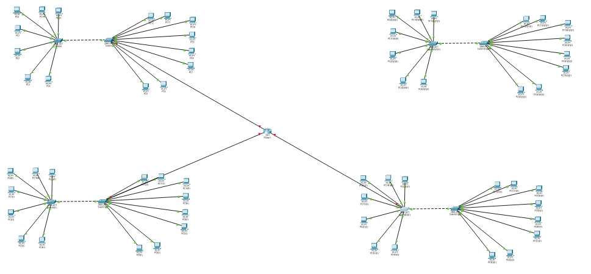
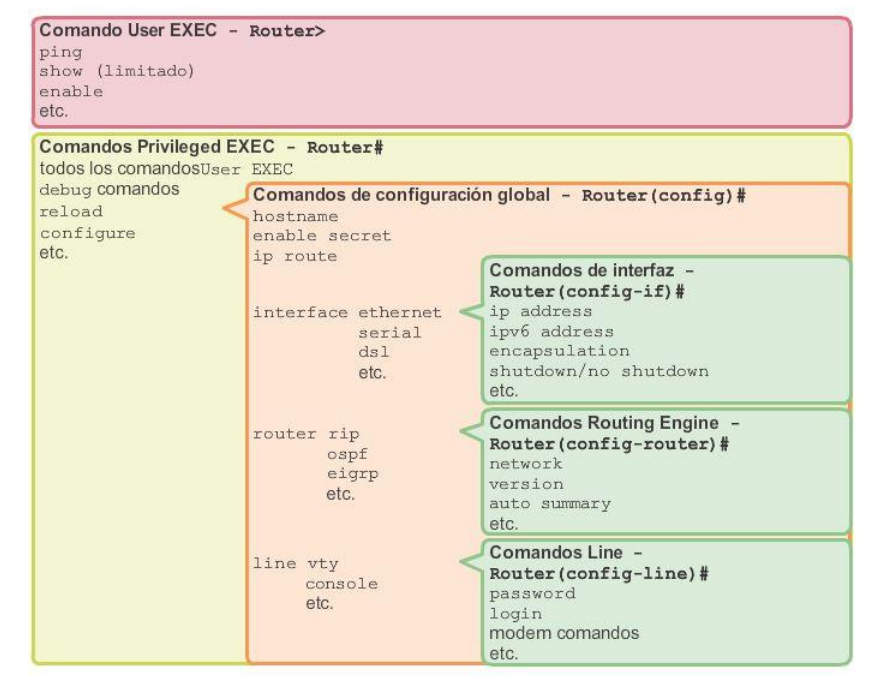
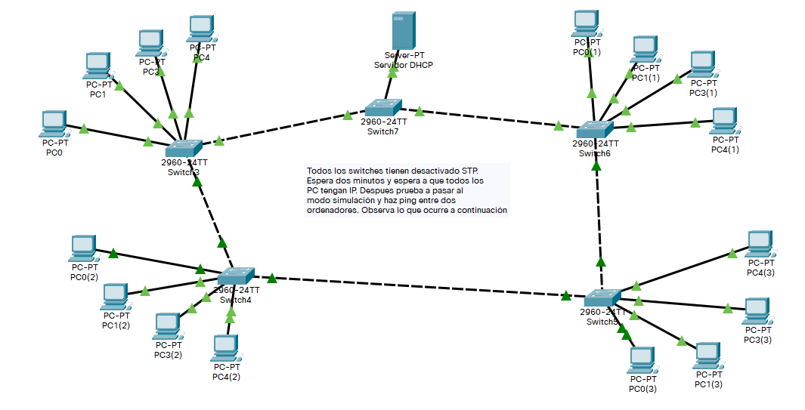

Tema 3:Configuración y administración de conmutadores
=======================================================

Segmentación de la red.
----------------------------
En primer lugar analicemos una red grande.

.. figure:: 01-red-grande.png

En una red como la que mostramos, puede haber muchos enviando y recibiendo a la vez. ¿Qué ocurre si un nodo genera una difusión? En redes tan grandes, la cantidad de "perjudicados" por una difusión, aumenta mucho. De hecho aumenta más cuanto más ordenadores hay en un switch.

Ventajas que presenta.
----------------------------

En este sentido, los switches pueden ayudar a aliviar problemas de congestión usandolos como divisores de redes. Una red grande se puede dividir en dos redes más pequeñas y mejorar el rendimiento. Por desgracia esto implica dos cosas:

* Coste. Donde antes había un switch ahora hay dos.
* Trabajo. Recablear toda una sala es algo lento.

Conmutadores y dominios de colisión y "broadcast".
--------------------------------------------------------------------------
Se denomina "dominio de colisión" al conjunto de máquinas que pertenecen a un mismo enlace o red local y en el que una de esas máquinas puede perjudicar a las demás sin querer.

Se denomina "dominio de broadcast" al conjunto de máquinas en las que UNA DIFUSIÓN IP (es decir, un paquete en el que la IP de destino es algo como 192.168.1.255) puede perjudicar a las demás sin querer. Un dominio de broadcast puede abarcar muchas redes Ethernet, o lo que es lo mismo, un dominio de broadcast puede abarcar muchos dominios de colisión. En la imagen siguiente puede verse una red muy grande compuesta por varias redes más pequeñas. Una difusión IP generada por una máquina cualquiera *podría ser recibida por todos los equipos de esa red*

Formas de conexión al conmutador para su configuración.
---------------------------------------------------------------

Cables 
~~~~~~~~~~~~~~
Los switches Cisco aceptan varios tipos de cable para conectar un PC con ellos y enviarles comandos:

1. Cable de red típico. Muchos switches por defecto **traen deshabilitado el acceso por medio de este tipo de cable**.
2. Cable de consola.
3. Cable auxiliar. Cada vez menos utilizado.

Protocolos
~~~~~~~~~~~~~~~

* Telnet: un protocolo muy simple que **no cifra los datos**
* SSH: es el que debería usarse siempre porque entre otras ventajas SSH **cifra datos**.

Práctica: intercepción de contraseñas.
~~~~~~~~~~~~~~~~~~~~~~~~~~~~~~~~~~~~~~

Descarga Putty en tu Windows e instala los siguientes páquetes en tu máquina virtual Ubuntu::

    sudo apt-get update -y
    sudo apt-get install wireshark openssh-server telnetd

Ve a tu máquina Ubuntu y crea un usuario para él que además pertenezca al grupo administrador (grupo ``sudo``). Usa estos comandos::

    sudo adduser pepe
    sudo usermod -a -G sudo pepe

Asegúrate de tener la tarjeta de tu máquina virtual en modo puente, arranca Wireshark y despues pide a tu compañero que use tanto Telnet como SSH para conectar con tu máquina. Intenta ver como envía la contraseña.

Configuración del conmutador.
--------------------------------

El sistema operativo IOS
~~~~~~~~~~~~~~~~~~~~~~~~~~~~~~~

IOS es el S.O de Cisco se maneja fundamentalmente por comandos. Sin embargo, cuando encendemos un switch/router por primera vez, no es posible acceder a ese sistema. Necesitamos proporcionar una configuración inicial. Y para ello, usaremos casi con toda seguridad el cable de consola.

El cable de consola es un cable propio de Cisco y por un lado usa una conexión propia de Cisco y en el otro extremos puede ser:

* USB (hoy en día lo más probable)
* RS-232 (aún muy utilizado, pero está cayendo en desuso)
* RJ-45 (depende del dispositivo)

Para acceder al sistema operativo necesitaremos un ordenador en el que haya algún programa de tipo "Terminal". Este programa enviará los datos directamente al dispositivo (sin direcciones de origen ni de destino ni nada). Es vital saber qué velocidades acepta el dispositivo al que nos conectamos. En el caso Cisco, es casi sin excepción:

* Velocidad: 9600 bits por segundo.
* Tamaño de los caracteres de datos: 8 bits.
* Paridad. Es un mecanismo de comprobación de comprobación de errores. Los dispositivos Cisco no usan paridad.
* Bits de stop. En Cisco se usa 1 bits de stop.
* Control de flujo/velocidad. No se usará ninguno.

En ocasiones se puede ver algo como 96008N1N. Esto significa "9600 bits/seg", "8 bits de datos", "No paridad", "1 bit de stop" y "No control de flujo".

Una vez que tenemos acceso al sistema operativo, debemos recordar que IOS es un sistema operativo modal.

1. El sistema operativo arranca en modo usuario. En ese modo lo único que se suele poder hacer es "visualizar", pero no "cambiar" ni "configurar". En suma, se usa el comando "show"
2. Para pasar al modo "privilegiado" se usa el comando ``enable``. Lo normal es que dicho modo tenga una clave. Para volver al modo usuario podemos usar ``disable``.
3. Para pasar al modo "configuración" se usa ``configure terminal`` desde el modo privilegiado.

La figura siguiente, tomada de Cisco, muestra los distintos modos:

El modo usuario
~~~~~~~~~~~~~~~~~

En este modo solo se pueden usar unos pocos comandos show. Por ejemplo:

* ``show interfaces`` muestra la información de todos los interfaces.
* ``show interfaces Fastethernet 0/1`` muestra solo la tarjeta 0/1

Modo privilegiado
~~~~~~~~~~~~~~~~~~

Comandos muy típicos:

* ``show running-config`` muestra la configuración en RAM.
* ``show startup-config`` muestra la configuración de arranque.
* ``show version``
* ``copy running-config startup-config``.

Modo de configuración global:
~~~~~~~~~~~~~~~~~~~~~~~~~~~~~~

* ``hostname <nombre>``

Configuración de contraseñas
~~~~~~~~~~~~~~~~~~~~~~~~~~~~~~~~~~

Se puede poner contraseña a un montón de elementos:

* Contraseña al cable de consola.
* Contraseña de administrador para el modo privilegiado. 
* Contraseña al telnet.
* Contraseña SSH.
* Contraseña al puerto auxiliar.

Para poner contraseña a la conexión por cable de consola::

    Switch>enable
    Switch#configure terminal    
    Switch(config)#line console 0
    Switch(config-line)#password sesamo1234
    Switch(config-line)#login

Para poner una clave al modo de administrador::

    Switch>enable
    Switch#configure terminal
    Switch(config)#enable secret Admin1234!
    Switch(config)#exit
    Switch#copy running-config startup-config
    Switch#reload

.. WARNING::

   En muchos foros, manuales, tutoriales, vídeos se indica que el comando es "enable password" en lugar de "enable secret". Hace mucho tiempo que eso no es verdad. El comando Cisco fue durante mucho tiempo "enable password" y de hecho **el comando sigue funcionando**. Sin embargo, ``enable password`` guarda las claves en la memoria **SIN CIFRAR**.

Poner una IP de gestión a un switch
--------------------------------------

Los comandos serían algo como esto::

    #Nos convertimos en administrador
    Switch>enable
    #Pasamos al modo de configuración global
    Switch#configure terminal    
    #Entramos en la VLAN nativa
    Switch(config)#interface vlan 1
    #Ponemos una IP
    Switch(config-if)#ip address 192.168.1.2 255.255.255.0
    #Y activamos este interfaz
    Switch(config-if)#no shutdown

Para poner contraseña a Telnet y SSH el procedimiento es bastante parecido::

    #Nos convertimos en administrador
    Switch>enable
    #Pasamos al modo de configuración global
    Switch#configure terminal    
    #Seleccionamos las conexiones
    Switch(config)#line vty 0 15
    #Ponemos una clave de acceso a estas conexiones
    password clave1234!
    #Con esto se exigirá el uso de la clave
    login

Para SSH hay que hacer dos cosas:

1. Generar las claves del nodo.
2. Configurar el acceso ssh.

Configurar claves públicas de un nodo
~~~~~~~~~~~~~~~~~~~~~~~~~~~~~~~~~~~~~~~
Los comandos serían estos::

    ip domain-name midominio.com
    crypto key generate rsa general-keys modulus 2048

Configurar el acceso SSH
~~~~~~~~~~~~~~~~~~~~~~~~~~~~~~~~~~~~~~~~
Una vez dado el paso anterior haríamos esto::

    username admin-ssh secret clavessh1234
    line vty 0 15
    login local
    transport input ssh
    exit

Configuración estática y dinámica de la tabla de direcciones MAC.
------------------------------------------------------------------

Recordatorio de ARP y funcionamiento de switches
~~~~~~~~~~~~~~~~~~~~~~~~~~~~~~~~~~~~~~~~~~~~~~~~~

Los ordenadores no envían datos directamente a una dirección IP. Primero averiguan la dirección MAC del destinatario y despues envian los datos a esa MAC.

Para averiguar la MAC los ordenadores hacen preguntas según un protocolo que llamábamos ARP. Esas preguntas implican difusiones y sabemos que las difusiones son malas para el rendimiento.

Para evitar tantas difusiones los switches pueden "aprender". Usan una tabla en RAM llamada "tabla de MACS" para intentar enviar cada paquete solo al destinatario y así ahorrar difusiones.

Ver la tabla de MACs
~~~~~~~~~~~~~~~~~~~~~~~~

Es posible examinar el estado actual de la tabla de MACS en memoria usando el comando ``show mac-address-table``.

Borrado de la tabla de MACs
~~~~~~~~~~~~~~~~~~~~~~~~~~~~~~~
Para borrar la tabla podemos usar el comando ``clear mac-address-table``

Configuración del "timeout" en la tabla de MACs
~~~~~~~~~~~~~~~~~~~~~~~~~~~~~~~~~~~~~~~~~~~~~~~~~
Técnicamente el nombre es "aging" (envejecimiento) pero es muy frecuente oír simplemente "timeout de una entrada".

Para configurar el "timeout" se debe pasar al modo de configuración global y despues entrar en la VLAN para la que queramos cambiar el tiempo. Por ahora no hablaremos de VLAN y usaremos la VLAN por defecto en todos los casos, que es la VLAN 1. Así, por ejemplo, para cambiar el tiempo que mantenemos algo en la caché ARP a 60 segundos usaremos esto::

    enable
    configure terminal
    interface vlan 1
    arp timeout 60
    no shutdown

Asignación estática de una MAC a un puerto
~~~~~~~~~~~~~~~~~~~~~~~~~~~~~~~~~~~~~~~~~~~~~
Hay que recordar que en este comando se debe usar obligatoriamente la VLAN. Si no hemos creado ninguna se usa la VLAN por defecto que es la 1. Si por ejemplo queremos indicar que una cierta MAC va enganchada a un cierto puerto podemos usar::

    mac address-table static 00aa.1122.ccdd vlan 1 interface fastethernet 0/3

Borrado de una entrada MAC en la tabla del switch
~~~~~~~~~~~~~~~~~~~~~~~~~~~~~~~~~~~~~~~~~~~~~~~~~~~~~
Es tan sencillo como "negar" el comando anterior. Es decir, tecleamos lo mismo pero poniendo delante un ``no``::

    no mac address-table static 00aa.1122.ccdd vlan 1 interface fastethernet 0/3

Diagnóstico de incidencias del conmutador.
------------------------------------------------------------------
En general se puede usar el comando ``show`` en el modo administrador para acceder a diversa información de interés. Así, por ejemplo el comando ``show interfaces`` nos muestra **todos los interfaces uno por uno** con estadísticas detalladas de uso, incluyendo errores que haya podido haber. A continuación se muestra un ejemplo de resultado (solo se muestra un interfaz)::

    FastEthernet0/1 is up, line protocol is up (connected)
    Hardware is Lance, address is 0090.0cad.ae01 (bia 0090.0cad.ae01)
    BW 100000 Kbit, DLY 1000 usec,
        reliability 255/255, txload 1/255, rxload 1/255
    Encapsulation ARPA, loopback not set
    Keepalive set (10 sec)
    Full-duplex, 100Mb/s
    input flow-control is off, output flow-control is off
    ARP type: ARPA, ARP Timeout 04:00:00
    Last input 00:00:08, output 00:00:05, output hang never
    Last clearing of "show interface" counters never
    Input queue: 0/75/0/0 (size/max/drops/flushes); Total output drops: 0
    Queueing strategy: fifo
    Output queue :0/40 (size/max)
    5 minute input rate 0 bits/sec, 0 packets/sec
    5 minute output rate 0 bits/sec, 0 packets/sec
        956 packets input, 193351 bytes, 0 no buffer
        Received 956 broadcasts, 0 runts, 0 giants, 0 throttles
        0 input errors, 0 CRC, 0 frame, 0 overrun, 0 ignored, 0 abort
        0 watchdog, 0 multicast, 0 pause input
        0 input packets with dribble condition detected
        2357 packets output, 263570 bytes, 0 underruns
        0 output errors, 0 collisions, 10 interface resets
        0 babbles, 0 late collision, 0 deferred
        0 lost carrier, 0 no carrier
        0 output buffer failures, 0 output buffers swapped out

Las tormentas de "broadcast".
------------------------------------------------------------------
Las tormentas de paquetes ocurren cuando se dan estas dos condiciones:

1. Se ha formado un ciclo al intentar interconectar salas.
2. Usamos switches de gama baja o si los hemos puesto de gama alta tienen desactivado STP (explicaremos lo que es un poco más abajo)

Observemos la figura siguiente:

Supongamos que está todo recién encendido y un equipo intenta enviar un simple ``ping`` a otro. Ese ``ping`` tendrá que hacer una difusión ARP

El protocolo Spanning-Tree.
------------------------------------------------------------------