Ejercicios de STP
==========================

Ejercicio STP 1
-----------------------------------------------
Indicar el estado final en que quedará una red de switches que ejecutan STP. Ten en cuenta que el número de un switch es *irrelevante.* Lo que importa son las prioridades y las MAC más pequeñas. Las prioridades de los switches son:

* Switch 1, prioridad 7
* Switch 2, prioridad 5
* Switch 3, prioridad 8
* Switch 4, prioridad 6
* Switch 5, prioridad 7

Las conexiones entre switches son:

* Conexion desde el Switch 5, prioridad 7 con MAC 43 a la MAC 97 de Switch 2, prioridad 5 
* Conexion desde el Switch 2, prioridad 5 con MAC 2d a la MAC 26 de Switch 3, prioridad 8 
* Conexion desde el Switch 3, prioridad 8 con MAC e8 a la MAC 39 de Switch 4, prioridad 6 
* Conexion desde el Switch 4, prioridad 6 con MAC a6 a la MAC 57 de Switch 1, prioridad 7 
* Conexion desde el Switch 5, prioridad 7 con MAC 12 a la MAC 6f de Switch 4, prioridad 6 
* Conexion desde el Switch 2, prioridad 5 con MAC 7e a la MAC f6 de Switch 1, prioridad 7 

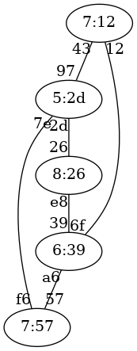

   Ejercicio 1 de STP

Solución al ejercicio STP 1
-----------------------------------------------

Switch raíz 5:2d

A continuación se indica cada switch con el formato prioridad:mac-mas-baja junto al estado de sus puertos.

7:57, distancia a raíz:1

* Puerto 57, estado Designado
* Puerto f6, estado Raiz

5:2d, distancia a raíz:0

* Puerto 97, estado Designado
* Puerto 2d, estado Designado
* Puerto 7e, estado Designado

8:26, distancia a raíz:1

* Puerto 26, estado Raiz
* Puerto e8, estado Designado

6:39, distancia a raíz:2

* Puerto 39, estado Raiz
* Puerto a6, estado Bloqueado
* Puerto 6f, estado Bloqueado

7:12, distancia a raíz:1

* Puerto 43, estado Raiz
* Puerto 12, estado Designado

Ejercicio STP 2
-----------------------------------------------
Indicar el estado final en que quedará una red de switches que ejecutan STP. Ten en cuenta que el número de un switch es *irrelevante.* Lo que importa son las prioridades y las MAC más pequeñas. Las prioridades de los switches son:

* Switch 1, prioridad 2
* Switch 2, prioridad 2
* Switch 3, prioridad 1
* Switch 4, prioridad 7
* Switch 5, prioridad 2

Las conexiones entre switches son:

* Conexion desde el Switch 1, prioridad 2 con MAC 41 a la MAC 13 de Switch 2, prioridad 2 
* Conexion desde el Switch 2, prioridad 2 con MAC b5 a la MAC de de Switch 3, prioridad 1 
* Conexion desde el Switch 3, prioridad 1 con MAC d5 a la MAC 97 de Switch 5, prioridad 2 
* Conexion desde el Switch 5, prioridad 2 con MAC aa a la MAC a7 de Switch 4, prioridad 7 
* Conexion desde el Switch 4, prioridad 7 con MAC 85 a la MAC 67 de Switch 1, prioridad 2 
* Conexion desde el Switch 2, prioridad 2 con MAC 27 a la MAC 20 de Switch 5, prioridad 2 

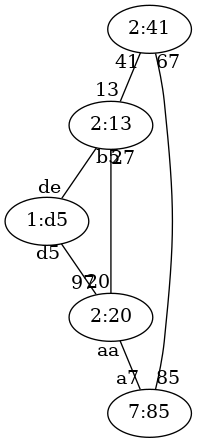

   Ejercicio 2 de STP

Solución al ejercicio STP 2
-----------------------------------------------

Switch raíz 1:d5

A continuación se indica cada switch con el formato prioridad:mac-mas-baja junto al estado de sus puertos.

2:41, distancia a raíz:2

* Puerto 41, estado Raiz
* Puerto 67, estado Designado

2:13, distancia a raíz:1

* Puerto 13, estado Designado
* Puerto b5, estado Raiz
* Puerto 27, estado Bloqueado

1:d5, distancia a raíz:0

* Puerto de, estado Designado
* Puerto d5, estado Designado

7:85, distancia a raíz:2

* Puerto a7, estado Raiz
* Puerto 85, estado Bloqueado

2:20, distancia a raíz:1

* Puerto 97, estado Raiz
* Puerto aa, estado Designado
* Puerto 20, estado Designado

Ejercicio STP 3
-----------------------------------------------
Indicar el estado final en que quedará una red de switches que ejecutan STP. Ten en cuenta que el número de un switch es *irrelevante.* Lo que importa son las prioridades y las MAC más pequeñas. Las prioridades de los switches son:

* Switch 1, prioridad 2
* Switch 2, prioridad 7
* Switch 3, prioridad 6
* Switch 4, prioridad 5
* Switch 5, prioridad 6

Las conexiones entre switches son:

* Conexion desde el Switch 3, prioridad 6 con MAC 38 a la MAC 9e de Switch 2, prioridad 7 
* Conexion desde el Switch 2, prioridad 7 con MAC 85 a la MAC 9c de Switch 1, prioridad 2 
* Conexion desde el Switch 1, prioridad 2 con MAC d9 a la MAC 5b de Switch 4, prioridad 5 
* Conexion desde el Switch 4, prioridad 5 con MAC 48 a la MAC c4 de Switch 5, prioridad 6 
* Conexion desde el Switch 1, prioridad 2 con MAC 13 a la MAC 53 de Switch 5, prioridad 6 
* Conexion desde el Switch 3, prioridad 6 con MAC db a la MAC 42 de Switch 1, prioridad 2 

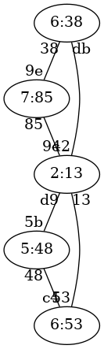

   Ejercicio 3 de STP

Solución al ejercicio STP 3
-----------------------------------------------

Switch raíz 2:13

A continuación se indica cada switch con el formato prioridad:mac-mas-baja junto al estado de sus puertos.

2:13, distancia a raíz:0

* Puerto 9c, estado Designado
* Puerto d9, estado Designado
* Puerto 13, estado Designado
* Puerto 42, estado Designado

7:85, distancia a raíz:1

* Puerto 9e, estado Bloqueado
* Puerto 85, estado Raiz

6:38, distancia a raíz:1

* Puerto 38, estado Designado
* Puerto db, estado Raiz

5:48, distancia a raíz:1

* Puerto 5b, estado Raiz
* Puerto 48, estado Designado

6:53, distancia a raíz:1

* Puerto c4, estado Bloqueado
* Puerto 53, estado Raiz

Ejercicio STP 4
-----------------------------------------------
Indicar el estado final en que quedará una red de switches que ejecutan STP. Ten en cuenta que el número de un switch es *irrelevante.* Lo que importa son las prioridades y las MAC más pequeñas. Las prioridades de los switches son:

* Switch 1, prioridad 8
* Switch 2, prioridad 1
* Switch 3, prioridad 5
* Switch 4, prioridad 5
* Switch 5, prioridad 8

Las conexiones entre switches son:

* Conexion desde el Switch 1, prioridad 8 con MAC f0 a la MAC cc de Switch 2, prioridad 1 
* Conexion desde el Switch 2, prioridad 1 con MAC 32 a la MAC 9e de Switch 5, prioridad 8 
* Conexion desde el Switch 5, prioridad 8 con MAC 70 a la MAC 7e de Switch 3, prioridad 5 
* Conexion desde el Switch 3, prioridad 5 con MAC aa a la MAC b4 de Switch 4, prioridad 5 
* Conexion desde el Switch 3, prioridad 5 con MAC dc a la MAC e6 de Switch 2, prioridad 1 
* Conexion desde el Switch 2, prioridad 1 con MAC 31 a la MAC 65 de Switch 4, prioridad 5 

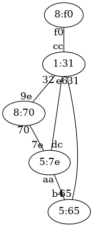

   Ejercicio 4 de STP

Solución al ejercicio STP 4
-----------------------------------------------

Switch raíz 1:31

A continuación se indica cada switch con el formato prioridad:mac-mas-baja junto al estado de sus puertos.

8:f0, distancia a raíz:1

* Puerto f0, estado Raiz

1:31, distancia a raíz:0

* Puerto cc, estado Designado
* Puerto 32, estado Designado
* Puerto e6, estado Designado
* Puerto 31, estado Designado

5:7e, distancia a raíz:1

* Puerto 7e, estado Bloqueado
* Puerto aa, estado Designado
* Puerto dc, estado Raiz

5:65, distancia a raíz:1

* Puerto b4, estado Bloqueado
* Puerto 65, estado Raiz

8:70, distancia a raíz:1

* Puerto 9e, estado Raiz
* Puerto 70, estado Designado

Ejercicio STP 5
-----------------------------------------------
Indicar el estado final en que quedará una red de switches que ejecutan STP. Ten en cuenta que el número de un switch es *irrelevante.* Lo que importa son las prioridades y las MAC más pequeñas. Las prioridades de los switches son:

* Switch 1, prioridad 5
* Switch 2, prioridad 7
* Switch 3, prioridad 3
* Switch 4, prioridad 5
* Switch 5, prioridad 7

Las conexiones entre switches son:

* Conexion desde el Switch 1, prioridad 5 con MAC dd a la MAC ea de Switch 4, prioridad 5 
* Conexion desde el Switch 4, prioridad 5 con MAC ef a la MAC 9b de Switch 2, prioridad 7 
* Conexion desde el Switch 2, prioridad 7 con MAC e7 a la MAC 42 de Switch 3, prioridad 3 
* Conexion desde el Switch 3, prioridad 3 con MAC 6f a la MAC ac de Switch 5, prioridad 7 
* Conexion desde el Switch 5, prioridad 7 con MAC fa a la MAC 4f de Switch 4, prioridad 5 
* Conexion desde el Switch 5, prioridad 7 con MAC c2 a la MAC 3a de Switch 1, prioridad 5 

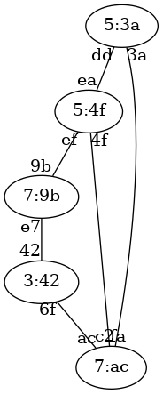

   Ejercicio 5 de STP

Solución al ejercicio STP 5
-----------------------------------------------

Switch raíz 3:42

A continuación se indica cada switch con el formato prioridad:mac-mas-baja junto al estado de sus puertos.

5:3a, distancia a raíz:2

* Puerto dd, estado Designado
* Puerto 3a, estado Raiz

7:9b, distancia a raíz:1

* Puerto 9b, estado Designado
* Puerto e7, estado Raiz

3:42, distancia a raíz:0

* Puerto 42, estado Designado
* Puerto 6f, estado Designado

5:4f, distancia a raíz:2

* Puerto ea, estado Bloqueado
* Puerto ef, estado Bloqueado
* Puerto 4f, estado Raiz

7:ac, distancia a raíz:1

* Puerto ac, estado Raiz
* Puerto fa, estado Designado
* Puerto c2, estado Designado

Ejercicio STP 6
-----------------------------------------------
Indicar el estado final en que quedará una red de switches que ejecutan STP. Ten en cuenta que el número de un switch es *irrelevante.* Lo que importa son las prioridades y las MAC más pequeñas. Las prioridades de los switches son:

* Switch 1, prioridad 1
* Switch 2, prioridad 7
* Switch 3, prioridad 5
* Switch 4, prioridad 5
* Switch 5, prioridad 7

Las conexiones entre switches son:

* Conexion desde el Switch 2, prioridad 7 con MAC 96 a la MAC 20 de Switch 1, prioridad 1 
* Conexion desde el Switch 1, prioridad 1 con MAC 12 a la MAC 4b de Switch 4, prioridad 5 
* Conexion desde el Switch 4, prioridad 5 con MAC 36 a la MAC 90 de Switch 5, prioridad 7 
* Conexion desde el Switch 5, prioridad 7 con MAC 66 a la MAC 44 de Switch 3, prioridad 5 
* Conexion desde el Switch 2, prioridad 7 con MAC df a la MAC e3 de Switch 4, prioridad 5 
* Conexion desde el Switch 3, prioridad 5 con MAC ea a la MAC 59 de Switch 4, prioridad 5 

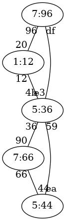

   Ejercicio 6 de STP

Solución al ejercicio STP 6
-----------------------------------------------

Switch raíz 1:12

A continuación se indica cada switch con el formato prioridad:mac-mas-baja junto al estado de sus puertos.

1:12, distancia a raíz:0

* Puerto 20, estado Designado
* Puerto 12, estado Designado

7:96, distancia a raíz:1

* Puerto 96, estado Raiz
* Puerto df, estado Designado

5:44, distancia a raíz:2

* Puerto 44, estado Designado
* Puerto ea, estado Raiz

5:36, distancia a raíz:1

* Puerto 4b, estado Raiz
* Puerto 36, estado Designado
* Puerto e3, estado Bloqueado
* Puerto 59, estado Designado

7:66, distancia a raíz:2

* Puerto 90, estado Raiz
* Puerto 66, estado Bloqueado

Ejercicio STP 7
-----------------------------------------------
Indicar el estado final en que quedará una red de switches que ejecutan STP. Ten en cuenta que el número de un switch es *irrelevante.* Lo que importa son las prioridades y las MAC más pequeñas. Las prioridades de los switches son:

* Switch 1, prioridad 8
* Switch 2, prioridad 6
* Switch 3, prioridad 8
* Switch 4, prioridad 6
* Switch 5, prioridad 1

Las conexiones entre switches son:

* Conexion desde el Switch 4, prioridad 6 con MAC 1e a la MAC d3 de Switch 1, prioridad 8 
* Conexion desde el Switch 1, prioridad 8 con MAC bb a la MAC bf de Switch 2, prioridad 6 
* Conexion desde el Switch 2, prioridad 6 con MAC 6c a la MAC 73 de Switch 5, prioridad 1 
* Conexion desde el Switch 5, prioridad 1 con MAC 1a a la MAC 23 de Switch 3, prioridad 8 
* Conexion desde el Switch 3, prioridad 8 con MAC d9 a la MAC 90 de Switch 1, prioridad 8 
* Conexion desde el Switch 5, prioridad 1 con MAC 74 a la MAC c8 de Switch 1, prioridad 8 

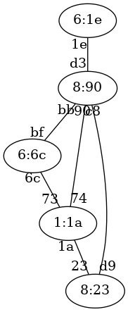

   Ejercicio 7 de STP

Solución al ejercicio STP 7
-----------------------------------------------

Switch raíz 1:1a

A continuación se indica cada switch con el formato prioridad:mac-mas-baja junto al estado de sus puertos.

8:90, distancia a raíz:1

* Puerto d3, estado Designado
* Puerto bb, estado Designado
* Puerto 90, estado Designado
* Puerto c8, estado Raiz

6:6c, distancia a raíz:1

* Puerto bf, estado Bloqueado
* Puerto 6c, estado Raiz

8:23, distancia a raíz:1

* Puerto 23, estado Raiz
* Puerto d9, estado Bloqueado

6:1e, distancia a raíz:2

* Puerto 1e, estado Raiz

1:1a, distancia a raíz:0

* Puerto 73, estado Designado
* Puerto 1a, estado Designado
* Puerto 74, estado Designado

Ejercicio STP 8
-----------------------------------------------
Indicar el estado final en que quedará una red de switches que ejecutan STP. Ten en cuenta que el número de un switch es *irrelevante.* Lo que importa son las prioridades y las MAC más pequeñas. Las prioridades de los switches son:

* Switch 1, prioridad 3
* Switch 2, prioridad 2
* Switch 3, prioridad 7
* Switch 4, prioridad 5
* Switch 5, prioridad 6

Las conexiones entre switches son:

* Conexion desde el Switch 5, prioridad 6 con MAC 78 a la MAC f5 de Switch 1, prioridad 3 
* Conexion desde el Switch 1, prioridad 3 con MAC 8b a la MAC fd de Switch 3, prioridad 7 
* Conexion desde el Switch 3, prioridad 7 con MAC ed a la MAC c1 de Switch 4, prioridad 5 
* Conexion desde el Switch 4, prioridad 5 con MAC a4 a la MAC f6 de Switch 2, prioridad 2 
* Conexion desde el Switch 1, prioridad 3 con MAC 92 a la MAC 87 de Switch 2, prioridad 2 
* Conexion desde el Switch 2, prioridad 2 con MAC 8f a la MAC 6a de Switch 3, prioridad 7 

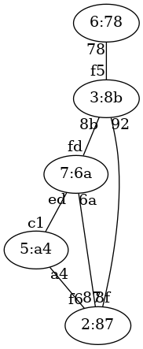

   Ejercicio 8 de STP

Solución al ejercicio STP 8
-----------------------------------------------

Switch raíz 2:87

A continuación se indica cada switch con el formato prioridad:mac-mas-baja junto al estado de sus puertos.

3:8b, distancia a raíz:1

* Puerto f5, estado Designado
* Puerto 8b, estado Designado
* Puerto 92, estado Raiz

2:87, distancia a raíz:0

* Puerto f6, estado Designado
* Puerto 87, estado Designado
* Puerto 8f, estado Designado

7:6a, distancia a raíz:1

* Puerto fd, estado Bloqueado
* Puerto ed, estado Bloqueado
* Puerto 6a, estado Raiz

5:a4, distancia a raíz:1

* Puerto c1, estado Designado
* Puerto a4, estado Raiz

6:78, distancia a raíz:2

* Puerto 78, estado Raiz

Ejercicio STP 9
-----------------------------------------------
Indicar el estado final en que quedará una red de switches que ejecutan STP. Ten en cuenta que el número de un switch es *irrelevante.* Lo que importa son las prioridades y las MAC más pequeñas. Las prioridades de los switches son:

* Switch 1, prioridad 1
* Switch 2, prioridad 4
* Switch 3, prioridad 7
* Switch 4, prioridad 5
* Switch 5, prioridad 8

Las conexiones entre switches son:

* Conexion desde el Switch 1, prioridad 1 con MAC 83 a la MAC 5f de Switch 4, prioridad 5 
* Conexion desde el Switch 4, prioridad 5 con MAC de a la MAC b6 de Switch 5, prioridad 8 
* Conexion desde el Switch 5, prioridad 8 con MAC 58 a la MAC ab de Switch 2, prioridad 4 
* Conexion desde el Switch 2, prioridad 4 con MAC 7e a la MAC 82 de Switch 3, prioridad 7 
* Conexion desde el Switch 1, prioridad 1 con MAC 25 a la MAC 14 de Switch 2, prioridad 4 
* Conexion desde el Switch 4, prioridad 5 con MAC cc a la MAC 97 de Switch 3, prioridad 7 

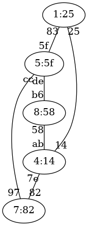

   Ejercicio 9 de STP

Solución al ejercicio STP 9
-----------------------------------------------

Switch raíz 1:25

A continuación se indica cada switch con el formato prioridad:mac-mas-baja junto al estado de sus puertos.

1:25, distancia a raíz:0

* Puerto 83, estado Designado
* Puerto 25, estado Designado

4:14, distancia a raíz:1

* Puerto ab, estado Designado
* Puerto 7e, estado Designado
* Puerto 14, estado Raiz

7:82, distancia a raíz:2

* Puerto 82, estado Raiz
* Puerto 97, estado Bloqueado

5:5f, distancia a raíz:1

* Puerto 5f, estado Raiz
* Puerto de, estado Designado
* Puerto cc, estado Designado

8:58, distancia a raíz:2

* Puerto b6, estado Bloqueado
* Puerto 58, estado Raiz

Ejercicio STP 11
-----------------------------------------------
Indicar el estado final en que quedará una red de switches que ejecutan STP. Ten en cuenta que el número de un switch es *irrelevante.* Lo que importa son las prioridades y las MAC más pequeñas. Las prioridades de los switches son:

* Switch 1, prioridad 7
* Switch 2, prioridad 2
* Switch 3, prioridad 2
* Switch 4, prioridad 8
* Switch 5, prioridad 6
* Switch 6, prioridad 3

Las conexiones entre switches son:

* Conexion desde el Switch 1, prioridad 7 con MAC 7b a la MAC 8c de Switch 3, prioridad 2 
* Conexion desde el Switch 3, prioridad 2 con MAC 3a a la MAC 92 de Switch 4, prioridad 8 
* Conexion desde el Switch 4, prioridad 8 con MAC 55 a la MAC a1 de Switch 5, prioridad 6 
* Conexion desde el Switch 5, prioridad 6 con MAC d1 a la MAC 83 de Switch 6, prioridad 3 
* Conexion desde el Switch 6, prioridad 3 con MAC ce a la MAC 4b de Switch 2, prioridad 2 
* Conexion desde el Switch 1, prioridad 7 con MAC 22 a la MAC b3 de Switch 5, prioridad 6 
* Conexion desde el Switch 6, prioridad 3 con MAC c0 a la MAC 40 de Switch 1, prioridad 7 

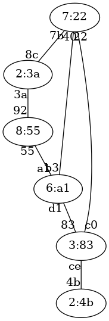

   Ejercicio 11 de STP

Solución al ejercicio STP 11
-----------------------------------------------

Switch raíz 2:3a

A continuación se indica cada switch con el formato prioridad:mac-mas-baja junto al estado de sus puertos.

7:22, distancia a raíz:1

* Puerto 7b, estado Raiz
* Puerto 22, estado Designado
* Puerto 40, estado Designado

2:4b, distancia a raíz:3

* Puerto 4b, estado Raiz

2:3a, distancia a raíz:0

* Puerto 8c, estado Designado
* Puerto 3a, estado Designado

8:55, distancia a raíz:1

* Puerto 92, estado Raiz
* Puerto 55, estado Designado

6:a1, distancia a raíz:2

* Puerto a1, estado Raiz
* Puerto d1, estado Bloqueado
* Puerto b3, estado Bloqueado

3:83, distancia a raíz:2

* Puerto 83, estado Designado
* Puerto ce, estado Designado
* Puerto c0, estado Raiz

Ejercicio STP 12
-----------------------------------------------
Indicar el estado final en que quedará una red de switches que ejecutan STP. Ten en cuenta que el número de un switch es *irrelevante.* Lo que importa son las prioridades y las MAC más pequeñas. Las prioridades de los switches son:

* Switch 1, prioridad 4
* Switch 2, prioridad 8
* Switch 3, prioridad 3
* Switch 4, prioridad 6
* Switch 5, prioridad 2
* Switch 6, prioridad 1

Las conexiones entre switches son:

* Conexion desde el Switch 4, prioridad 6 con MAC ee a la MAC 31 de Switch 3, prioridad 3 
* Conexion desde el Switch 3, prioridad 3 con MAC bd a la MAC 96 de Switch 1, prioridad 4 
* Conexion desde el Switch 1, prioridad 4 con MAC 49 a la MAC 68 de Switch 2, prioridad 8 
* Conexion desde el Switch 2, prioridad 8 con MAC ef a la MAC 4d de Switch 6, prioridad 1 
* Conexion desde el Switch 6, prioridad 1 con MAC 85 a la MAC b4 de Switch 5, prioridad 2 
* Conexion desde el Switch 2, prioridad 8 con MAC 12 a la MAC d9 de Switch 5, prioridad 2 
* Conexion desde el Switch 1, prioridad 4 con MAC 77 a la MAC b7 de Switch 6, prioridad 1 

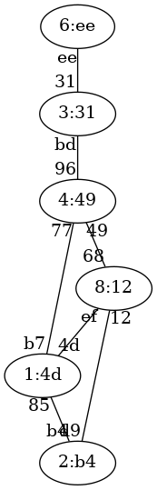

   Ejercicio 12 de STP

Solución al ejercicio STP 12
-----------------------------------------------

Switch raíz 1:4d

A continuación se indica cada switch con el formato prioridad:mac-mas-baja junto al estado de sus puertos.

4:49, distancia a raíz:1

* Puerto 96, estado Designado
* Puerto 49, estado Designado
* Puerto 77, estado Raiz

8:12, distancia a raíz:1

* Puerto 68, estado Bloqueado
* Puerto ef, estado Raiz
* Puerto 12, estado Designado

3:31, distancia a raíz:2

* Puerto 31, estado Designado
* Puerto bd, estado Raiz

6:ee, distancia a raíz:3

* Puerto ee, estado Raiz

2:b4, distancia a raíz:1

* Puerto b4, estado Raiz
* Puerto d9, estado Bloqueado

1:4d, distancia a raíz:0

* Puerto 4d, estado Designado
* Puerto 85, estado Designado
* Puerto b7, estado Designado

Ejercicio STP 13
-----------------------------------------------
Indicar el estado final en que quedará una red de switches que ejecutan STP. Ten en cuenta que el número de un switch es *irrelevante.* Lo que importa son las prioridades y las MAC más pequeñas. Las prioridades de los switches son:

* Switch 1, prioridad 6
* Switch 2, prioridad 5
* Switch 3, prioridad 2
* Switch 4, prioridad 1
* Switch 5, prioridad 3
* Switch 6, prioridad 4

Las conexiones entre switches son:

* Conexion desde el Switch 2, prioridad 5 con MAC 43 a la MAC ee de Switch 3, prioridad 2 
* Conexion desde el Switch 3, prioridad 2 con MAC 70 a la MAC de de Switch 1, prioridad 6 
* Conexion desde el Switch 1, prioridad 6 con MAC 5c a la MAC d0 de Switch 4, prioridad 1 
* Conexion desde el Switch 4, prioridad 1 con MAC 83 a la MAC 4f de Switch 5, prioridad 3 
* Conexion desde el Switch 5, prioridad 3 con MAC e4 a la MAC cb de Switch 6, prioridad 4 
* Conexion desde el Switch 3, prioridad 2 con MAC dc a la MAC 57 de Switch 4, prioridad 1 
* Conexion desde el Switch 4, prioridad 1 con MAC e6 a la MAC 74 de Switch 6, prioridad 4 

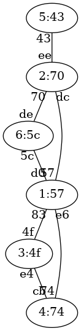

   Ejercicio 13 de STP

Solución al ejercicio STP 13
-----------------------------------------------

Switch raíz 1:57

A continuación se indica cada switch con el formato prioridad:mac-mas-baja junto al estado de sus puertos.

6:5c, distancia a raíz:1

* Puerto de, estado Bloqueado
* Puerto 5c, estado Raiz

5:43, distancia a raíz:2

* Puerto 43, estado Raiz

2:70, distancia a raíz:1

* Puerto ee, estado Designado
* Puerto 70, estado Designado
* Puerto dc, estado Raiz

1:57, distancia a raíz:0

* Puerto d0, estado Designado
* Puerto 83, estado Designado
* Puerto 57, estado Designado
* Puerto e6, estado Designado

3:4f, distancia a raíz:1

* Puerto 4f, estado Raiz
* Puerto e4, estado Bloqueado

4:74, distancia a raíz:1

* Puerto cb, estado Designado
* Puerto 74, estado Raiz

Ejercicio STP 14
-----------------------------------------------
Indicar el estado final en que quedará una red de switches que ejecutan STP. Ten en cuenta que el número de un switch es *irrelevante.* Lo que importa son las prioridades y las MAC más pequeñas. Las prioridades de los switches son:

* Switch 1, prioridad 3
* Switch 2, prioridad 4
* Switch 3, prioridad 6
* Switch 4, prioridad 8
* Switch 5, prioridad 5
* Switch 6, prioridad 5

Las conexiones entre switches son:

* Conexion desde el Switch 2, prioridad 4 con MAC de a la MAC c3 de Switch 3, prioridad 6 
* Conexion desde el Switch 3, prioridad 6 con MAC 45 a la MAC 4e de Switch 5, prioridad 5 
* Conexion desde el Switch 5, prioridad 5 con MAC 11 a la MAC 8b de Switch 1, prioridad 3 
* Conexion desde el Switch 1, prioridad 3 con MAC 1a a la MAC 1c de Switch 6, prioridad 5 
* Conexion desde el Switch 6, prioridad 5 con MAC 64 a la MAC 50 de Switch 4, prioridad 8 
* Conexion desde el Switch 4, prioridad 8 con MAC 23 a la MAC 10 de Switch 5, prioridad 5 
* Conexion desde el Switch 5, prioridad 5 con MAC f1 a la MAC 36 de Switch 6, prioridad 5 

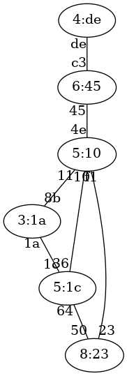

   Ejercicio 14 de STP

Solución al ejercicio STP 14
-----------------------------------------------

Switch raíz 3:1a

A continuación se indica cada switch con el formato prioridad:mac-mas-baja junto al estado de sus puertos.

3:1a, distancia a raíz:0

* Puerto 8b, estado Designado
* Puerto 1a, estado Designado

4:de, distancia a raíz:3

* Puerto de, estado Raiz

6:45, distancia a raíz:2

* Puerto c3, estado Designado
* Puerto 45, estado Raiz

8:23, distancia a raíz:2

* Puerto 50, estado Bloqueado
* Puerto 23, estado Raiz

5:10, distancia a raíz:1

* Puerto 4e, estado Designado
* Puerto 11, estado Raiz
* Puerto 10, estado Designado
* Puerto f1, estado Bloqueado

5:1c, distancia a raíz:1

* Puerto 1c, estado Raiz
* Puerto 64, estado Designado
* Puerto 36, estado Designado

Ejercicio STP 15
-----------------------------------------------
Indicar el estado final en que quedará una red de switches que ejecutan STP. Ten en cuenta que el número de un switch es *irrelevante.* Lo que importa son las prioridades y las MAC más pequeñas. Las prioridades de los switches son:

* Switch 1, prioridad 8
* Switch 2, prioridad 3
* Switch 3, prioridad 8
* Switch 4, prioridad 3
* Switch 5, prioridad 2
* Switch 6, prioridad 3

Las conexiones entre switches son:

* Conexion desde el Switch 6, prioridad 3 con MAC 9f a la MAC 9b de Switch 5, prioridad 2 
* Conexion desde el Switch 5, prioridad 2 con MAC 5e a la MAC 11 de Switch 4, prioridad 3 
* Conexion desde el Switch 4, prioridad 3 con MAC 4f a la MAC 89 de Switch 1, prioridad 8 
* Conexion desde el Switch 1, prioridad 8 con MAC 13 a la MAC cd de Switch 3, prioridad 8 
* Conexion desde el Switch 3, prioridad 8 con MAC f1 a la MAC 1c de Switch 2, prioridad 3 
* Conexion desde el Switch 6, prioridad 3 con MAC 4d a la MAC b6 de Switch 2, prioridad 3 
* Conexion desde el Switch 4, prioridad 3 con MAC a4 a la MAC be de Switch 6, prioridad 3 

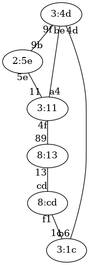

   Ejercicio 15 de STP

Solución al ejercicio STP 15
-----------------------------------------------

Switch raíz 2:5e

A continuación se indica cada switch con el formato prioridad:mac-mas-baja junto al estado de sus puertos.

8:13, distancia a raíz:2

* Puerto 89, estado Raiz
* Puerto 13, estado Designado

3:1c, distancia a raíz:2

* Puerto 1c, estado Designado
* Puerto b6, estado Raiz

8:cd, distancia a raíz:3

* Puerto cd, estado Raiz
* Puerto f1, estado Bloqueado

3:11, distancia a raíz:1

* Puerto 11, estado Raiz
* Puerto 4f, estado Designado
* Puerto a4, estado Designado

2:5e, distancia a raíz:0

* Puerto 9b, estado Designado
* Puerto 5e, estado Designado

3:4d, distancia a raíz:1

* Puerto 9f, estado Raiz
* Puerto 4d, estado Designado
* Puerto be, estado Bloqueado

Ejercicio STP 16
-----------------------------------------------
Indicar el estado final en que quedará una red de switches que ejecutan STP. Ten en cuenta que el número de un switch es *irrelevante.* Lo que importa son las prioridades y las MAC más pequeñas. Las prioridades de los switches son:

* Switch 1, prioridad 2
* Switch 2, prioridad 7
* Switch 3, prioridad 7
* Switch 4, prioridad 3
* Switch 5, prioridad 8
* Switch 6, prioridad 6

Las conexiones entre switches son:

* Conexion desde el Switch 5, prioridad 8 con MAC 9f a la MAC 60 de Switch 3, prioridad 7 
* Conexion desde el Switch 3, prioridad 7 con MAC 62 a la MAC c4 de Switch 2, prioridad 7 
* Conexion desde el Switch 2, prioridad 7 con MAC 1f a la MAC a3 de Switch 4, prioridad 3 
* Conexion desde el Switch 4, prioridad 3 con MAC 51 a la MAC 9d de Switch 6, prioridad 6 
* Conexion desde el Switch 6, prioridad 6 con MAC fa a la MAC 46 de Switch 1, prioridad 2 
* Conexion desde el Switch 3, prioridad 7 con MAC 97 a la MAC e0 de Switch 1, prioridad 2 
* Conexion desde el Switch 4, prioridad 3 con MAC 50 a la MAC af de Switch 1, prioridad 2 

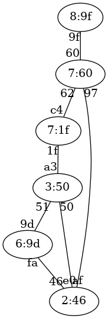

   Ejercicio 16 de STP

Solución al ejercicio STP 16
-----------------------------------------------

Switch raíz 2:46

A continuación se indica cada switch con el formato prioridad:mac-mas-baja junto al estado de sus puertos.

2:46, distancia a raíz:0

* Puerto 46, estado Designado
* Puerto e0, estado Designado
* Puerto af, estado Designado

7:1f, distancia a raíz:2

* Puerto c4, estado Bloqueado
* Puerto 1f, estado Raiz

7:60, distancia a raíz:1

* Puerto 60, estado Designado
* Puerto 62, estado Designado
* Puerto 97, estado Raiz

3:50, distancia a raíz:1

* Puerto a3, estado Designado
* Puerto 51, estado Designado
* Puerto 50, estado Raiz

8:9f, distancia a raíz:2

* Puerto 9f, estado Raiz

6:9d, distancia a raíz:1

* Puerto 9d, estado Bloqueado
* Puerto fa, estado Raiz

Ejercicio STP 17
-----------------------------------------------
Indicar el estado final en que quedará una red de switches que ejecutan STP. Ten en cuenta que el número de un switch es *irrelevante.* Lo que importa son las prioridades y las MAC más pequeñas. Las prioridades de los switches son:

* Switch 1, prioridad 8
* Switch 2, prioridad 2
* Switch 3, prioridad 8
* Switch 4, prioridad 3
* Switch 5, prioridad 4
* Switch 6, prioridad 1

Las conexiones entre switches son:

* Conexion desde el Switch 3, prioridad 8 con MAC dc a la MAC 86 de Switch 1, prioridad 8 
* Conexion desde el Switch 1, prioridad 8 con MAC a8 a la MAC 8e de Switch 6, prioridad 1 
* Conexion desde el Switch 6, prioridad 1 con MAC 5f a la MAC cb de Switch 5, prioridad 4 
* Conexion desde el Switch 5, prioridad 4 con MAC 68 a la MAC 73 de Switch 4, prioridad 3 
* Conexion desde el Switch 4, prioridad 3 con MAC 31 a la MAC be de Switch 2, prioridad 2 
* Conexion desde el Switch 2, prioridad 2 con MAC 4d a la MAC de de Switch 5, prioridad 4 
* Conexion desde el Switch 4, prioridad 3 con MAC f8 a la MAC a5 de Switch 1, prioridad 8 

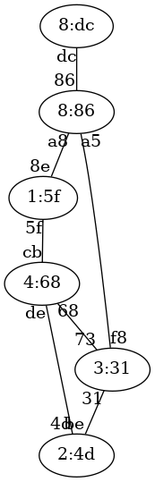

   Ejercicio 17 de STP

Solución al ejercicio STP 17
-----------------------------------------------

Switch raíz 1:5f

A continuación se indica cada switch con el formato prioridad:mac-mas-baja junto al estado de sus puertos.

8:86, distancia a raíz:1

* Puerto 86, estado Designado
* Puerto a8, estado Raiz
* Puerto a5, estado Designado

2:4d, distancia a raíz:2

* Puerto be, estado Bloqueado
* Puerto 4d, estado Raiz

8:dc, distancia a raíz:2

* Puerto dc, estado Raiz

3:31, distancia a raíz:2

* Puerto 73, estado Raiz
* Puerto 31, estado Designado
* Puerto f8, estado Bloqueado

4:68, distancia a raíz:1

* Puerto cb, estado Raiz
* Puerto 68, estado Designado
* Puerto de, estado Designado

1:5f, distancia a raíz:0

* Puerto 8e, estado Designado
* Puerto 5f, estado Designado

Ejercicio STP 18
-----------------------------------------------
Indicar el estado final en que quedará una red de switches que ejecutan STP. Ten en cuenta que el número de un switch es *irrelevante.* Lo que importa son las prioridades y las MAC más pequeñas. Las prioridades de los switches son:

* Switch 1, prioridad 6
* Switch 2, prioridad 6
* Switch 3, prioridad 8
* Switch 4, prioridad 8
* Switch 5, prioridad 7
* Switch 6, prioridad 8

Las conexiones entre switches son:

* Conexion desde el Switch 1, prioridad 6 con MAC 4f a la MAC e2 de Switch 5, prioridad 7 
* Conexion desde el Switch 5, prioridad 7 con MAC 8e a la MAC 76 de Switch 3, prioridad 8 
* Conexion desde el Switch 3, prioridad 8 con MAC 4b a la MAC 8c de Switch 2, prioridad 6 
* Conexion desde el Switch 2, prioridad 6 con MAC a6 a la MAC 47 de Switch 6, prioridad 8 
* Conexion desde el Switch 6, prioridad 8 con MAC 49 a la MAC a9 de Switch 4, prioridad 8 
* Conexion desde el Switch 5, prioridad 7 con MAC 28 a la MAC 2f de Switch 6, prioridad 8 
* Conexion desde el Switch 5, prioridad 7 con MAC bf a la MAC f8 de Switch 4, prioridad 8 

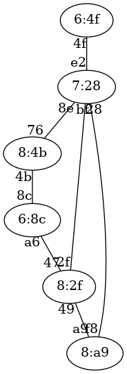

   Ejercicio 18 de STP

Solución al ejercicio STP 18
-----------------------------------------------

Switch raíz 6:4f

A continuación se indica cada switch con el formato prioridad:mac-mas-baja junto al estado de sus puertos.

6:4f, distancia a raíz:0

* Puerto 4f, estado Designado

6:8c, distancia a raíz:3

* Puerto 8c, estado Raiz
* Puerto a6, estado Bloqueado

8:4b, distancia a raíz:2

* Puerto 76, estado Raiz
* Puerto 4b, estado Designado

8:a9, distancia a raíz:2

* Puerto a9, estado Bloqueado
* Puerto f8, estado Raiz

7:28, distancia a raíz:1

* Puerto e2, estado Raiz
* Puerto 8e, estado Designado
* Puerto 28, estado Designado
* Puerto bf, estado Designado

8:2f, distancia a raíz:2

* Puerto 47, estado Designado
* Puerto 49, estado Designado
* Puerto 2f, estado Raiz

Ejercicio STP 19
-----------------------------------------------
Indicar el estado final en que quedará una red de switches que ejecutan STP. Ten en cuenta que el número de un switch es *irrelevante.* Lo que importa son las prioridades y las MAC más pequeñas. Las prioridades de los switches son:

* Switch 1, prioridad 1
* Switch 2, prioridad 6
* Switch 3, prioridad 4
* Switch 4, prioridad 7
* Switch 5, prioridad 1
* Switch 6, prioridad 6

Las conexiones entre switches son:

* Conexion desde el Switch 5, prioridad 1 con MAC b1 a la MAC 6e de Switch 1, prioridad 1 
* Conexion desde el Switch 1, prioridad 1 con MAC 88 a la MAC c9 de Switch 3, prioridad 4 
* Conexion desde el Switch 3, prioridad 4 con MAC 19 a la MAC 23 de Switch 4, prioridad 7 
* Conexion desde el Switch 4, prioridad 7 con MAC 4c a la MAC 53 de Switch 2, prioridad 6 
* Conexion desde el Switch 2, prioridad 6 con MAC d5 a la MAC f4 de Switch 6, prioridad 6 
* Conexion desde el Switch 3, prioridad 4 con MAC 55 a la MAC f9 de Switch 6, prioridad 6 
* Conexion desde el Switch 3, prioridad 4 con MAC 4a a la MAC b3 de Switch 2, prioridad 6 

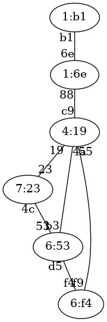

   Ejercicio 19 de STP

Solución al ejercicio STP 19
-----------------------------------------------

Switch raíz 1:6e

A continuación se indica cada switch con el formato prioridad:mac-mas-baja junto al estado de sus puertos.

1:6e, distancia a raíz:0

* Puerto 6e, estado Designado
* Puerto 88, estado Designado

6:53, distancia a raíz:2

* Puerto 53, estado Bloqueado
* Puerto d5, estado Designado
* Puerto b3, estado Raiz

4:19, distancia a raíz:1

* Puerto c9, estado Raiz
* Puerto 19, estado Designado
* Puerto 55, estado Designado
* Puerto 4a, estado Designado

7:23, distancia a raíz:2

* Puerto 23, estado Raiz
* Puerto 4c, estado Designado

1:b1, distancia a raíz:1

* Puerto b1, estado Raiz

6:f4, distancia a raíz:2

* Puerto f4, estado Bloqueado
* Puerto f9, estado Raiz

Ejercicio STP 21
-----------------------------------------------
Indicar el estado final en que quedará una red de switches que ejecutan STP. Ten en cuenta que el número de un switch es *irrelevante.* Lo que importa son las prioridades y las MAC más pequeñas. Las prioridades de los switches son:

* Switch 1, prioridad 2
* Switch 2, prioridad 5
* Switch 3, prioridad 6
* Switch 4, prioridad 2
* Switch 5, prioridad 1
* Switch 6, prioridad 1
* Switch 7, prioridad 3

Las conexiones entre switches son:

* Conexion desde el Switch 7, prioridad 3 con MAC 81 a la MAC f3 de Switch 3, prioridad 6 
* Conexion desde el Switch 3, prioridad 6 con MAC 57 a la MAC cb de Switch 1, prioridad 2 
* Conexion desde el Switch 1, prioridad 2 con MAC dc a la MAC ed de Switch 6, prioridad 1 
* Conexion desde el Switch 6, prioridad 1 con MAC a4 a la MAC 1a de Switch 4, prioridad 2 
* Conexion desde el Switch 4, prioridad 2 con MAC 27 a la MAC 4d de Switch 2, prioridad 5 
* Conexion desde el Switch 2, prioridad 5 con MAC 1b a la MAC 6d de Switch 5, prioridad 1 
* Conexion desde el Switch 3, prioridad 6 con MAC 83 a la MAC 43 de Switch 4, prioridad 2 
* Conexion desde el Switch 2, prioridad 5 con MAC 20 a la MAC bd de Switch 6, prioridad 1 

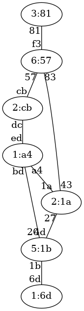

   Ejercicio 21 de STP

Solución al ejercicio STP 21
-----------------------------------------------

Switch raíz 1:6d

A continuación se indica cada switch con el formato prioridad:mac-mas-baja junto al estado de sus puertos.

2:cb, distancia a raíz:3

* Puerto cb, estado Bloqueado
* Puerto dc, estado Raiz

5:1b, distancia a raíz:1

* Puerto 4d, estado Designado
* Puerto 1b, estado Raiz
* Puerto 20, estado Designado

6:57, distancia a raíz:3

* Puerto f3, estado Designado
* Puerto 57, estado Designado
* Puerto 83, estado Raiz

2:1a, distancia a raíz:2

* Puerto 1a, estado Designado
* Puerto 27, estado Raiz
* Puerto 43, estado Designado

1:6d, distancia a raíz:0

* Puerto 6d, estado Designado

1:a4, distancia a raíz:2

* Puerto ed, estado Designado
* Puerto a4, estado Bloqueado
* Puerto bd, estado Raiz

3:81, distancia a raíz:4

* Puerto 81, estado Raiz

Ejercicio STP 22
-----------------------------------------------
Indicar el estado final en que quedará una red de switches que ejecutan STP. Ten en cuenta que el número de un switch es *irrelevante.* Lo que importa son las prioridades y las MAC más pequeñas. Las prioridades de los switches son:

* Switch 1, prioridad 2
* Switch 2, prioridad 7
* Switch 3, prioridad 6
* Switch 4, prioridad 1
* Switch 5, prioridad 2
* Switch 6, prioridad 6
* Switch 7, prioridad 1

Las conexiones entre switches son:

* Conexion desde el Switch 1, prioridad 2 con MAC 31 a la MAC d8 de Switch 7, prioridad 1 
* Conexion desde el Switch 7, prioridad 1 con MAC 57 a la MAC fa de Switch 2, prioridad 7 
* Conexion desde el Switch 2, prioridad 7 con MAC 27 a la MAC 7e de Switch 3, prioridad 6 
* Conexion desde el Switch 3, prioridad 6 con MAC c6 a la MAC 96 de Switch 6, prioridad 6 
* Conexion desde el Switch 6, prioridad 6 con MAC 7d a la MAC 73 de Switch 5, prioridad 2 
* Conexion desde el Switch 5, prioridad 2 con MAC 48 a la MAC e8 de Switch 4, prioridad 1 
* Conexion desde el Switch 2, prioridad 7 con MAC f1 a la MAC b0 de Switch 4, prioridad 1 
* Conexion desde el Switch 4, prioridad 1 con MAC 95 a la MAC 87 de Switch 7, prioridad 1 

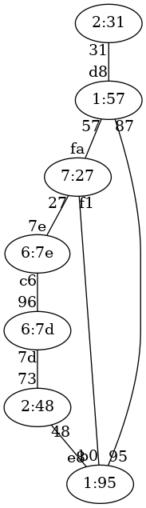

   Ejercicio 22 de STP

Solución al ejercicio STP 22
-----------------------------------------------

Switch raíz 1:57

A continuación se indica cada switch con el formato prioridad:mac-mas-baja junto al estado de sus puertos.

2:31, distancia a raíz:1

* Puerto 31, estado Raiz

7:27, distancia a raíz:1

* Puerto fa, estado Raiz
* Puerto 27, estado Designado
* Puerto f1, estado Bloqueado

6:7e, distancia a raíz:2

* Puerto 7e, estado Raiz
* Puerto c6, estado Designado

1:95, distancia a raíz:1

* Puerto e8, estado Designado
* Puerto b0, estado Designado
* Puerto 95, estado Raiz

2:48, distancia a raíz:2

* Puerto 73, estado Designado
* Puerto 48, estado Raiz

6:7d, distancia a raíz:3

* Puerto 96, estado Bloqueado
* Puerto 7d, estado Raiz

1:57, distancia a raíz:0

* Puerto d8, estado Designado
* Puerto 57, estado Designado
* Puerto 87, estado Designado

Ejercicio STP 23
-----------------------------------------------
Indicar el estado final en que quedará una red de switches que ejecutan STP. Ten en cuenta que el número de un switch es *irrelevante.* Lo que importa son las prioridades y las MAC más pequeñas. Las prioridades de los switches son:

* Switch 1, prioridad 7
* Switch 2, prioridad 8
* Switch 3, prioridad 7
* Switch 4, prioridad 3
* Switch 5, prioridad 5
* Switch 6, prioridad 7
* Switch 7, prioridad 2

Las conexiones entre switches son:

* Conexion desde el Switch 2, prioridad 8 con MAC 97 a la MAC 10 de Switch 5, prioridad 5 
* Conexion desde el Switch 5, prioridad 5 con MAC 2e a la MAC 9b de Switch 3, prioridad 7 
* Conexion desde el Switch 3, prioridad 7 con MAC a9 a la MAC b3 de Switch 1, prioridad 7 
* Conexion desde el Switch 1, prioridad 7 con MAC 75 a la MAC 41 de Switch 4, prioridad 3 
* Conexion desde el Switch 4, prioridad 3 con MAC fc a la MAC 92 de Switch 6, prioridad 7 
* Conexion desde el Switch 6, prioridad 7 con MAC 6f a la MAC 36 de Switch 7, prioridad 2 
* Conexion desde el Switch 4, prioridad 3 con MAC 79 a la MAC 58 de Switch 7, prioridad 2 
* Conexion desde el Switch 2, prioridad 8 con MAC 2a a la MAC 80 de Switch 6, prioridad 7 

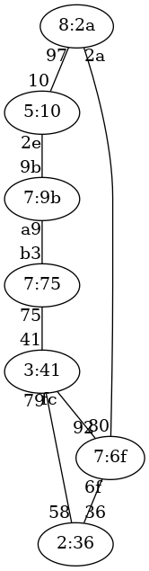

   Ejercicio 23 de STP

Solución al ejercicio STP 23
-----------------------------------------------

Switch raíz 2:36

A continuación se indica cada switch con el formato prioridad:mac-mas-baja junto al estado de sus puertos.

7:75, distancia a raíz:2

* Puerto b3, estado Designado
* Puerto 75, estado Raiz

8:2a, distancia a raíz:2

* Puerto 97, estado Designado
* Puerto 2a, estado Raiz

7:9b, distancia a raíz:3

* Puerto 9b, estado Bloqueado
* Puerto a9, estado Raiz

3:41, distancia a raíz:1

* Puerto 41, estado Designado
* Puerto fc, estado Bloqueado
* Puerto 79, estado Raiz

5:10, distancia a raíz:3

* Puerto 10, estado Raiz
* Puerto 2e, estado Designado

7:6f, distancia a raíz:1

* Puerto 92, estado Designado
* Puerto 6f, estado Raiz
* Puerto 80, estado Designado

2:36, distancia a raíz:0

* Puerto 36, estado Designado
* Puerto 58, estado Designado

Ejercicio STP 24
-----------------------------------------------
Indicar el estado final en que quedará una red de switches que ejecutan STP. Ten en cuenta que el número de un switch es *irrelevante.* Lo que importa son las prioridades y las MAC más pequeñas. Las prioridades de los switches son:

* Switch 1, prioridad 4
* Switch 2, prioridad 4
* Switch 3, prioridad 8
* Switch 4, prioridad 4
* Switch 5, prioridad 2
* Switch 6, prioridad 2
* Switch 7, prioridad 4

Las conexiones entre switches son:

* Conexion desde el Switch 7, prioridad 4 con MAC a8 a la MAC 57 de Switch 5, prioridad 2 
* Conexion desde el Switch 5, prioridad 2 con MAC 4f a la MAC c2 de Switch 4, prioridad 4 
* Conexion desde el Switch 4, prioridad 4 con MAC 41 a la MAC d1 de Switch 2, prioridad 4 
* Conexion desde el Switch 2, prioridad 4 con MAC a5 a la MAC 27 de Switch 3, prioridad 8 
* Conexion desde el Switch 3, prioridad 8 con MAC 58 a la MAC b2 de Switch 1, prioridad 4 
* Conexion desde el Switch 1, prioridad 4 con MAC c9 a la MAC 7c de Switch 6, prioridad 2 
* Conexion desde el Switch 4, prioridad 4 con MAC a7 a la MAC 35 de Switch 7, prioridad 4 
* Conexion desde el Switch 1, prioridad 4 con MAC 1f a la MAC f6 de Switch 5, prioridad 2 

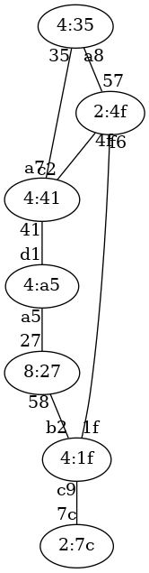

   Ejercicio 24 de STP

Solución al ejercicio STP 24
-----------------------------------------------

Switch raíz 2:4f

A continuación se indica cada switch con el formato prioridad:mac-mas-baja junto al estado de sus puertos.

4:1f, distancia a raíz:1

* Puerto b2, estado Designado
* Puerto c9, estado Designado
* Puerto 1f, estado Raiz

4:a5, distancia a raíz:2

* Puerto d1, estado Raiz
* Puerto a5, estado Bloqueado

8:27, distancia a raíz:2

* Puerto 27, estado Designado
* Puerto 58, estado Raiz

4:41, distancia a raíz:1

* Puerto c2, estado Raiz
* Puerto 41, estado Designado
* Puerto a7, estado Bloqueado

2:4f, distancia a raíz:0

* Puerto 57, estado Designado
* Puerto 4f, estado Designado
* Puerto f6, estado Designado

2:7c, distancia a raíz:2

* Puerto 7c, estado Raiz

4:35, distancia a raíz:1

* Puerto a8, estado Raiz
* Puerto 35, estado Designado

Ejercicio STP 25
-----------------------------------------------
Indicar el estado final en que quedará una red de switches que ejecutan STP. Ten en cuenta que el número de un switch es *irrelevante.* Lo que importa son las prioridades y las MAC más pequeñas. Las prioridades de los switches son:

* Switch 1, prioridad 5
* Switch 2, prioridad 3
* Switch 3, prioridad 4
* Switch 4, prioridad 6
* Switch 5, prioridad 1
* Switch 6, prioridad 5
* Switch 7, prioridad 1

Las conexiones entre switches son:

* Conexion desde el Switch 6, prioridad 5 con MAC 5b a la MAC 7a de Switch 3, prioridad 4 
* Conexion desde el Switch 3, prioridad 4 con MAC 1c a la MAC 43 de Switch 5, prioridad 1 
* Conexion desde el Switch 5, prioridad 1 con MAC dc a la MAC de de Switch 2, prioridad 3 
* Conexion desde el Switch 2, prioridad 3 con MAC e7 a la MAC a8 de Switch 4, prioridad 6 
* Conexion desde el Switch 4, prioridad 6 con MAC 78 a la MAC 71 de Switch 7, prioridad 1 
* Conexion desde el Switch 7, prioridad 1 con MAC 95 a la MAC 11 de Switch 1, prioridad 5 
* Conexion desde el Switch 3, prioridad 4 con MAC 55 a la MAC 34 de Switch 4, prioridad 6 
* Conexion desde el Switch 3, prioridad 4 con MAC 93 a la MAC 38 de Switch 7, prioridad 1 

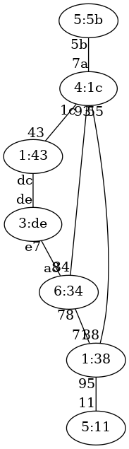

   Ejercicio 25 de STP

Solución al ejercicio STP 25
-----------------------------------------------

Switch raíz 1:38

A continuación se indica cada switch con el formato prioridad:mac-mas-baja junto al estado de sus puertos.

5:11, distancia a raíz:1

* Puerto 11, estado Raiz

3:de, distancia a raíz:2

* Puerto de, estado Bloqueado
* Puerto e7, estado Raiz

4:1c, distancia a raíz:1

* Puerto 7a, estado Designado
* Puerto 1c, estado Designado
* Puerto 55, estado Bloqueado
* Puerto 93, estado Raiz

6:34, distancia a raíz:1

* Puerto a8, estado Designado
* Puerto 78, estado Raiz
* Puerto 34, estado Designado

1:43, distancia a raíz:2

* Puerto 43, estado Raiz
* Puerto dc, estado Designado

5:5b, distancia a raíz:2

* Puerto 5b, estado Raiz

1:38, distancia a raíz:0

* Puerto 71, estado Designado
* Puerto 95, estado Designado
* Puerto 38, estado Designado

Ejercicio STP 26
-----------------------------------------------
Indicar el estado final en que quedará una red de switches que ejecutan STP. Ten en cuenta que el número de un switch es *irrelevante.* Lo que importa son las prioridades y las MAC más pequeñas. Las prioridades de los switches son:

* Switch 1, prioridad 8
* Switch 2, prioridad 1
* Switch 3, prioridad 7
* Switch 4, prioridad 1
* Switch 5, prioridad 7
* Switch 6, prioridad 2
* Switch 7, prioridad 6

Las conexiones entre switches son:

* Conexion desde el Switch 1, prioridad 8 con MAC d9 a la MAC 48 de Switch 2, prioridad 1 
* Conexion desde el Switch 2, prioridad 1 con MAC 60 a la MAC dc de Switch 7, prioridad 6 
* Conexion desde el Switch 7, prioridad 6 con MAC d8 a la MAC 22 de Switch 6, prioridad 2 
* Conexion desde el Switch 6, prioridad 2 con MAC 2e a la MAC f4 de Switch 5, prioridad 7 
* Conexion desde el Switch 5, prioridad 7 con MAC 40 a la MAC a3 de Switch 3, prioridad 7 
* Conexion desde el Switch 3, prioridad 7 con MAC e0 a la MAC b0 de Switch 4, prioridad 1 
* Conexion desde el Switch 5, prioridad 7 con MAC b1 a la MAC dd de Switch 7, prioridad 6 
* Conexion desde el Switch 5, prioridad 7 con MAC c4 a la MAC 81 de Switch 4, prioridad 1 

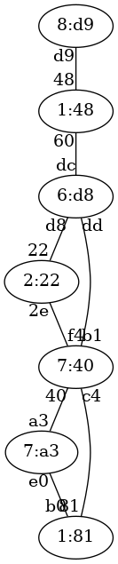

   Ejercicio 26 de STP

Solución al ejercicio STP 26
-----------------------------------------------

Switch raíz 1:48

A continuación se indica cada switch con el formato prioridad:mac-mas-baja junto al estado de sus puertos.

8:d9, distancia a raíz:1

* Puerto d9, estado Raiz

1:48, distancia a raíz:0

* Puerto 48, estado Designado
* Puerto 60, estado Designado

7:a3, distancia a raíz:3

* Puerto a3, estado Raiz
* Puerto e0, estado Bloqueado

1:81, distancia a raíz:3

* Puerto b0, estado Designado
* Puerto 81, estado Raiz

7:40, distancia a raíz:2

* Puerto f4, estado Bloqueado
* Puerto 40, estado Designado
* Puerto b1, estado Raiz
* Puerto c4, estado Designado

2:22, distancia a raíz:2

* Puerto 22, estado Raiz
* Puerto 2e, estado Designado

6:d8, distancia a raíz:1

* Puerto dc, estado Raiz
* Puerto d8, estado Designado
* Puerto dd, estado Designado

Ejercicio STP 27
-----------------------------------------------
Indicar el estado final en que quedará una red de switches que ejecutan STP. Ten en cuenta que el número de un switch es *irrelevante.* Lo que importa son las prioridades y las MAC más pequeñas. Las prioridades de los switches son:

* Switch 1, prioridad 7
* Switch 2, prioridad 6
* Switch 3, prioridad 4
* Switch 4, prioridad 7
* Switch 5, prioridad 6
* Switch 6, prioridad 2
* Switch 7, prioridad 3

Las conexiones entre switches son:

* Conexion desde el Switch 7, prioridad 3 con MAC 1f a la MAC 28 de Switch 1, prioridad 7 
* Conexion desde el Switch 1, prioridad 7 con MAC 9c a la MAC 52 de Switch 4, prioridad 7 
* Conexion desde el Switch 4, prioridad 7 con MAC d3 a la MAC e0 de Switch 5, prioridad 6 
* Conexion desde el Switch 5, prioridad 6 con MAC 38 a la MAC 8e de Switch 6, prioridad 2 
* Conexion desde el Switch 6, prioridad 2 con MAC c0 a la MAC 2b de Switch 2, prioridad 6 
* Conexion desde el Switch 2, prioridad 6 con MAC b3 a la MAC b2 de Switch 3, prioridad 4 
* Conexion desde el Switch 7, prioridad 3 con MAC 22 a la MAC 1a de Switch 2, prioridad 6 
* Conexion desde el Switch 3, prioridad 4 con MAC c2 a la MAC b9 de Switch 6, prioridad 2 

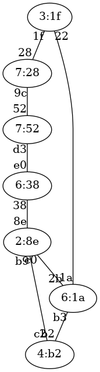

   Ejercicio 27 de STP

Solución al ejercicio STP 27
-----------------------------------------------

Switch raíz 2:8e

A continuación se indica cada switch con el formato prioridad:mac-mas-baja junto al estado de sus puertos.

7:28, distancia a raíz:3

* Puerto 28, estado Raiz
* Puerto 9c, estado Bloqueado

6:1a, distancia a raíz:1

* Puerto 2b, estado Raiz
* Puerto b3, estado Bloqueado
* Puerto 1a, estado Designado

4:b2, distancia a raíz:1

* Puerto b2, estado Designado
* Puerto c2, estado Raiz

7:52, distancia a raíz:2

* Puerto 52, estado Designado
* Puerto d3, estado Raiz

6:38, distancia a raíz:1

* Puerto e0, estado Designado
* Puerto 38, estado Raiz

2:8e, distancia a raíz:0

* Puerto 8e, estado Designado
* Puerto c0, estado Designado
* Puerto b9, estado Designado

3:1f, distancia a raíz:2

* Puerto 1f, estado Designado
* Puerto 22, estado Raiz

Ejercicio STP 28
-----------------------------------------------
Indicar el estado final en que quedará una red de switches que ejecutan STP. Ten en cuenta que el número de un switch es *irrelevante.* Lo que importa son las prioridades y las MAC más pequeñas. Las prioridades de los switches son:

* Switch 1, prioridad 1
* Switch 2, prioridad 5
* Switch 3, prioridad 1
* Switch 4, prioridad 7
* Switch 5, prioridad 3
* Switch 6, prioridad 7
* Switch 7, prioridad 5

Las conexiones entre switches son:

* Conexion desde el Switch 1, prioridad 1 con MAC c0 a la MAC eb de Switch 5, prioridad 3 
* Conexion desde el Switch 5, prioridad 3 con MAC 37 a la MAC 25 de Switch 4, prioridad 7 
* Conexion desde el Switch 4, prioridad 7 con MAC 59 a la MAC 19 de Switch 3, prioridad 1 
* Conexion desde el Switch 3, prioridad 1 con MAC 5f a la MAC 24 de Switch 7, prioridad 5 
* Conexion desde el Switch 7, prioridad 5 con MAC 3e a la MAC 63 de Switch 2, prioridad 5 
* Conexion desde el Switch 2, prioridad 5 con MAC 6d a la MAC 8c de Switch 6, prioridad 7 
* Conexion desde el Switch 3, prioridad 1 con MAC ba a la MAC 23 de Switch 1, prioridad 1 
* Conexion desde el Switch 4, prioridad 7 con MAC ca a la MAC 88 de Switch 7, prioridad 5 

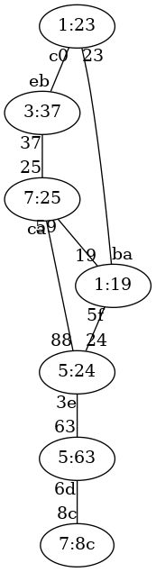

   Ejercicio 28 de STP

Solución al ejercicio STP 28
-----------------------------------------------

Switch raíz 1:19

A continuación se indica cada switch con el formato prioridad:mac-mas-baja junto al estado de sus puertos.

1:23, distancia a raíz:1

* Puerto c0, estado Designado
* Puerto 23, estado Raiz

5:63, distancia a raíz:2

* Puerto 63, estado Raiz
* Puerto 6d, estado Designado

1:19, distancia a raíz:0

* Puerto 19, estado Designado
* Puerto 5f, estado Designado
* Puerto ba, estado Designado

7:25, distancia a raíz:1

* Puerto 25, estado Designado
* Puerto 59, estado Raiz
* Puerto ca, estado Bloqueado

3:37, distancia a raíz:2

* Puerto eb, estado Bloqueado
* Puerto 37, estado Raiz

7:8c, distancia a raíz:3

* Puerto 8c, estado Raiz

5:24, distancia a raíz:1

* Puerto 24, estado Raiz
* Puerto 3e, estado Designado
* Puerto 88, estado Designado

Ejercicio STP 29
-----------------------------------------------
Indicar el estado final en que quedará una red de switches que ejecutan STP. Ten en cuenta que el número de un switch es *irrelevante.* Lo que importa son las prioridades y las MAC más pequeñas. Las prioridades de los switches son:

* Switch 1, prioridad 6
* Switch 2, prioridad 3
* Switch 3, prioridad 2
* Switch 4, prioridad 1
* Switch 5, prioridad 7
* Switch 6, prioridad 7
* Switch 7, prioridad 7

Las conexiones entre switches son:

* Conexion desde el Switch 2, prioridad 3 con MAC 44 a la MAC b8 de Switch 7, prioridad 7 
* Conexion desde el Switch 7, prioridad 7 con MAC 1f a la MAC ef de Switch 4, prioridad 1 
* Conexion desde el Switch 4, prioridad 1 con MAC 98 a la MAC 4a de Switch 1, prioridad 6 
* Conexion desde el Switch 1, prioridad 6 con MAC b3 a la MAC a6 de Switch 5, prioridad 7 
* Conexion desde el Switch 5, prioridad 7 con MAC c7 a la MAC cf de Switch 6, prioridad 7 
* Conexion desde el Switch 6, prioridad 7 con MAC 1d a la MAC af de Switch 3, prioridad 2 
* Conexion desde el Switch 4, prioridad 1 con MAC 93 a la MAC 47 de Switch 5, prioridad 7 
* Conexion desde el Switch 3, prioridad 2 con MAC d2 a la MAC f3 de Switch 5, prioridad 7 

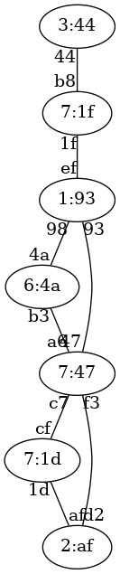

   Ejercicio 29 de STP

Solución al ejercicio STP 29
-----------------------------------------------

Switch raíz 1:93

A continuación se indica cada switch con el formato prioridad:mac-mas-baja junto al estado de sus puertos.

6:4a, distancia a raíz:1

* Puerto 4a, estado Raiz
* Puerto b3, estado Bloqueado

3:44, distancia a raíz:2

* Puerto 44, estado Raiz

2:af, distancia a raíz:2

* Puerto af, estado Bloqueado
* Puerto d2, estado Raiz

1:93, distancia a raíz:0

* Puerto ef, estado Designado
* Puerto 98, estado Designado
* Puerto 93, estado Designado

7:47, distancia a raíz:1

* Puerto a6, estado Designado
* Puerto c7, estado Designado
* Puerto 47, estado Raiz
* Puerto f3, estado Designado

7:1d, distancia a raíz:2

* Puerto cf, estado Raiz
* Puerto 1d, estado Designado

7:1f, distancia a raíz:1

* Puerto b8, estado Designado
* Puerto 1f, estado Raiz

Ejercicio STP 31
-----------------------------------------------
Indicar el estado final en que quedará una red de switches que ejecutan STP. Ten en cuenta que el número de un switch es *irrelevante.* Lo que importa son las prioridades y las MAC más pequeñas. Las prioridades de los switches son:

* Switch 1, prioridad 4
* Switch 2, prioridad 3
* Switch 3, prioridad 5
* Switch 4, prioridad 5
* Switch 5, prioridad 8
* Switch 6, prioridad 3
* Switch 7, prioridad 3
* Switch 8, prioridad 7

Las conexiones entre switches son:

* Conexion desde el Switch 3, prioridad 5 con MAC 7d a la MAC 5c de Switch 1, prioridad 4 
* Conexion desde el Switch 1, prioridad 4 con MAC 28 a la MAC 87 de Switch 6, prioridad 3 
* Conexion desde el Switch 6, prioridad 3 con MAC 26 a la MAC 30 de Switch 8, prioridad 7 
* Conexion desde el Switch 8, prioridad 7 con MAC b8 a la MAC 39 de Switch 5, prioridad 8 
* Conexion desde el Switch 5, prioridad 8 con MAC c9 a la MAC 90 de Switch 2, prioridad 3 
* Conexion desde el Switch 2, prioridad 3 con MAC 36 a la MAC da de Switch 4, prioridad 5 
* Conexion desde el Switch 4, prioridad 5 con MAC 7b a la MAC ca de Switch 7, prioridad 3 
* Conexion desde el Switch 8, prioridad 7 con MAC 8c a la MAC 3f de Switch 7, prioridad 3 
* Conexion desde el Switch 3, prioridad 5 con MAC 6a a la MAC a3 de Switch 4, prioridad 5 

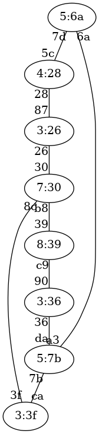

   Ejercicio 31 de STP

Solución al ejercicio STP 31
-----------------------------------------------

Switch raíz 3:26

A continuación se indica cada switch con el formato prioridad:mac-mas-baja junto al estado de sus puertos.

4:28, distancia a raíz:1

* Puerto 5c, estado Designado
* Puerto 28, estado Raiz

3:36, distancia a raíz:3

* Puerto 90, estado Raiz
* Puerto 36, estado Designado

5:6a, distancia a raíz:2

* Puerto 7d, estado Raiz
* Puerto 6a, estado Designado

5:7b, distancia a raíz:3

* Puerto da, estado Bloqueado
* Puerto 7b, estado Raiz
* Puerto a3, estado Bloqueado

8:39, distancia a raíz:2

* Puerto 39, estado Raiz
* Puerto c9, estado Designado

3:26, distancia a raíz:0

* Puerto 87, estado Designado
* Puerto 26, estado Designado

3:3f, distancia a raíz:2

* Puerto ca, estado Designado
* Puerto 3f, estado Raiz

7:30, distancia a raíz:1

* Puerto 30, estado Raiz
* Puerto b8, estado Designado
* Puerto 8c, estado Designado

Ejercicio STP 32
-----------------------------------------------
Indicar el estado final en que quedará una red de switches que ejecutan STP. Ten en cuenta que el número de un switch es *irrelevante.* Lo que importa son las prioridades y las MAC más pequeñas. Las prioridades de los switches son:

* Switch 1, prioridad 1
* Switch 2, prioridad 8
* Switch 3, prioridad 4
* Switch 4, prioridad 1
* Switch 5, prioridad 6
* Switch 6, prioridad 4
* Switch 7, prioridad 8
* Switch 8, prioridad 5

Las conexiones entre switches son:

* Conexion desde el Switch 4, prioridad 1 con MAC 7a a la MAC d0 de Switch 5, prioridad 6 
* Conexion desde el Switch 5, prioridad 6 con MAC ae a la MAC d4 de Switch 6, prioridad 4 
* Conexion desde el Switch 6, prioridad 4 con MAC 46 a la MAC 83 de Switch 1, prioridad 1 
* Conexion desde el Switch 1, prioridad 1 con MAC 73 a la MAC 94 de Switch 2, prioridad 8 
* Conexion desde el Switch 2, prioridad 8 con MAC 4f a la MAC 20 de Switch 3, prioridad 4 
* Conexion desde el Switch 3, prioridad 4 con MAC 74 a la MAC 1a de Switch 7, prioridad 8 
* Conexion desde el Switch 7, prioridad 8 con MAC f1 a la MAC 15 de Switch 8, prioridad 5 
* Conexion desde el Switch 4, prioridad 1 con MAC 13 a la MAC a6 de Switch 1, prioridad 1 
* Conexion desde el Switch 6, prioridad 4 con MAC 87 a la MAC 4b de Switch 7, prioridad 8 

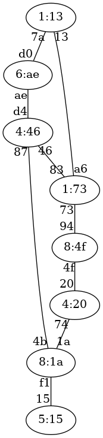

   Ejercicio 32 de STP

Solución al ejercicio STP 32
-----------------------------------------------

Switch raíz 1:13

A continuación se indica cada switch con el formato prioridad:mac-mas-baja junto al estado de sus puertos.

1:73, distancia a raíz:1

* Puerto 83, estado Designado
* Puerto 73, estado Designado
* Puerto a6, estado Raiz

8:4f, distancia a raíz:2

* Puerto 94, estado Raiz
* Puerto 4f, estado Designado

4:20, distancia a raíz:3

* Puerto 20, estado Raiz
* Puerto 74, estado Bloqueado

1:13, distancia a raíz:0

* Puerto 7a, estado Designado
* Puerto 13, estado Designado

6:ae, distancia a raíz:1

* Puerto d0, estado Raiz
* Puerto ae, estado Designado

4:46, distancia a raíz:2

* Puerto d4, estado Bloqueado
* Puerto 46, estado Raiz
* Puerto 87, estado Designado

8:1a, distancia a raíz:3

* Puerto 1a, estado Designado
* Puerto f1, estado Designado
* Puerto 4b, estado Raiz

5:15, distancia a raíz:4

* Puerto 15, estado Raiz

Ejercicio STP 33
-----------------------------------------------
Indicar el estado final en que quedará una red de switches que ejecutan STP. Ten en cuenta que el número de un switch es *irrelevante.* Lo que importa son las prioridades y las MAC más pequeñas. Las prioridades de los switches son:

* Switch 1, prioridad 7
* Switch 2, prioridad 5
* Switch 3, prioridad 4
* Switch 4, prioridad 3
* Switch 5, prioridad 2
* Switch 6, prioridad 3
* Switch 7, prioridad 3
* Switch 8, prioridad 3

Las conexiones entre switches son:

* Conexion desde el Switch 3, prioridad 4 con MAC 1f a la MAC 49 de Switch 2, prioridad 5 
* Conexion desde el Switch 2, prioridad 5 con MAC ae a la MAC d1 de Switch 6, prioridad 3 
* Conexion desde el Switch 6, prioridad 3 con MAC a6 a la MAC e7 de Switch 8, prioridad 3 
* Conexion desde el Switch 8, prioridad 3 con MAC 78 a la MAC 2c de Switch 1, prioridad 7 
* Conexion desde el Switch 1, prioridad 7 con MAC b2 a la MAC 71 de Switch 7, prioridad 3 
* Conexion desde el Switch 7, prioridad 3 con MAC a2 a la MAC d8 de Switch 4, prioridad 3 
* Conexion desde el Switch 4, prioridad 3 con MAC e1 a la MAC 58 de Switch 5, prioridad 2 
* Conexion desde el Switch 2, prioridad 5 con MAC 38 a la MAC 7f de Switch 5, prioridad 2 
* Conexion desde el Switch 4, prioridad 3 con MAC 93 a la MAC 2d de Switch 1, prioridad 7 

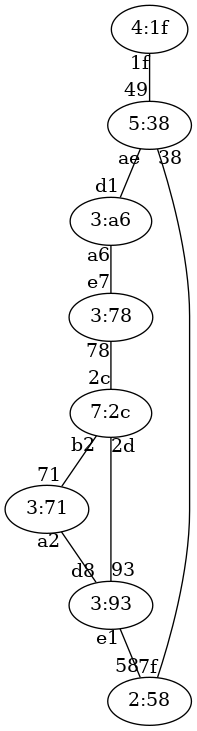

   Ejercicio 33 de STP

Solución al ejercicio STP 33
-----------------------------------------------

Switch raíz 2:58

A continuación se indica cada switch con el formato prioridad:mac-mas-baja junto al estado de sus puertos.

7:2c, distancia a raíz:2

* Puerto 2c, estado Designado
* Puerto b2, estado Bloqueado
* Puerto 2d, estado Raiz

5:38, distancia a raíz:1

* Puerto 49, estado Designado
* Puerto ae, estado Designado
* Puerto 38, estado Raiz

4:1f, distancia a raíz:2

* Puerto 1f, estado Raiz

3:93, distancia a raíz:1

* Puerto d8, estado Designado
* Puerto e1, estado Raiz
* Puerto 93, estado Designado

2:58, distancia a raíz:0

* Puerto 58, estado Designado
* Puerto 7f, estado Designado

3:a6, distancia a raíz:2

* Puerto d1, estado Raiz
* Puerto a6, estado Designado

3:71, distancia a raíz:2

* Puerto 71, estado Designado
* Puerto a2, estado Raiz

3:78, distancia a raíz:3

* Puerto e7, estado Bloqueado
* Puerto 78, estado Raiz

Ejercicio STP 34
-----------------------------------------------
Indicar el estado final en que quedará una red de switches que ejecutan STP. Ten en cuenta que el número de un switch es *irrelevante.* Lo que importa son las prioridades y las MAC más pequeñas. Las prioridades de los switches son:

* Switch 1, prioridad 6
* Switch 2, prioridad 8
* Switch 3, prioridad 6
* Switch 4, prioridad 2
* Switch 5, prioridad 3
* Switch 6, prioridad 1
* Switch 7, prioridad 6
* Switch 8, prioridad 1

Las conexiones entre switches son:

* Conexion desde el Switch 5, prioridad 3 con MAC 94 a la MAC 59 de Switch 6, prioridad 1 
* Conexion desde el Switch 6, prioridad 1 con MAC ad a la MAC 27 de Switch 4, prioridad 2 
* Conexion desde el Switch 4, prioridad 2 con MAC 2e a la MAC a8 de Switch 1, prioridad 6 
* Conexion desde el Switch 1, prioridad 6 con MAC ba a la MAC 3e de Switch 7, prioridad 6 
* Conexion desde el Switch 7, prioridad 6 con MAC a1 a la MAC d3 de Switch 8, prioridad 1 
* Conexion desde el Switch 8, prioridad 1 con MAC 1f a la MAC 6c de Switch 3, prioridad 6 
* Conexion desde el Switch 3, prioridad 6 con MAC ef a la MAC 42 de Switch 2, prioridad 8 
* Conexion desde el Switch 3, prioridad 6 con MAC ee a la MAC a4 de Switch 6, prioridad 1 
* Conexion desde el Switch 6, prioridad 1 con MAC 69 a la MAC fe de Switch 7, prioridad 6 

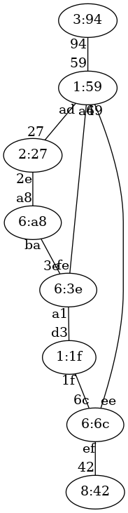

   Ejercicio 34 de STP

Solución al ejercicio STP 34
-----------------------------------------------

Switch raíz 1:1f

A continuación se indica cada switch con el formato prioridad:mac-mas-baja junto al estado de sus puertos.

6:a8, distancia a raíz:2

* Puerto a8, estado Designado
* Puerto ba, estado Raiz

8:42, distancia a raíz:2

* Puerto 42, estado Raiz

6:6c, distancia a raíz:1

* Puerto 6c, estado Raiz
* Puerto ef, estado Designado
* Puerto ee, estado Designado

2:27, distancia a raíz:3

* Puerto 27, estado Raiz
* Puerto 2e, estado Bloqueado

3:94, distancia a raíz:3

* Puerto 94, estado Raiz

1:59, distancia a raíz:2

* Puerto 59, estado Designado
* Puerto ad, estado Designado
* Puerto a4, estado Bloqueado
* Puerto 69, estado Raiz

6:3e, distancia a raíz:1

* Puerto 3e, estado Designado
* Puerto a1, estado Raiz
* Puerto fe, estado Designado

1:1f, distancia a raíz:0

* Puerto d3, estado Designado
* Puerto 1f, estado Designado

Ejercicio STP 35
-----------------------------------------------
Indicar el estado final en que quedará una red de switches que ejecutan STP. Ten en cuenta que el número de un switch es *irrelevante.* Lo que importa son las prioridades y las MAC más pequeñas. Las prioridades de los switches son:

* Switch 1, prioridad 8
* Switch 2, prioridad 4
* Switch 3, prioridad 3
* Switch 4, prioridad 5
* Switch 5, prioridad 4
* Switch 6, prioridad 2
* Switch 7, prioridad 4
* Switch 8, prioridad 4

Las conexiones entre switches son:

* Conexion desde el Switch 1, prioridad 8 con MAC 87 a la MAC d9 de Switch 2, prioridad 4 
* Conexion desde el Switch 2, prioridad 4 con MAC 2f a la MAC 37 de Switch 7, prioridad 4 
* Conexion desde el Switch 7, prioridad 4 con MAC 79 a la MAC e2 de Switch 8, prioridad 4 
* Conexion desde el Switch 8, prioridad 4 con MAC a8 a la MAC 6e de Switch 4, prioridad 5 
* Conexion desde el Switch 4, prioridad 5 con MAC 1c a la MAC 68 de Switch 3, prioridad 3 
* Conexion desde el Switch 3, prioridad 3 con MAC b0 a la MAC 60 de Switch 6, prioridad 2 
* Conexion desde el Switch 6, prioridad 2 con MAC 1f a la MAC b2 de Switch 5, prioridad 4 
* Conexion desde el Switch 7, prioridad 4 con MAC 8e a la MAC 9d de Switch 6, prioridad 2 
* Conexion desde el Switch 4, prioridad 5 con MAC 23 a la MAC 83 de Switch 7, prioridad 4 

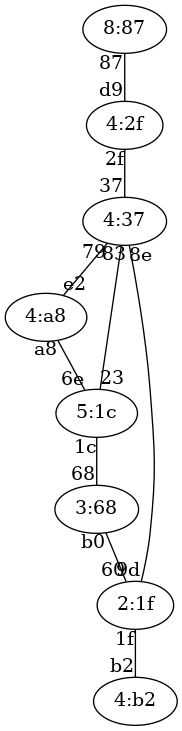

   Ejercicio 35 de STP

Solución al ejercicio STP 35
-----------------------------------------------

Switch raíz 2:1f

A continuación se indica cada switch con el formato prioridad:mac-mas-baja junto al estado de sus puertos.

8:87, distancia a raíz:3

* Puerto 87, estado Raiz

4:2f, distancia a raíz:2

* Puerto d9, estado Designado
* Puerto 2f, estado Raiz

3:68, distancia a raíz:1

* Puerto 68, estado Designado
* Puerto b0, estado Raiz

5:1c, distancia a raíz:2

* Puerto 6e, estado Designado
* Puerto 1c, estado Raiz
* Puerto 23, estado Bloqueado

4:b2, distancia a raíz:1

* Puerto b2, estado Raiz

2:1f, distancia a raíz:0

* Puerto 60, estado Designado
* Puerto 1f, estado Designado
* Puerto 9d, estado Designado

4:37, distancia a raíz:1

* Puerto 37, estado Designado
* Puerto 79, estado Designado
* Puerto 8e, estado Raiz
* Puerto 83, estado Designado

4:a8, distancia a raíz:2

* Puerto e2, estado Raiz
* Puerto a8, estado Bloqueado

Ejercicio STP 36
-----------------------------------------------
Indicar el estado final en que quedará una red de switches que ejecutan STP. Ten en cuenta que el número de un switch es *irrelevante.* Lo que importa son las prioridades y las MAC más pequeñas. Las prioridades de los switches son:

* Switch 1, prioridad 1
* Switch 2, prioridad 2
* Switch 3, prioridad 3
* Switch 4, prioridad 2
* Switch 5, prioridad 2
* Switch 6, prioridad 4
* Switch 7, prioridad 5
* Switch 8, prioridad 8

Las conexiones entre switches son:

* Conexion desde el Switch 3, prioridad 3 con MAC 75 a la MAC b3 de Switch 8, prioridad 8 
* Conexion desde el Switch 8, prioridad 8 con MAC 19 a la MAC 6d de Switch 7, prioridad 5 
* Conexion desde el Switch 7, prioridad 5 con MAC 1c a la MAC 81 de Switch 6, prioridad 4 
* Conexion desde el Switch 6, prioridad 4 con MAC a3 a la MAC b6 de Switch 4, prioridad 2 
* Conexion desde el Switch 4, prioridad 2 con MAC 30 a la MAC 88 de Switch 2, prioridad 2 
* Conexion desde el Switch 2, prioridad 2 con MAC 7f a la MAC 4f de Switch 1, prioridad 1 
* Conexion desde el Switch 1, prioridad 1 con MAC 6a a la MAC 1f de Switch 5, prioridad 2 
* Conexion desde el Switch 3, prioridad 3 con MAC ed a la MAC bd de Switch 1, prioridad 1 
* Conexion desde el Switch 7, prioridad 5 con MAC 9d a la MAC 89 de Switch 1, prioridad 1 

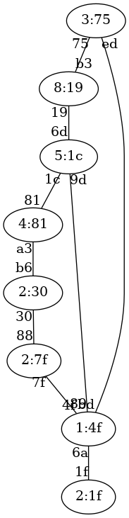

   Ejercicio 36 de STP

Solución al ejercicio STP 36
-----------------------------------------------

Switch raíz 1:4f

A continuación se indica cada switch con el formato prioridad:mac-mas-baja junto al estado de sus puertos.

1:4f, distancia a raíz:0

* Puerto 4f, estado Designado
* Puerto 6a, estado Designado
* Puerto bd, estado Designado
* Puerto 89, estado Designado

2:7f, distancia a raíz:1

* Puerto 88, estado Designado
* Puerto 7f, estado Raiz

3:75, distancia a raíz:1

* Puerto 75, estado Designado
* Puerto ed, estado Raiz

2:30, distancia a raíz:2

* Puerto b6, estado Bloqueado
* Puerto 30, estado Raiz

2:1f, distancia a raíz:1

* Puerto 1f, estado Raiz

4:81, distancia a raíz:2

* Puerto 81, estado Raiz
* Puerto a3, estado Designado

5:1c, distancia a raíz:1

* Puerto 6d, estado Designado
* Puerto 1c, estado Designado
* Puerto 9d, estado Raiz

8:19, distancia a raíz:2

* Puerto b3, estado Bloqueado
* Puerto 19, estado Raiz

Ejercicio STP 37
-----------------------------------------------
Indicar el estado final en que quedará una red de switches que ejecutan STP. Ten en cuenta que el número de un switch es *irrelevante.* Lo que importa son las prioridades y las MAC más pequeñas. Las prioridades de los switches son:

* Switch 1, prioridad 4
* Switch 2, prioridad 2
* Switch 3, prioridad 8
* Switch 4, prioridad 4
* Switch 5, prioridad 2
* Switch 6, prioridad 3
* Switch 7, prioridad 1
* Switch 8, prioridad 6

Las conexiones entre switches son:

* Conexion desde el Switch 4, prioridad 4 con MAC 9b a la MAC a8 de Switch 8, prioridad 6 
* Conexion desde el Switch 8, prioridad 6 con MAC 97 a la MAC 23 de Switch 5, prioridad 2 
* Conexion desde el Switch 5, prioridad 2 con MAC 84 a la MAC f2 de Switch 1, prioridad 4 
* Conexion desde el Switch 1, prioridad 4 con MAC e2 a la MAC 62 de Switch 2, prioridad 2 
* Conexion desde el Switch 2, prioridad 2 con MAC 19 a la MAC 85 de Switch 7, prioridad 1 
* Conexion desde el Switch 7, prioridad 1 con MAC 82 a la MAC 1b de Switch 6, prioridad 3 
* Conexion desde el Switch 6, prioridad 3 con MAC 26 a la MAC 25 de Switch 3, prioridad 8 
* Conexion desde el Switch 4, prioridad 4 con MAC 95 a la MAC 64 de Switch 7, prioridad 1 
* Conexion desde el Switch 6, prioridad 3 con MAC e6 a la MAC b3 de Switch 2, prioridad 2 

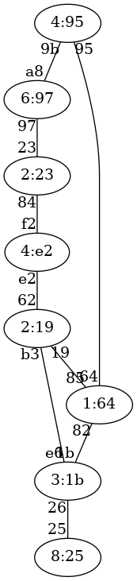

   Ejercicio 37 de STP

Solución al ejercicio STP 37
-----------------------------------------------

Switch raíz 1:64

A continuación se indica cada switch con el formato prioridad:mac-mas-baja junto al estado de sus puertos.

4:e2, distancia a raíz:2

* Puerto f2, estado Designado
* Puerto e2, estado Raiz

2:19, distancia a raíz:1

* Puerto 62, estado Designado
* Puerto 19, estado Raiz
* Puerto b3, estado Designado

8:25, distancia a raíz:2

* Puerto 25, estado Raiz

4:95, distancia a raíz:1

* Puerto 9b, estado Designado
* Puerto 95, estado Raiz

2:23, distancia a raíz:3

* Puerto 23, estado Raiz
* Puerto 84, estado Bloqueado

3:1b, distancia a raíz:1

* Puerto 1b, estado Raiz
* Puerto 26, estado Designado
* Puerto e6, estado Bloqueado

1:64, distancia a raíz:0

* Puerto 85, estado Designado
* Puerto 82, estado Designado
* Puerto 64, estado Designado

6:97, distancia a raíz:2

* Puerto a8, estado Raiz
* Puerto 97, estado Designado

Ejercicio STP 38
-----------------------------------------------
Indicar el estado final en que quedará una red de switches que ejecutan STP. Ten en cuenta que el número de un switch es *irrelevante.* Lo que importa son las prioridades y las MAC más pequeñas. Las prioridades de los switches son:

* Switch 1, prioridad 5
* Switch 2, prioridad 4
* Switch 3, prioridad 3
* Switch 4, prioridad 6
* Switch 5, prioridad 7
* Switch 6, prioridad 8
* Switch 7, prioridad 4
* Switch 8, prioridad 1

Las conexiones entre switches son:

* Conexion desde el Switch 4, prioridad 6 con MAC 74 a la MAC 85 de Switch 8, prioridad 1 
* Conexion desde el Switch 8, prioridad 1 con MAC fb a la MAC bf de Switch 2, prioridad 4 
* Conexion desde el Switch 2, prioridad 4 con MAC df a la MAC 6c de Switch 5, prioridad 7 
* Conexion desde el Switch 5, prioridad 7 con MAC 88 a la MAC d4 de Switch 3, prioridad 3 
* Conexion desde el Switch 3, prioridad 3 con MAC cd a la MAC 43 de Switch 1, prioridad 5 
* Conexion desde el Switch 1, prioridad 5 con MAC e1 a la MAC f9 de Switch 7, prioridad 4 
* Conexion desde el Switch 7, prioridad 4 con MAC 1b a la MAC c5 de Switch 6, prioridad 8 
* Conexion desde el Switch 3, prioridad 3 con MAC 23 a la MAC a1 de Switch 2, prioridad 4 
* Conexion desde el Switch 6, prioridad 8 con MAC 7c a la MAC 59 de Switch 8, prioridad 1 

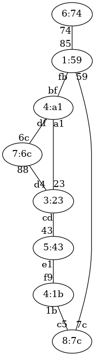

   Ejercicio 38 de STP

Solución al ejercicio STP 38
-----------------------------------------------

Switch raíz 1:59

A continuación se indica cada switch con el formato prioridad:mac-mas-baja junto al estado de sus puertos.

5:43, distancia a raíz:3

* Puerto 43, estado Raiz
* Puerto e1, estado Bloqueado

4:a1, distancia a raíz:1

* Puerto bf, estado Raiz
* Puerto df, estado Designado
* Puerto a1, estado Designado

3:23, distancia a raíz:2

* Puerto d4, estado Bloqueado
* Puerto cd, estado Designado
* Puerto 23, estado Raiz

6:74, distancia a raíz:1

* Puerto 74, estado Raiz

7:6c, distancia a raíz:2

* Puerto 6c, estado Raiz
* Puerto 88, estado Designado

8:7c, distancia a raíz:1

* Puerto c5, estado Designado
* Puerto 7c, estado Raiz

4:1b, distancia a raíz:2

* Puerto f9, estado Designado
* Puerto 1b, estado Raiz

1:59, distancia a raíz:0

* Puerto 85, estado Designado
* Puerto fb, estado Designado
* Puerto 59, estado Designado

Ejercicio STP 39
-----------------------------------------------
Indicar el estado final en que quedará una red de switches que ejecutan STP. Ten en cuenta que el número de un switch es *irrelevante.* Lo que importa son las prioridades y las MAC más pequeñas. Las prioridades de los switches son:

* Switch 1, prioridad 5
* Switch 2, prioridad 4
* Switch 3, prioridad 7
* Switch 4, prioridad 2
* Switch 5, prioridad 8
* Switch 6, prioridad 5
* Switch 7, prioridad 6
* Switch 8, prioridad 8

Las conexiones entre switches son:

* Conexion desde el Switch 2, prioridad 4 con MAC f3 a la MAC 9b de Switch 7, prioridad 6 
* Conexion desde el Switch 7, prioridad 6 con MAC 4d a la MAC 26 de Switch 4, prioridad 2 
* Conexion desde el Switch 4, prioridad 2 con MAC bc a la MAC 2b de Switch 1, prioridad 5 
* Conexion desde el Switch 1, prioridad 5 con MAC 7f a la MAC f2 de Switch 3, prioridad 7 
* Conexion desde el Switch 3, prioridad 7 con MAC 37 a la MAC 13 de Switch 5, prioridad 8 
* Conexion desde el Switch 5, prioridad 8 con MAC 68 a la MAC c9 de Switch 6, prioridad 5 
* Conexion desde el Switch 6, prioridad 5 con MAC 9e a la MAC 97 de Switch 8, prioridad 8 
* Conexion desde el Switch 1, prioridad 5 con MAC 4f a la MAC cd de Switch 8, prioridad 8 
* Conexion desde el Switch 8, prioridad 8 con MAC 74 a la MAC c2 de Switch 7, prioridad 6 

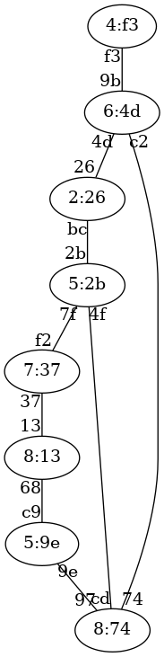

   Ejercicio 39 de STP

Solución al ejercicio STP 39
-----------------------------------------------

Switch raíz 2:26

A continuación se indica cada switch con el formato prioridad:mac-mas-baja junto al estado de sus puertos.

5:2b, distancia a raíz:1

* Puerto 2b, estado Raiz
* Puerto 7f, estado Designado
* Puerto 4f, estado Designado

4:f3, distancia a raíz:2

* Puerto f3, estado Raiz

7:37, distancia a raíz:2

* Puerto f2, estado Raiz
* Puerto 37, estado Designado

2:26, distancia a raíz:0

* Puerto 26, estado Designado
* Puerto bc, estado Designado

8:13, distancia a raíz:3

* Puerto 13, estado Raiz
* Puerto 68, estado Designado

5:9e, distancia a raíz:3

* Puerto c9, estado Bloqueado
* Puerto 9e, estado Raiz

6:4d, distancia a raíz:1

* Puerto 9b, estado Designado
* Puerto 4d, estado Raiz
* Puerto c2, estado Designado

8:74, distancia a raíz:2

* Puerto 97, estado Designado
* Puerto cd, estado Bloqueado
* Puerto 74, estado Raiz

