Tema 5: Configuración y administración básica de routers
================================================================

La capa de transporte
--------------------------------

Recordemos la arquitectura de las redes:

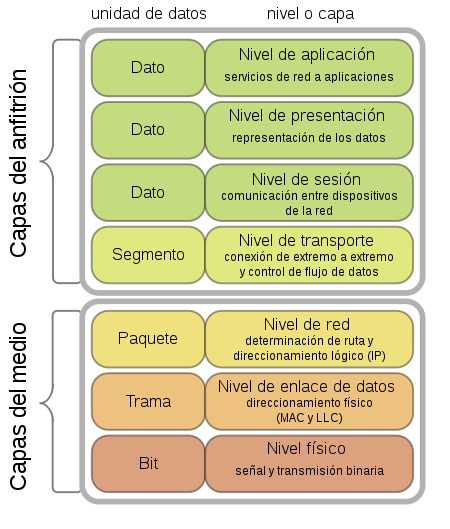

En el dibujo vemos las distintas capas y sabemos que:

* Las direcciones Ethernet son fijas. Hay una dirección por tarjeta de red.
* Las direcciones IP son configurables. Por cada tarjeta puede haber una IP (o más).

Tradicionalmente pensamos en el movimiento de datos como si fuera una transacción entre dos máquinas y habrá un paquete que tiene una IP de origen y una de destino.

Supongamos que en un ordenador hay dos servicios. Un servidor Web y un servidor de bases de datos por ejemplo Oracle. Supongamos ahora que otro ordenador quiere conectarse y ver la página web. Supongamos que el cliente tiene la IP 192.168.1.1 y que el servidor tiene la IP 192.168.1.10.

¿Qué ocurre cuando la conexión del 192.168.1.1 (cliente) llega al servidor 192.168.1.10? Con lo que sabemos hasta ahora ¿quien recibe la conexión? ¿El proceso Oracle o el proceso Apache web?

Como en un ordenador puede haber muchos programas enviando y recibiendo datos, ocurre que a cada programa se le asigna un número llamado **PUERTO**. Esto significa que cuando un cliente quiere conectar con un servidor **DEBE PROPORCIONAR UN NÚMERO DE PUERTO**. Los números de puerto y la gestión de esas múltiples conexiones se hace en la capa de transporte.

Ocurre por tanto, que cualquier bloque de trama que envíamos tiene en realidad *al menos* cuatro elementos:

1. IP de origen
2. Puerto de origen
3. IP de destino.
4. Puerto de destino

Tenemos que tener presente que a partir de ahora, la estructura de cualquier paquete es algo como esto:

.. figure:: img/02-puertos.png

Un puerto, en realidad es un número. El sistema operativo usa ese número para saber a qué programa tiene que darle un paquete entrante. Cuando un programa servidor (como Apache) arranca intenta que el sistema operativo le dé un puerto fijo. Si ningún otro programa lo usa, el sistema operativo se lo dará y a partir de ese momento, los paquetes entrantes cuyo puerto de destino sea ese se entregarán al software de Apache.

* Los servidores que aceptan conexiones **siempre escuchan en el mismo puerto**. De hecho hay algunos números de puerto estandarizados. Por ejemplo el 80 TCP es de HTTP y el 443 TCP es de HTTPS.
* Los clientes no siempre usan el mismo número. De hecho los eligen al azar con valores entre 49152 y 65535.

¿Qué es eso de TCP? Resulta que en realidad hay dos protocolos de transporte bastante conocidos (en realidad más pero no los mencionaremos)

* TCP es un protocolo fiable. Para conseguir fiabilidad envia confirmaciones de recepción de mensajes. El problema es que TCP es más lento que su alternativa.
* UDP es no confiable. Algunas aplicaciones (como video conferencia) necesitan la velocidad extra a toda costa y no importa si se pierden algunos datos.

Se debe tener también presente algunas cosas sobre los protocolos:

* Cada programador elige el protocolo de su programa: **no lo podemos cambiar**
* Aparte de las IP, los puertos y los orígenes y destino, **el sentido del tráfico importa**. 
* En las redes, los estándares son públicos, abiertos y gratuitos. Estos estándares se denominan RFCs (Request For Comments)

Componentes del router.
----------------------------------------------------------------------------
Los router modernos son verdaderos ordenadores en sí mismos:

* Microprocesador: Los Cisco llevan MPC (PowerPC). En los domésticos se ve procesadores embebidos en muchos casos MIPS.
* Sistema operativo: En Cisco está IOS. En los domésticos los sistemas son propietarios.
* RAM: los router/switch modernos almacenan datos temporales como por ejemplo la tabla de MACs.
* ROM: en realidad hoy en día suelen ser EEPROM. Alojan un programa llamado comúnmente el firmware.
* NVRAM: en ella se almacena información como la VLANs. Solo en dispositivos de gama media/alta.
* E/S: normalmente solo a través de los puertos de red.

En la figura siguiente podemos ver un router doméstico abierto:

.. figure:: img/03-router-abierto.jpg

El diagrama de bloques sería más o menos así:

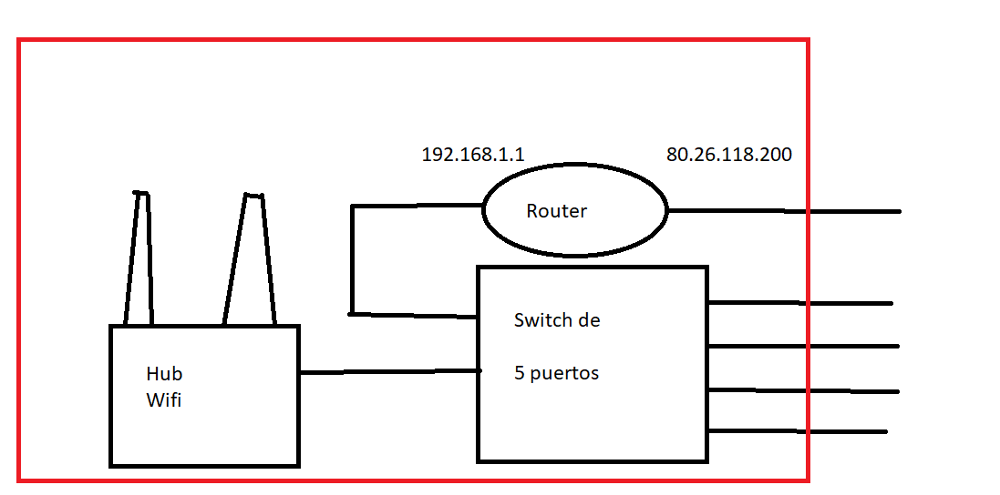

Los router domésticos a nivel interno no solamente tienen un sistema operativo sino también algunos parámetros configurables:

* IP y máscara. Por defecto, en muchos hogares es la 192.168.1.1 con máscara 255.255.255.0
* Rango de direcciones DHCP. DHCP se explicará en profundidad en segundo curso, en el módulo "Servicios de red".

Los routers en las LAN y en las WAN.
----------------------------------------------------------------------------

En las redes LAN el router toma decisiones sencillas. En líneas generales solo deciden "¿se envía este paquete al otro lado o no?".

En redes WAN, los routers tienen conexión con muchas otras redes. Al tener muchas redes, estos routers tienen que "intentar averiguar todas las conexiones y decidir cuales son los mejores caminos".

El proceso de NAT paso a paso
~~~~~~~~~~~~~~~~~~~~~~~~~~~~~~~~~

Paso 1: un usuario quiere iniciar una conexión y conectarse a un servidor en otro lugar remoto.

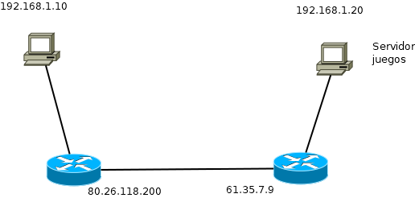

Paso 2: el usuario pide al servidor la IP pública de su router y usando su programa intenta conectarse a la IP pública del otro router y al puerto del juego o servicio. El puerto de origen se elige al azar.

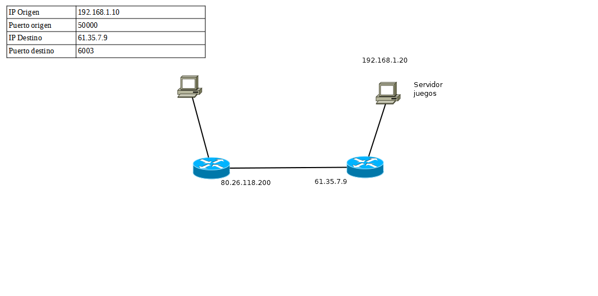

Paso 3: el paquete llega al router. El router observa que el paquete va al exterior. Como no se pueden usar IPs privadas en el exterior, el router **CAMBIA LA IP DE ORIGEN Y TOMA NOTA DE ESA TRADUCCIÓN POR SI EN EL FUTURO SE NECESITA ESA INFORMACIÓN**.

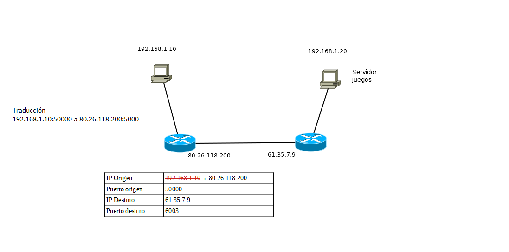

Paso 4: el paquete (con la IP de origen cambiada) viaja por la red y llega al router de destino. Como los router **por defecto no aceptan conexiones entrantes, en principio el paquete no entraría** Es necesario que primero el router derecho tenga *el puerto 6003 abierto.* Abrir un puerto consiste en poner una regla que indique que si llega una conexión entrante iniciada en el exterior se va a dejar pasar enviando el paquete a una cierta IP.

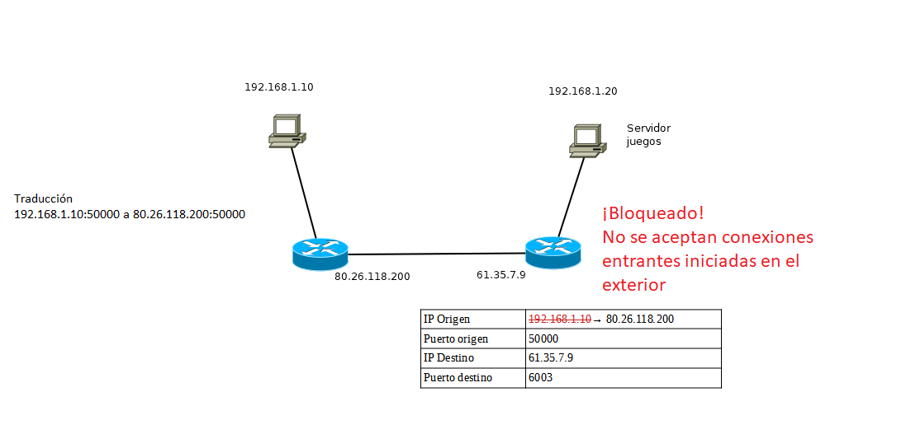

Paso 5: si hubiera la regla correcta, el paquete entrará pero con la IP de destino modificada.

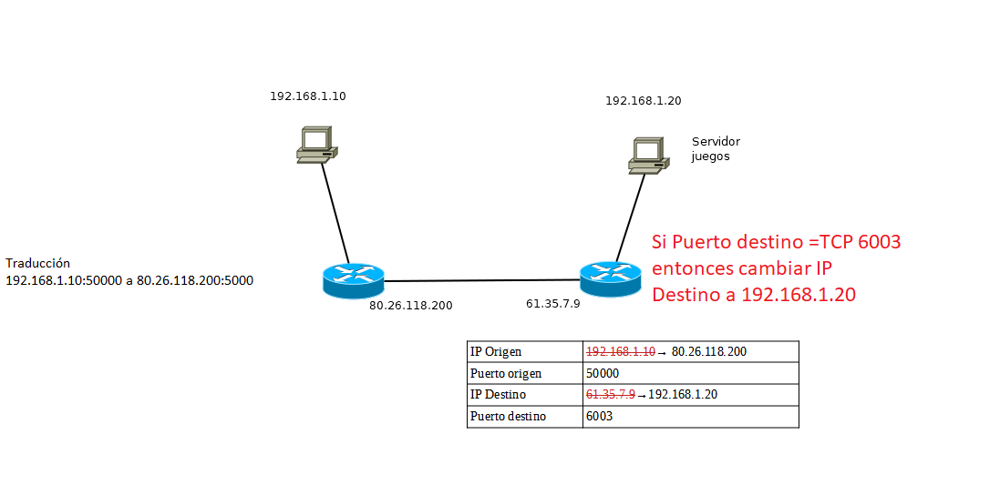

Paso 6: el paquete que intentaba iniciar la conexión **llega correctamente a su destino**.

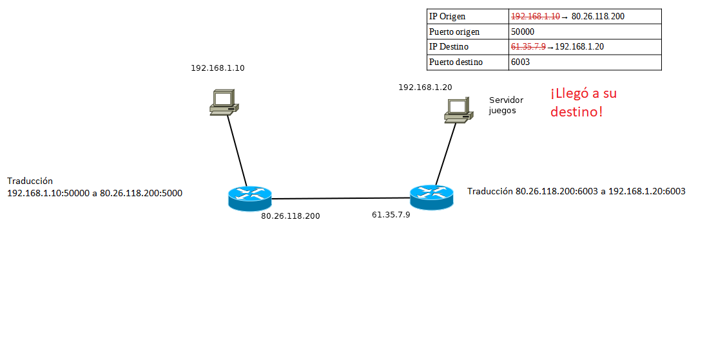

Paso 7: el servidor va a responder y genera un paquete de respuesta.

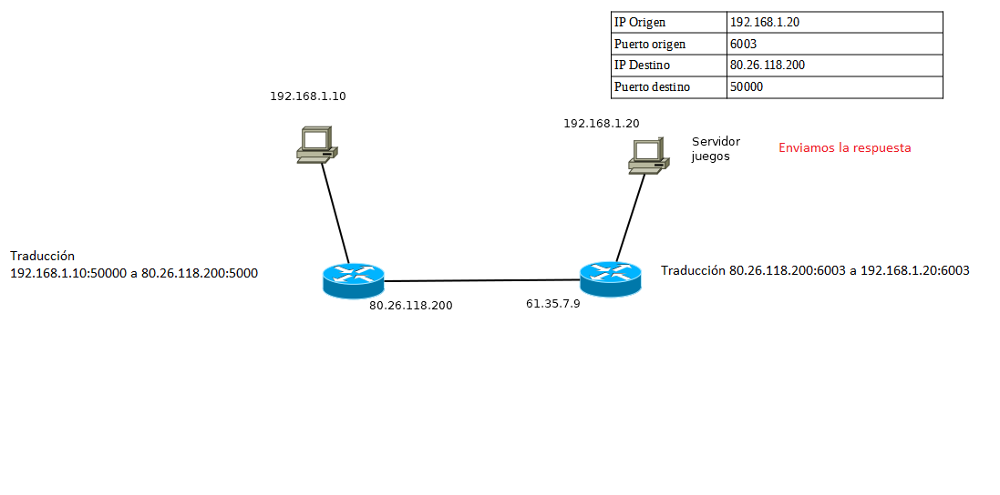

Paso 8: el paquete llega al router **que vuelve a modificar la IP de origen porque no se aceptan IPs privadas en Internet.** Por supuesto, el router vuelve a apuntar esa traducción.

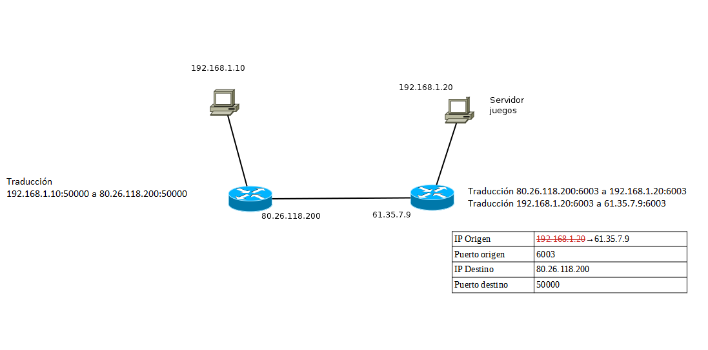

Paso 9: el paquete intenta entrar. Lo primero que podríamos pensar es que el paquete no entrará, sin embargo **SÍ VA A CONSEGUIR ENTRAR**

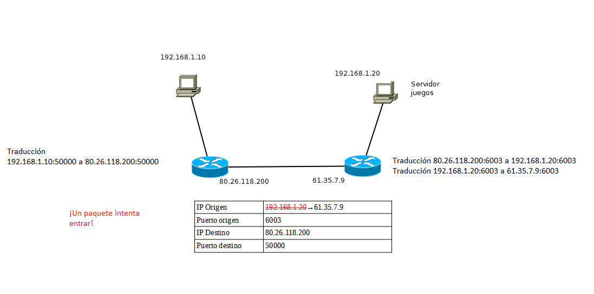

Paso 10: el router observa que el paquete **coincide perfectamente** con la información de una traducción que se hizo en el pasado. Es decir **el paquete puede pasar**. De nuevo, se vuelve a cambiar la IP de destino y el paquete se inyecta en la red izquierda.

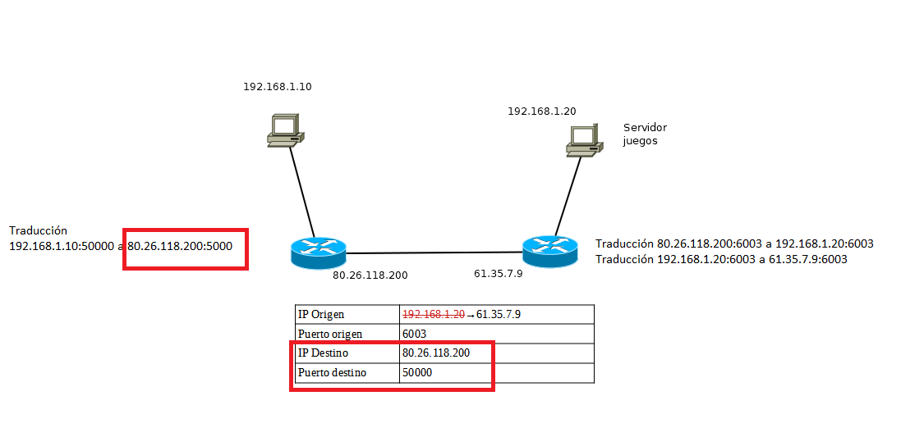

Paso 10b: se modifica la IP y se envía al interior.

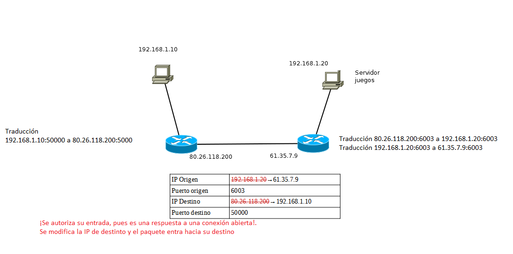

Paso 11: el paquete **llega a su destino**

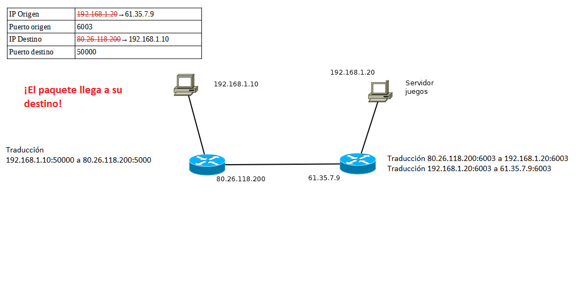

Formas de conexión al router para su configuración inicial.
----------------------------------------------------------------------------

Routers domésticos
~~~~~~~~~~~~~~~~~~~~

Los routers domésticos (también se encuentran en PYMES y pequeñas instituciones) se configuran mediante un interfaz web. Basta con abrir el navegador y conectarse a su IP de gestión, que en la mayoría de casos es la http://192.168.1.1

Routers de gama alta
~~~~~~~~~~~~~~~~~~~~~~

El proceso es el mismo que en los switches:

* Cable de consola.
* Conexión Telnet (insegura).
* Conexión SSH (segura pero requiere algunos pasos más).

Comandos para configuración del router.
----------------------------------------------------------------------------

Poner clave al modo administrador
~~~~~~~~~~~~~~~~~~~~~~~~~~~~~~~~~~

Para poner una clave::

    Router>enable
    Router#configure terminal
    Router(config)#enable secret admin1234
    Router(config)#exit
    Router#exit
    Router>enable
    Password:

Poner clave al acceso por telnet
~~~~~~~~~~~~~~~~~~~~~~~~~~~~~~~~~~~~~~
El proceso era::

    Router>enable
    Router#configure terminal
    Router(config)#line vty 0 4
    Router(config-line)#password telnet1234
    Router(config-line)#login

Poner clave al acceso por cable de consola
~~~~~~~~~~~~~~~~~~~~~~~~~~~~~~~~~~~~~~~~~~~~~~
El proceso era el siguiente::

    Router>enable
    Router#configure terminal
    Router(config)#line console 0
    Router(config-line)#password consola1234
    Router(config-line)#login

Quitar una clave o valor de configuración
~~~~~~~~~~~~~~~~~~~~~~~~~~~~~~~~~~~~~~~~~~~~~~~~~~~~~~
Supongamos que queremos quitar la clave del modo administrador. Lo único que se necesita es ir al modo correcto y escribir **no** y despues el comando que ejecutaba la operación. Por ejemplo, para quitar la clave ``admin1234`` que hemos puesto antes haríamos esto::

    Router>enable
    Password:****
    Router#configure terminal
    Router(config)#no enable secret 

Comandos para administración del router.
----------------------------------------------------------------------------

Poner una IP a una interfaz
~~~~~~~~~~~~~~~~~~~~~~~~~~~~~~~~~~
Para poner una IP se debe entrar en el interfaz correspondiente y luego usar el comando ``ip address <IP> <máscara>``. Por ejemplo, para poner la IP 192.168.1.1 con máscara 255.255.255.0 al interfaz ``GigabitEthernet 0/0`` hacemos esto::

    Router>enable
    Router#configure terminal
    Router(config)#interface GigabitEthernet 0/0
    Router(config-if)#ip address 192.168.1.1 255.255.255.0
    Router(config-if)#no shutdown

Configurar DHCP
~~~~~~~~~~~~~~~~~~~~~~~~

DHCP (Dynamic Host Configuration Protocol) es un protocolo que permite que los host de una red se configuren automáticamente. Solo se necesita definir una serie de parámetros en alguna máquina que hará de *servidor DHCP* y que escuchará peticiones. Cuando un ordenador se encienda y esté configurado en modo DHCP **difundirá una petición** y si esa petición la recibe el servidor le contestará indicando la IP, máscara y otros datos que puede usar.

Los parámetros que se necesitan son estos:

* Dirección IP y máscara. Absolutamente imprescindibles.
* Gateway (dirección del router que nos permite salir a otras redes).
* Otros parámetros, dirección de servidores DNS.

Los comandos son estos::

    Router>enable
    Router#configure terminal
    Router(config)#ip dhcp pool pool_contables
    Router(dhcp-config)#network 192.168.1.0 255.255.255.0
    Router(dhcp-config)#default-router 192.168.1.1
    Router(dhcp-config)#dns-server 8.8.8.8
    

Excluir direcciones de la asignación DHCP
~~~~~~~~~~~~~~~~~~~~~~~~~~~~~~~~~~~~~~~~~~~~~~~~
Una vez estemos en un DHCP, como teníamos antes, podemos *excluir direcciones.* Se puede excluir solo una o excluir un rango de direcciones::

    Router>enable
    Router#configure terminal
    Router(config)#ip dhcp pool pool_contables
    Router(dhcp-config)#network 192.168.1.0 255.255.255.0
    Router(dhcp-config)#exit
    Router(config)#ip dhcp excluded-address 192.168.1.1
    Router(config)#ip dhcp excluded-address 192.168.1.20 192.168.1.30

Activar NAT en un router
~~~~~~~~~~~~~~~~~~~~~~~~~~~~~~

En los router de gama alta, solo hay que identificar qué tarjeta va conectada a la red interna y qué tarjeta va a la red externa.

* La tarjeta interna debe recibir el comando ``ip nat inside``.
* La tarjeta externa el comando ``ip nat outside``.

Configuración del enrutamiento estático.
----------------------------------------------------------------------------

Se debe empezar por ir al modo de configuración globa. En líneas generales el comando tiene estas partes:

1. En primer lugar se escribe ``ip route``.
2. Despues se escribe **la dirección IP de red** de la red a la cual queremos que el router pueda enviar paquetas.
3. Despues se escribe **la máscara de dicha red**.
4. Después se escribe **la IP del siguiente router** al que vamos a enviar el paquete.

Así, para enseñarle a un router que si necesita enviar paquetes a la red 10.0.0.0/16 debe enviarlo al router con la IP 80.26.118.200 escribiremos ``ip router 10.0.0.0 255.255.0.0 80.26.118.200``

Definición y ubicación de listas de control de acceso (ACLs).
----------------------------------------------------------------------------

Ejercicio completo de configuración de routers
----------------------------------------------------------------------

Observa la figura siguiente. En ella hay tres router que interconectan tres redes. En ellas ocurre lo siguiente:

* Todas las redes usan direccionamiento con IPs privadas del tipo 192.168.1.0/255.255.255.0.
* Todos los equipos "PC"  se configuran mediante direccionamiento dinámico con DHCP en los respectivos router. Se desea que estos equipos adopten una IP al azar, que usen siempre como router por defecto a su router (que tendrá la IP 192.168.1.1) y que usen como servidor DNS a la IP 8.8.8.8.
* Todos los "Server" tienen la dirección 192.168.1.25/255.255.255.0. Su router y su DNS serán los mismos valores que en los PC pero en los "Server" todos los parámetros son estáticos, se deben configurar a mano.
* Todos los router tienen una tarjeta llamada "GigabitEthernet 0/0" que les conectan con las redes internas. Esta tarjeta **siempre** tiene la IP 192.168.1.1/255.255.255.0
* Todos los router tienen tarjetas "Serial" que les conecta con otros router. En concreto:

    * El router "Router0" tiene una tarjeta "Serial 0/3/0" que le conecta con una tarjeta "Serial 0/3/0" de "Router1".
    * El router "Router0" tiene una tarjeta "Serial 0/3/1" que le conecta con una tarjeta "Serial 0/3/0" de "Router2".
    * El router "Router1" tiene una tarjeta "Serial 0/3/1" que le conecta con una tarjeta "Serial 0/3/1" de "Router2"
    
* Los router están interconectados entre sí usando direcciones públicas. En concreto:

    * "Router0" y "Router1" están conectados por la red 1.0.0.0/8. "Router0" tendrá la 1.1.1.1 y "Router1" la 1.1.1.2
    * "Router0" y "Router2" están conectados por la red 2.0.0.0/8. "Router0" tendrá la 2.2.2.1 y "Router2" la 2.2.2.2
    * "Router1" y "Router2" están conectados por la red 3.0.0.0/8. "Router1" tendrá la 3.3.3.1 y "Router2" la 3.3.3.2
    
    
  En los siguientes párrafos se desglosa la solución.
  
  
  
Direccionamiento, DHCP y NAT interno
~~~~~~~~~~~~~~~~~~~~~~~~~~~~~~~~~~~~~~

Todos los routers están configurados exactamente igual::

	enable
	configure terminal
	ip dhcp pool pool_direcciones
	network 192.168.1.0 255.255.255.0
	default-router 192.168.1.1
	dns-server 8.8.8.8
	exit
	ip dhcp excluded-address 192.168.1.1
	ip dhcp excluded-address 192.168.1.10 192.168.1.20
	interface gigabitethernet 0/0 
	ip address 192.168.1.1 255.255.255.0
	ip nat inside
	no shutdown
	exit
	exit
	copy running-config startup-config

NAT Externo y direcciones públicas
~~~~~~~~~~~~~~~~~~~~~~~~~~~~~~~~~~~

Habrá que entrar en las distintas tarjetas y activar el NAT correcto. Para Router0 sería así::

	enable
	configure terminal
	interface serial 0/3/0
	ip address 1.1.1.1 255.0.0.0
	ip nat outside
	no shutdown
	interface serial 0/3/1
	ip address 2.2.2.1 255.0.0.0
	ip nat outside
	no shutdown
	
	
Para Router1 sería muy parecido::

	enable
	configure terminal
	interface serial 0/3/0
	ip address 1.1.1.2 255.0.0.0
	ip nat outside
	no shutdown
	interface serial 0/3/1
	ip address 3.3.3.1 255.0.0.0
	ip nat outside
	no shutdown
	
Y para Router2 también muy similar::

	enable
	configure terminal
	interface serial 0/3/0
	ip address 3.3.3.2 255.0.0.0
	ip nat outside
	no shutdown
	interface serial 0/3/1
	ip address 2.2.2.2 255.0.0.0
	ip nat outside
	no shutdown
	
