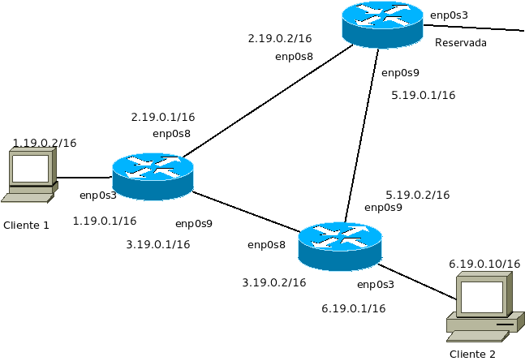

Instrucciones para el ordenador PC-19
=========================================

Junto con este documento se te ha dado una imagen con la topología de una red y una máquina virtual que puedes importar. Importa la máquina y haz 4 clones de manera que tengas en total 5 máquinas virtuales. Es muy recomendable que a cada máquina le pongas un nombre como vamos a ver a continuación. 

Obsérva la imagen con detenimiento porque vamos a construir una topologia de red con varios routers y con 
enrutamiento estático. 

Como puedes ver tenemos 6 máquinas:

* Un cliente llamado "Cliente 1".
* Un cliente llamado "Cliente 2".
* Tres router que llamaremos "Izquierda", "Arriba" y "Abajo".

Cliente 1 y Cliente 2 solo van a usar **una tarjeta de red en modo puente**, la ``enp0s3``. Sin embargo  los router van a tener **tres tarjetas de red en modo puente**. Si estás usando máquinas virtuales clonadas o importadas recuerda **reiniciar las MAC de todas las tarjetas.** A continuación se te indican las direcciones IP y las tarjetas en las que hay que asignarlas.

* Cliente 1: la tarjeta enp0s3 tiene la IP **1.19.101.10/16**
* Cliente 2: la tarjeta enp0s3 tiene la IP **6.19.101.10/16**
* Izquierda: la tarjeta enp0s3 tiene la IP **1.119.0.1/16**,la tarjeta enp0s8 tiene la IP **2.119.0.1/16**,la tarjeta enp0s9 tiene la IP **3.119.0.1/16**
* Arriba: la tarjeta enp0s3 tiene la IP **Reservada**,la tarjeta enp0s8 tiene la IP **2.119.0.2/16**,la tarjeta enp0s9 tiene la IP **5.119.0.1/16**
* Abajo: la tarjeta enp0s3 tiene la IP **6.119.0.1/16**,la tarjeta enp0s8 tiene la IP **3.119.0.2/16**,la tarjeta enp0s9 tiene la IP **5.119.0.2/16**

Ejercicio 1
--------------
Configurar las IP, máscaras, gateways y rutas en todas las máquinas de manera que Cliente1 pueda hacer ping a Cliente2 enviando los paquetes por abajo, es decir el camino directo.

Ejercicio 2
--------------
Modifica las rutas de manera que Cliente1 pueda hacer ping a Cliente2 enviando los paquetes por arriba, es decir el camino más largo.

Ejercicio 3
--------------
En el router de arriba hemos dejado una tarjeta sin usar. Intenta conectar con las redes de algún compañero. Para ello, tanto tu compañero como tú tendréis que hacer lo siguiente:

* Poneros de acuerdo en una red IP para ese segmento. Examinad vuestros números de puesto y usad la dirección de red 30.<numeromayor>.<numeromenor>.0/24. Es decir, si tenéis los números de puesto 7 y 24 deberíais usar la 30.24.7.0/24. 
* Pasáos el uno al otro las direcciones de red de vuestros respectivos "Cliente 1" y "Cliente 2"
* Poneros de acuerdo en qué IP usar cada uno en vuestro router de arriba.
* Reconfigura **todos tus router** para añadir en ellos rutas para llegar a las redes de los clientes de tu compañero.

Este ejercicio demuestra que la configuración estática de rutas solo es razonable para pequeñas redes y con pocos cambios. En el ejercicio siguiente verás como ahorrarte todo este trabajo.

Ejercicio 4
-------------
Reinicia todos los router, lo que borrará todas las rutas. En todos tus router tienes instalado un servicio que permite usar protocolos dinámicos de enrutamientos. Configúralos para que calculen todas las rutas automáticamente.

Solución al ejercicio 1
------------------------

Direccionamiento
~~~~~~~~~~~~~~~~~~~~~
Cliente 1 tendría un fichero de ``netplan`` como este::
	
	network:
	  version: 2 
	  ethernets: 
	    enp0s3:
	      addresses: [1.19.101.10/16]
	      gateway4:  1.119.0.1/16
	

Izquierda tendría un fichero de ``netplan`` como este::
	
	network:
	  version: 2 
	  ethernets: 
	    enp0s3:
	      addresses: [1.119.0.1/16]
	    enp0s8:
	      addresses: [2.119.0.1/16]
	    enp0s9:
	      addresses: [3.119.0.1/16]
	
	

Arriba tendría un fichero de ``netplan`` como este::
	
	network:
	  version: 2 
	  ethernets: 
	    enp0s8:
	      addresses: [2.119.0.2/16]
	    enp0s9:
	      addresses: [5.119.0.1/16]
	
	

Abajo tendría un fichero de ``netplan`` como este::
	
	network:
	  version: 2 
	  ethernets: 
	    enp0s3:
	      addresses: [6.119.0.1/16]
	    enp0s8:
	      addresses: [3.119.0.2/16]
	    enp0s9:
	      addresses: [5.119.0.2/16]
	
	

Una vez configuradas todas las direcciones IP repasalo todo ejecutando ``ip addr`` **en todas las máquinas** y comprueba que **todo el mundo puede hacer ping a su vecino inmediato**. Si no es así repasa las direcciones y tarjetas y si no ves el error llama al profesor.

Enrutamiento
~~~~~~~~~~~~~~~~~~~~~~~~~
Antes de empezar, en Linux se debe habilitar el enrutamiento.

1. Escribe ``sudo nano /etc/sysctl.conf``.
2. Busca una línea con el texto ``net.ipv4.ip_forward=1``.
3. Si tiene una almohadilla delante es porque esa línea está comentada y no está activada. Borra el símbolo #, **guarda los cambios** y despues ejecuta ``sudo sysctl -p`` que forzará la recarga del fichero y activará el enrutamiento.

En todos los router debemos recordar poner tanto las rutas de ida *como las rutas de vuelta*, así, los comandos a ejecutar serían algo como esto:

En Izquierda podemos ejecutar esto::

	sudo ip route add 6.19.101.0/16 via 3.119.0.2/16

En Abajo podemos ejecutar esto::

	sudo ip route add 1.19.101.0/16 via 3.119.0.1/16

Solución al ejercicio 2
------------------------

Direccionamiento
~~~~~~~~~~~~~~~~~~~~~
Los ficheros de ``netplan`` **NO CAMBIAN**

Enrutamiento
~~~~~~~~~~~~~~~~~~~~~~~~~
Si ya tienes el enrutamiento activa (ver más arriba) **no hace falta que vuelvas a hacerlo**.

En primer lugar **debemos borrar las rutas anteriores en los router Izquierda y Abajo**. Ademas, de nuevo en todos los router debemos recordar poner tanto las rutas de ida *como las rutas de vuelta*. 

En Izquierda podemos ejecutar esto::

	sudo ip route add 6.19.101.0/16 via 2.119.0.2/16

En Arriba podemos ejecutar esto::

	sudo ip route add 1.19.101.0/16 via 2.119.0.1/16
	sudo ip route add 6.19.101.0/16 via 5.119.0.2/16

En Abajo podemos ejecutar esto::

	sudo ip route add 1.19.101.0/16 via 5.119.0.1/16

Solución al ejercicio 3
-------------------------
No se da

Solución al ejercicio 4
------------------------
En todos los router tendrás que hacer esto:

1. Editar el fichero de configuracion ``/etc/frr/daemons``
2. Activar OSPF poniendo ``yes``  en lugar de ``no`` en esta línea ``ospfd=no``
3. Reiniciar el servicio con ``sudo service frr restart``
4. Arranca la configuración del router con ``sudo vtysh``
5. Introduce los comandos correspondientes a cada router.

Router izquierda::

	network 1.119.0.0/16 area 1
	network 2.119.0.0/16 area 1
	network 3.119.0.0/16 area 1

Router Arriba::

	network 2.119.0.0/16 area 1
	network 5.119.0.0/16 area 1

Router Abajo::

	network 6.119.0.0/16 area 1
	network 3.119.0.0/16 area 1
	network 5.119.0.0/16 area 1
