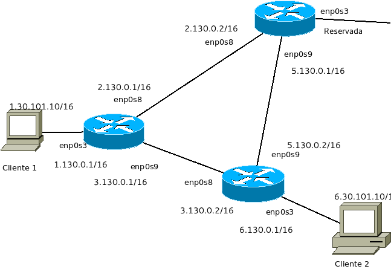

Instrucciones para el ordenador PC-30
=========================================

Junto con este documento se te ha dado una imagen con la topología de una red y una máquina virtual que puedes importar. Importa la máquina y haz 4 clones de manera que tengas en total 5 máquinas virtuales. Es muy recomendable que a cada máquina le pongas un nombre como vamos a ver a continuación. 

Obsérva la imagen con detenimiento porque vamos a construir una topologia de red con varios routers y con 
enrutamiento estático. 

Como puedes ver tenemos 6 máquinas:

* Un cliente llamado "Cliente 1".
* Un cliente llamado "Cliente 2".
* Tres router que llamaremos "Izquierda", "Arriba" y "Abajo".

Cliente 1 y Cliente 2 solo van a usar **una tarjeta de red en modo puente**, la ``enp0s3``. Sin embargo  los router van a tener **tres tarjetas de red en modo puente**. A continuación se te indican las direcciones IP y las tarjetas en las que hay que asignarlas.

* Cliente 1: la tarjeta enp0s3 tiene la IP **1.30.101.10/16**
* Cliente 2: la tarjeta enp0s3 tiene la IP **6.30.101.10/16**
* Izquierda: la tarjeta enp0s3 tiene la IP **1.130.0.1/16**,la tarjeta enp0s8 tiene la IP **2.130.0.1/16**,la tarjeta enp0s9 tiene la IP **3.130.0.1/16**
* Arriba: la tarjeta enp0s3 tiene la IP **Reservada**,la tarjeta enp0s8 tiene la IP **2.130.0.2/16**,la tarjeta enp0s9 tiene la IP **5.130.0.1/16**
* Abajo: la tarjeta enp0s3 tiene la IP **6.130.0.1/16**,la tarjeta enp0s8 tiene la IP **3.130.0.2/16**,la tarjeta enp0s9 tiene la IP **5.130.0.2/16**

Ejercicio 1
--------------
Configurar las IP, máscaras, gateways y rutas en todas las máquinas de manera que Cliente1 pueda hacer ping a Cliente2 enviando los paquetes por abajo, es decir el camino directo.

Ejercicio 2
--------------
Modifica las rutas de manera que Cliente1 pueda hacer ping a Cliente2 enviando los paquetes por arriba, es decir el camino más largo.

Ejercicio 3
--------------
En el router de arriba hemos dejado una tarjeta sin usar. Ponle la dirección 10.9.0.230/24 y reconfigura las rutas para que Cliente 1 pueda hacer ping al router del instituto (10.9.0.254).

Solución al ejercicio 1
------------------------

Direccionamiento
~~~~~~~~~~~~~~~~~~~~~
Cliente 1 tendría un fichero de ``netplan`` como este::
	
	network:
	  version: 2 
	  ethernets: 
	    enp0s3:
	      addresses: [1.30.101.10/16]
	      gateway4:  1.130.0.1/16
	

Izquierda tendría un fichero de ``netplan`` como este::
	
	network:
	  version: 2 
	  ethernets: 
	    enp0s3:
	      addresses: [1.130.0.1/16]
	    enp0s8:
	      addresses: [2.130.0.1/16]
	    enp0s9:
	      addresses: [3.130.0.1/16]
	
	

Arriba tendría un fichero de ``netplan`` como este::
	
	network:
	  version: 2 
	  ethernets: 
	    enp0s8:
	      addresses: [2.130.0.2/16]
	    enp0s9:
	      addresses: [5.130.0.1/16]
	
	

Abajo tendría un fichero de ``netplan`` como este::
	
	network:
	  version: 2 
	  ethernets: 
	    enp0s3:
	      addresses: [6.130.0.1/16]
	    enp0s8:
	      addresses: [3.130.0.2/16]
	    enp0s9:
	      addresses: [5.130.0.2/16]
	
	

Enrutamiento
~~~~~~~~~~~~~~~~~~~~~~~~~
Antes de empezar, en Linux se debe habilitar el enrutamiento.

1. Escribe ``sudo nano /etc/sysctl.conf``.
2. Busca una línea con el texto ``net.ipv4.ip_forward=1``.
3. Si tiene una almohadilla delante es porque esa línea está comentada y no está activada. Borra el símbolo #, **guarda los cambios** y despues ejecuta ``sudo sysctl -p`` que forzará la recarga del fichero y activará el enrutamiento.

En todos los router debemos recordar poner tanto las rutas de ida *como las rutas de vuelta*, así, los comandos a ejecutar serían algo como esto:

En Izquierda podemos ejecutar esto::

	sudo ip route add 6.30.101.0/16 via 3.130.0.2/16

En Abajo podemos ejecutar esto::

	sudo ip route add 1.30.101.0/16 via 3.130.0.1/16

Solución al ejercicio 2
------------------------

Direccionamiento
~~~~~~~~~~~~~~~~~~~~~
Los ficheros de ``netplan`` **NO CAMBIAN**

Enrutamiento
~~~~~~~~~~~~~~~~~~~~~~~~~
Si ya tienes el enrutamiento activa (ver más arriba) **no hace falta que vuelvas a hacerlo**.

En primer lugar **debemos borrar las rutas anteriores en los router Izquierda y Abajo**. Ademas, de nuevo en todos los router debemos recordar poner tanto las rutas de ida *como las rutas de vuelta*. 

En Izquierda podemos ejecutar esto::

	sudo ip route add 6.30.101.0/16 via 2.130.0.2/16

En Arriba podemos ejecutar esto::

	sudo ip route add 1.30.101.0/16 via 2.130.0.1/16
	sudo ip route add 6.30.101.0/16 via 5.130.0.2/16

En Abajo podemos ejecutar esto::

	sudo ip route add 1.30.101.0/16 via 5.130.0.1/16

Solución al ejercicio 3
-------------------------
No se da
