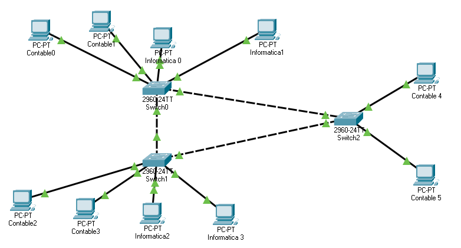
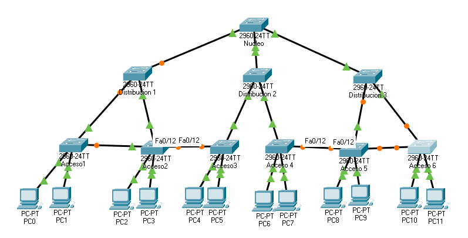
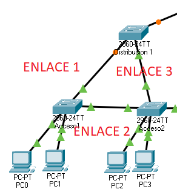
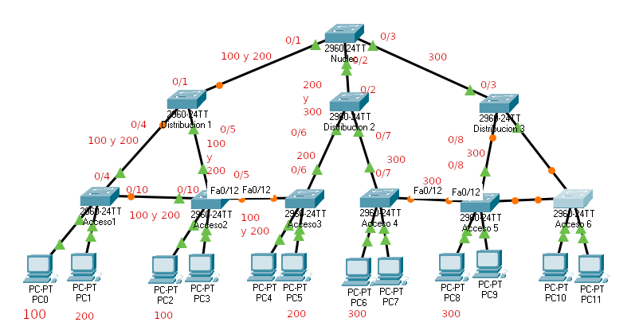
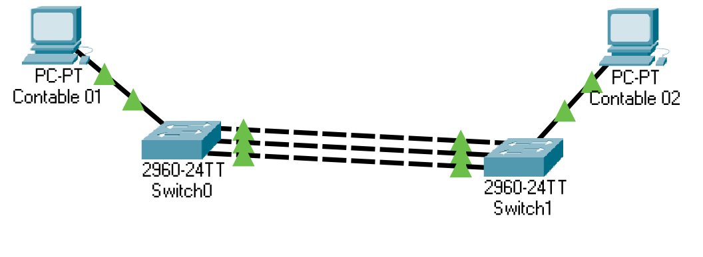
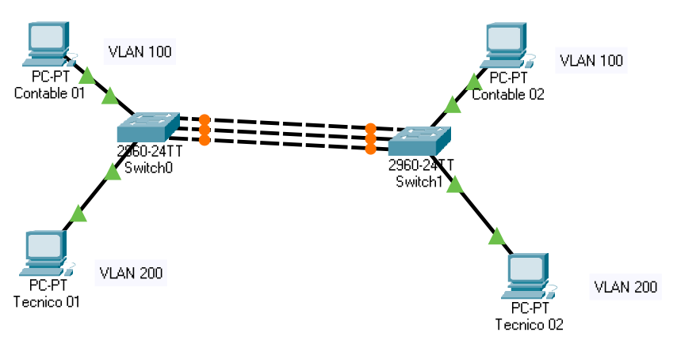
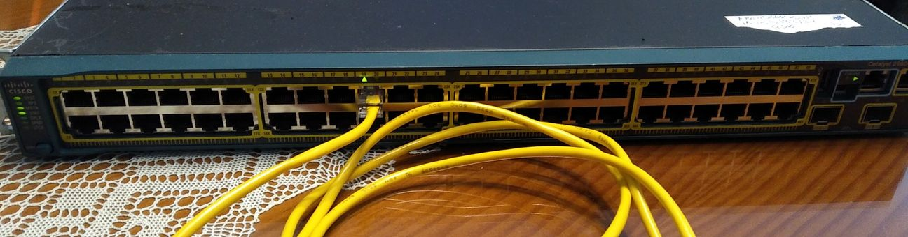

Tema 4: Configuración de redes virtuales VLAN
====================================================

Introducción
--------------------
Las VLAN intentan dar solución a un problema consistente en que a veces ordenadores de una misma sala no forman parte de la misma red.

Es decir, queremos una red virtual formada por ordenadores que están en sitios distintos. La solución a este problema son las VLANs (Virtual Local Area Network).

El diseño de redes locales a tres capas (núcleo, distribución y acceso).
----------------------------------------------------------------------------
En general, para diseñar redes grandes se utiliza una topología llamada de tres niveles. Cada nivel va a cumplir funciones distintas del anterior. Estos niveles son núcleo, distribución y acceso.

* Se llama "switches de acceso" a aquellos switches que dan servicio directo a terminales como PCs, impresoras o similares.

* Se llama "switches de distribución" a *switches que interconectan switches de acceso*.

* Se llama "switches de núcleo" a *switches que interconectan switches de distribución y que están más cerca del punto de salida (router)*

En la figura puede verse una organización típica con tres capas.

.. figure:: img/02-tres-capas.png

Implantación y configuración de redes virtuales.
----------------------------------------------------------------------------

Implantación
~~~~~~~~~~~~~~~~~~~~
En primer lugar es IMPRESCINDIBLE disponer de hardware que soporte VLANs y a ser posible usando el protocolo estándar 802.1q.

1) Se debe entrar en el switch y crear las distintas VLANs (con un número).

2) Se deben asignar puertos del switch a esas VLAN. Estos puertos se denominan "puertos de acceso". Es importante recordar que las VLAN están unidas a los puertos del switch. Si tiramos del cable y se conectar ese cable de ordenador a otro puertos, habremos sacado al ordenador de su VLAN.

3) A menudo las VLAN deben pasar por varios switches. Habrá puertos que transporten tráfico de varias VLANs. Estos puertos se denominan "troncos" o "puertos troncales". Se debe avisar al switch de los puertos que actuarán como troncales.

Configuración
~~~~~~~~~~~~~~~~~~~~~~~~
Al crear la arquitectura de redes es **fundamental** que los usuarios no tengan acceso al cableado del switch. Una vez se les asigne una VLAN, dicha VLAN quedará asociada a la interfaz del switch. Si alguien tira del cable del switch y lo conecta a otra interfaz *el usuario quedará fuera de la VLAN*.

Para configurar dispositivos Cisco se usan comandos como estos::

    #Permiten convertirse en 
    #administrador y pasar al modo
    #de configuración global.
    enable
    configure terminal 

Para poner una interfaz del switch en modo acceso solo tenemos que hacer cuatro cosas:

1. Entrar en la interfaz correcta (recuérdese que es **fundamental** tomar nota correcta de la interfaz a la que va conectado cada terminal)
2. Poner la interfaz en modo acceso.
3. Asignar una ID de VLAN a ese interfaz.
4. Activar la conexión. En realidad no tiene por qué ser necesario pero debe recordarse que podríamos tener dispositivos en los que las interfaces no se encienden por defecto.

Así, los comandos necesarios serían estos::

    #Entramos en la interfaz
    interface fastethernet 0/1
    #Activamos el modo acceso
    switchport mode access
    #Indicamos la VLAN
    switchport access vlan 10
    #Activamos la tarjeta.
    no shutdown 
    #Salimos de esta tarjeta
    exit 
    #Entramos en la siguiente 
    #y configuramos el resto de
    #interfaces...
    interface fastethernet .. 

Definición de enlaces troncales en los conmutadores y routers.
----------------------------------------------------------------------------

Para configurar el acceso troncal, el proceso es parecido.

1. Entrar en la tarjeta
2. Activar el modo "trunk".
3. Indicar las VLANs que se autorizan
4. Encender la tarjeta
5. Hacer lo mismo en los dos lados del cable.

Los comandos serían::

    #Para entrar en la tarjeta
    interface fastethernet 0/1
    #Activar el modo troncal
    switchport mode trunk
    #Autorizamos la 10 y la 20
    switchport trunk allowed vlan 10,20
    
    #Activamos la conexión 
    no shutdown

En algunos dispositivos se pueden configurar muchas interfaces a la vez, haciendo esto::

    interface fastethernet 0/1-12
    switchport mode access
    switchport access vlan 30
    no shutdown

.. WARNING:: 
   Al construir VLANs y enlaces troncales se debe tener cuidado al "copiar y pegar configuraciones" de unos switches a otros. Podría ocurrir que sin querer autorizásemos VLANs en enlaces troncales que no debían permitir ese paso.

Reflexión sobre ciclos en switches con VLANs
~~~~~~~~~~~~~~~~~~~~~~~~~~~~~~~~~~~~~~~~~~~~~~

Observa la figura siguiente

¿Por qué no se han deshabilitado puertos? En realidad sí se deshabilitan, pero cuando tenemos ciclos en switches que forman parte de VLANs puede ocurrir que **un puerto esté bloqueado dentro de una VLAN, pero esté activo dentro de otra VLAN distinta**. En realidad lo que ejecutan los switches modernos es PVST (Per-VLAN Spanning Tree)

    
Protocolos para la administración centralizada de redes virtuales; el protocolo VTP
----------------------------------------------------------------------------------------
En realidad **las VLAN no se crean "sobre la marcha" a medida que definimos los interfaces**. En redes grandes se establecen muy claramente dos cosas:

* El identificador de VLAN al que van a pertenecer un grupo de usuarios. 
* El *nombre de dicha VLAN*. Aunque los nombres no son estrictamente obligatorios **sí son muy recomendables**. En redes grandes pueden ser fundamentales para no perdernos en la asignación de interfaces a VLANs.

Este último punto es el que nos interesa. Para crear una VLAN y asociarle un nombre tenemos que dar estos pasos:

.. code-block: bash

    Switch1>enable
    Switch1#configure terminal
    Switch1(config)#vlan 10
    Switch1(config-vlan)#name Contabilidad
    Switch1(config-vlan)#exit
    Switch1(config)#vlan 20
    Switch1(config-vlan)#name Investigación
    Switch1(config-vlan)#exit
    

¿Qué ocurre si tenemos una red grande con varias decenas de VLANs? ¿Y si además de vez en cuando algunos nombres cambian o se crean otros nuevos? Evidentemente, conectarse a tantos switches tecleando una y otra vez los mismos comandos y/o cambiar los números o nombres correspondientes no solo es muy tedioso, sino propenso a errores. Para evitar esto tenemos un protocolo llamado VTP (VLAN Trunking Protocol) que nos va a facilitar la operativa.

Modos VTP
~~~~~~~~~

1. Servidor.
2. Cliente.
3. Transparente

Proceso básico
~~~~~~~~~~~~~~~
En el modo de configuración global tenemos que hacer esto:

1. Configurar dominio con el comando ``vtp domain acme.com``.
2. Configurar la clave con ``vtp password abcd1234``.
3. Configurar el modo con ``vtp mode client`` o ``vtp mode server``
4. Habilitar los interfaces troncales correspondientes.

Ejercicio completo con VLANs y VTP
--------------------------------------

Observa la red de la figura:

Las conexiones son las siguientes:

* Puerto 0/1 de Nucleo con puerto 0/1 de Distribucion1.
* Puerto 0/2 de Nucleo con puerto 0/2 de Distribucion2.
* Puerto 0/3 de Nucleo con puerto 0/1 de Distribucion3.
* Puerto 0/4 de Distribucion1 con puerto 0/4 de Acceso1.
* Puerto 0/5 de Distribucion1 con puerto 0/5 de Acceso2.
* Puerto 0/6 de Distribucion2 con puerto 0/6 de Acceso3.
* Puerto 0/7 de Distribucion2 con puerto 0/7 de Acceso4.
* Puerto 0/8 de Distribucion1 con puerto 0/8 de Acceso5.
* Puerto 0/9 de Distribucion1 con puerto 0/9 de Acceso6.
* PC 0 va conectado a puerto 0/1 de Acceso1.
* PC 1 va conectado a puerto 0/2 de Acceso1.
* PC 2 va conectado a puerto 0/1 de Acceso2.
* PC 3 va conectado a puerto 0/2 de Acceso2.
* PC 4 va conectado a puerto 0/1 de Acceso3.
* PC 5 va conectado a puerto 0/2 de Acceso3.
* PC 6 va conectado a puerto 0/1 de Acceso4.
* PC 7 va conectado a puerto 0/2 de Acceso4.
* PC 8 va conectado a puerto 0/1 de Acceso5.
* PC 9 va conectado a puerto 0/2 de Acceso5.
* PC 10 va conectado a puerto 0/1 de Acceso6.
* PC 11 va conectado a puerto 0/2 de Acceso6.
* Puerto 0/11 de Acceso1 va conectado a puerto 0/11 de Acceso2.
* Puerto 0/12 de Acceso2 va conectado a puerto 0/12 de Acceso3.
* Puerto 0/12 de Acceso1 va conectado a puerto 0/12 de Acceso5.
* Puerto 0/12 de Acceso5 va conectado a puerto 0/13 de Acceso6.

En esta red se desea lo siguiente:

1. Usando VTP se desea tener centralizada la información sobre VLANs en un único switch, en este caso el switch Nucleo. El dominio de la empresa es ``empresa.com`` y la clave que se va a usar es ``vtpadmin1234``.
2. La empresa va a tener estas VLANS con estos nombres: 10 (GESTIONVTP), 100 (USUARIOS), 200 (TECNICOS), 300 (GERENCIA)
3. El switch Acceso2 va a ser gestionado por sus propios técnicos y se desea que IGNORE por completo toda la información sobre VLANS.
4. Dentro de la VLAN USUARIOS están los ordenadores 0 y 2.
5. Dentro de la VLAN TECNICOS están los ordenadores 1, 5 y 9.
6. Dentro de la VLAN GERENCIA están los ordenadores 6 y 8.
7. La empresa dispone de la red 10.0.0.0/8 para configurar direcciones IP y se desea que la VLAN USUARIOS esté en la red 10.1.0.0/16, que la VLAN TECNICOS esté en la 10.2.0.0/16 y que la VLAN GERENCIA esté en la 10.3.0.0/16

Configurar las direcciones IP, máscaras, enlaces de acceso, enlaces troncales y modos VTP para conseguir que la conectividad funcione según los requisitos pedidos.

Solución
~~~~~~~~~~~~~

Empecemos por las direcciones IP.

* Las direcciones de USUARIOS deben ser algo como 10.1.xxx.xxx con máscara 255.255.0.0. Usaremos las IP 10.1.0.1 y la 10.1.0.2 para los dos ordenadores de esta VLAN.
* Para TECNICOS usaremos las IP 10.2.0.1 y 10.2.0.2. También llevarán la máscara 255.255.0.0
* Para GERENCIA usaremos las IP 10.3.0.1 y 10.3.0.2 con máscara 255.255.0.0

Una vez hecho esto, los distintos ordenadores se pueden hacer ping solo con los de su subred. En este punto cabe preguntarse **¿para qué queremos entonces las VLAN?**.

Recordemos que al formar VLANs los distintos grupos de ordenadores quedan *totalmente aislados*. Esto significa que 

* Los de la VLAN USUARIOS **no reciben las difusiones Ethernet de ninguna otra VLAN** con lo que el rendimiento mejora. Recordemos que hemos dividido un dominio de colisiones grande en varios dominios de colisión pequeños.
* La seguridad también mejora porque nadie puede recibir tramas ni mensajes IP de ningún otra VLAN. 

Con solo una cualquiera de estas ventajas ya tendríamos suficiente para justificar la implantación de las VLANs, pero el hecho de obtener las dos hace que esta tecnología sea mucho más interesante aún.

Analicemos ahora las VLANs y los enlaces. Empecemos por ver los equipos 0 y 2, que pertenecen a la VLAN 100 (USUARIOS). 

Los puertos de los PC van a ser de acceso y van a usar la VLAN 100, pero ¿qué puertos vamos a poner como troncales usando la VLAN 100?

1. Una posibilidad sería poner como troncal para la VLAN 100 los enlaces 1 y 3. Esto implicaría que todo el tráfico iría primero al switch de distribución y si el PC0 quisiese pasar algo al 2 no podría hacerlo directamente.
2. Podemos decidir poner troncal los enlaces 2 y 3. De esta manera no todo el tráfico va al switch de distribución. Lo malo es que esta solución hace que cuando el ordenador PC0 quiere salir siempre va a tener que dar un salto de más.
3. Podríamos decidir poner troncal los enlaces 1 y 2. Esto es simplemente lo mismo que el punto anterior pero desde otro punto de vista.

En realidad, debemos recordar que tenemos un gran aliado: el protocolo STP. Este protocolo resolverá automáticamente los ciclos por lo que en realidad la mejor solución sería **poner los tres enlaces 1,2 y 3 como troncales con la 10 y manipular la prioridad del switch Distribución1 para que tenga una prioridad mejor. Así, el switch Distribucion1 conseguirá ser elegido como raíz antes que los de acceso**. STP decidirá cerrar un enlace para la VLAN10 y volverá a activarlo si fuese necesario con lo que conseguimos una alta disponibilidad y además de manera automática.

Por tanto, haremos lo siguiente (de momento, la configuración necesitará más comandos más adelante):

1. En el switch Acceso1 el puerto 0/1 será de acceso para la VLAN 100. Los puertos 0/4 y 0/10 serán troncales para la VLAN 100.
2. En el switch Acceso2 el puerto 0/1 será de acceso para la VLAN 100.  Los puertos 0/5 y 0/10 serán troncales para la 100.
3. En el switch Distribucion1 los puertos 0/4, 0/5 y 0/1 serán troncales para la 100. Tengamos en cuenta que el 0/1 es el puerto que lleva hacia el switch de núcleo. Si no ponemos troncal con la 100 este puerto 0/1 los ordenadores *no serán capaces de salir al exterior.* Aunque en este ejemplo no lo hemos puesto para simplificar, el switch de núcleo va conectado a un router que nos dará conectividad con el exterior.

En la figura siguiente hemos creado un esquema que facilite el identificar que VLANs transitan por qué puertos.

Para VTP haremos esto en el switch Nucleo 1::

    enable
    configure terminal
    vtp domain empresa.com 
    vtp password vtpadmin1234
    vtp mode server
    vlan 100
    name USUARIOS
    vlan 200
    name TECNICOS
    vlan 300
    name GERENCIA
    vlan 10
    name GESTIONVTP

En todos los demás switches **excepto "Acceso 2"** pondremos esto::

    enable
    configure terminal
    vtp domain empresa.com 
    vtp password vtpadmin1234
    vtp mode client

En "Acceso 2"::

    enable
    configure terminal
    vtp domain empresa.com 
    vtp password vtpadmin1234
    vtp mode transparent

Y en todos los switches habilitaremos todos los enlaces troncales con la VLAN 10 si deseamos que reciban por ese interfaz las actualizaciones VTP

Switch Nucleo 1
~~~~~~~~~~~~~~~~~~~~~~~~~~~~~~~~~~~~~~~~~~~~~~~~~~~~~~~~~~~~~~~~~~~~~~~~~~~~~~~~

Los comandos serían::

    enable
    configure terminal
    interface fastethernet 0/1
    switchport mode trunk
    switchport trunk allowed vlan 100,200,10
    exit
    interface fastethernet 0/2
    switchport mode trunk
    switchport trunk allowed vlan 200,300,10
    exit
    interface fastethernet 0/3
    switchport mode trunk
    switchport trunk allowed vlan 300,10
    exit

Switch Distribución 1
~~~~~~~~~~~~~~~~~~~~~~~~~~~~~~~~~~~~~~~~~~~~~~~~~~~~~~~~~~~~~~~~~~~~~~~~~~~~~~~~

Los comandos serían::

    enable
    configure terminal
    interface fastethernet 0/1
    switchport mode trunk
    switchport trunk allowed vlan 100,200,10
    exit
    interface fastethernet 0/4
    switchport mode trunk
    switchport trunk allowed vlan 100,200,10
    exit
    interface fastethernet 0/5
    switchport mode trunk
    switchport trunk allowed vlan 100,200,10
    exit

Switch Distribución 2
~~~~~~~~~~~~~~~~~~~~~~~~~~~~~~~~~~~~~~~~~~~~~~~~~~~~~~~~~~~~~~~~~~~~~~~~~~~~~~~~

Los comandos serían::

    enable
    configure terminal
    interface fastethernet 0/2
    switchport mode trunk
    switchport trunk allowed vlan 200,300,10
    exit
    interface fastethernet 0/6
    switchport mode trunk
    switchport trunk allowed vlan 200,10
    exit
    interface fastethernet 0/7
    switchport mode trunk
    switchport trunk allowed vlan 300,10
    exit

Switch Distribución 3
~~~~~~~~~~~~~~~~~~~~~~~~~~~~~~~~~~~~~~~~~~~~~~~~~~~~~~~~~~~~~~~~~~~~~~~~~~~~~~~~

Los comandos serían::

    enable
    configure terminal
    interface fastethernet 0/3
    switchport mode trunk
    switchport trunk allowed vlan 300,10
    exit
    interface fastethernet 0/8
    switchport mode trunk
    switchport trunk allowed vlan 300,10
    exit
    
Switch Acceso 1
~~~~~~~~~~~~~~~~~~~~~~~~~~~~~~~~~~~~~~~~~~~~~~~~~~~~~~~~~~~~~~~~~~~~~~~~~~~~~~~~

Los comandos serían::

    enable
    configure terminal
    interface fastethernet 0/4
    switchport mode trunk
    switchport trunk allowed vlan 100,200,10
    exit
    interface fastethernet 0/10
    switchport mode trunk
    switchport trunk allowed vlan 100,200,10
    exit
    interface fastethernet 0/1
    switchport mode access
    switchport access vlan 100
    exit
    interface fastethernet 0/2
    switchport mode access
    switchport access vlan 202
    exit
    
Switch Acceso 2
~~~~~~~~~~~~~~~~~~~~~~~~~~~~~~~~~~~~~~~~~~~~~~~~~~~~~~~~~~~~~~~~~~~~~~~~~~~~~~~~

Los comandos serían::

    enable
    configure terminal
    interface fastethernet 0/5
    switchport mode trunk
    switchport trunk allowed vlan 100,200,10
    exit
    interface fastethernet 0/10
    switchport mode trunk
    switchport trunk allowed vlan 100,200,10
    exit
    interface fastethernet 0/12
    switchport mode trunk
    switchport trunk allowed vlan 100,200,10
    exit
    interface fastethernet 0/1
    switchport mode access
    switchport access vlan 100
    exit

Switch Acceso 3
~~~~~~~~~~~~~~~~~~~~~~~~~~~~~~~~~~~~~~~~~~~~~~~~~~~~~~~~~~~~~~~~~~~~~~~~~~~~~~~~

Los comandos serían::

    enable
    configure terminal
    interface fastethernet 0/6
    switchport mode trunk
    switchport trunk allowed vlan 200,10
    exit
    interface fastethernet 0/12
    switchport mode trunk
    switchport trunk allowed vlan 100,200,10
    exit
    interface fastethernet 0/2
    switchport mode access
    switchport access vlan 200
    exit

Switch Acceso 4
~~~~~~~~~~~~~~~~~~~~~~~~~~~~~~~~~~~~~~~~~~~~~~~~~~~~~~~~~~~~~~~~~~~~~~~~~~~~~~~~

Los comandos serían::

    enable
    configure terminal
    interface fastethernet 0/7
    switchport mode trunk
    switchport trunk allowed vlan 300,10
    exit
    interface fastethernet 0/12
    switchport mode trunk
    switchport trunk allowed vlan 300,10
    exit
    interface fastethernet 0/1
    switchport mode access
    switchport access vlan 300
    exit

Switch Acceso 5
~~~~~~~~~~~~~~~~~~~~~~~~~~~~~~~~~~~~~~~~~~~~~~~~~~~~~~~~~~~~~~~~~~~~~~~~~~~~~~~~

Los comandos serían (se deja un enlace sin configurar, intentar en casa)::

    enable
    configure terminal
    interface fastethernet 0/8
    switchport mode trunk
    switchport trunk allowed vlan 300,10
    exit
    interface fastethernet 0/12
    switchport mode trunk
    switchport trunk allowed vlan 300,10
    exit
    interface fastethernet 0/1
    switchport mode access
    switchport access vlan 300
    exit
    interface fastethernet 0/2
    switchport mode access
    switchport access vlan 200
    exit

Switch Acceso 6
~~~~~~~~~~~~~~~~~~~~~~~~~~~~~~~~~~~~~~~~~~~~~~~~~~~~~~~~~~~~~~~~~~~~~~~~~~~~~~~~

En este ejercicio concreto, no tiene ninguna función.

    
    
    
    
    

El protocolo IEEE802.1Q
----------------------------------------------------------------------------
Es el protocolo estándar para construir tramas de datos que viajan entre enlaces troncales. No nos hemos preguntado una cosa ¿como sabe un switch con un enlace troncal que un paquete es de una VLAN y/o que va a otra VLAN?

Recordemos la cabecera Ethernet
1. Primero tenemos la MAC de destino.
2. Tenemos la MAC de origen.
3. Despues la longitud de la trama.
4. Y otros campos....

Sin embargo los switches que usan VLANs **alteran** la trama añadiendo un *identificador de VLAN*. Esto es imprescindible para que los switches sepan qué hacer con la trama. A este nuevo formato de trama se le da el nombre IEEE 802.1Q. La nueva estructura es:

1. MAC de destino.
2. MAC de origen.
3. Identificador de VLAN
4. Longitud...

Se puede activar el uso de este protocolo en dispositivos Cisco con ``encapsulation dot1q``

Etherchannel
---------------

Es la capacidad que tienen los switches de gama alta de "agrupar" o "agregar" varios interfaces de manera que se comporten como si fuesen uno solo incluso **sumando el ancho de banda**.

Para crear lo que Etherchannel llama un "grupo", tenemos que entrar en los distintos interfaces y usar el comando ``channel-group <numero> mode active``. Esto debe hacerse en todos los interfaces de los dos lados de un enlace, es decir en los dos switches.

En la figura siguiente tenemos un ejemplo. El ordenador izquierdo está conectado al puerto 0/1 del Switch 0. El ordenador derecho está conectado al puerto 0/1 del Switch 1. Deseamos que los switches agreguen sus enlaces y ofrezcan un ancho de banda sumado. Así, si cada conexión es de 100 Mbits/s dispondremos de un ancho de banda de 300 Mbits/s

Configuremos los enlaces. En el switch 0 tendremos que activar las interfaces 2,3 y 4 como pertenecientes a un grupo. Todo grupo debe llevar un número y por ejemplo usaremos el 1. Evidentemente, todos los enlaces que estén en el mismo grupo deben llevar el mismo número de grupo.

Comandos para el switch 0::

    enable
    configure terminal
    interface fastethernet 0/2
    channel-group 1 mode active
    exit
    interface fastethernet 0/3
    channel-group 1 mode active
    exit
    interface fastethernet 0/4 
    channel-group 1 mode active
    exit

Como casualmente, los mismos interfaces del switch 1 forman parte del Etherchannel podemos enviar los mismos comandos al switch derechoñ

Etherchannel y VLANs
~~~~~~~~~~~~~~~~~~~~~~~~~
Etherchannel ofrece soporte a las VLANs de la misma manera que si fuese un enlace normal. Examinemos la figura de abajo

En el diagrama puede verse que los ordenadores de arriba pertenecen a la VLAN 100. Los de abajo a la 200. Cada máquina deber a los de su VLAN **y solo a los de su VLAN**. 

Para resolver esto debemos crear los interfaces de acceso correspondientes y luego configurar el Etherchannel para que que acepte tráfico solo de las VLAN 100 y 200. Para ello entraremos en los interfaces llamados ``port-channel <numero>``, los pondremos en modo troncal y añadiremos las VLAN pedidas. Los comandos para estas VLAN son iguales en ambos switches porque casualmente los interfaces coinciden. Así, los comandos serían estos::

    enable
    configure terminal
    interface fastethernet 0/1
    switchport mode access
    switchport access vlan 100
    exit
    interface fastethernet 0/5
    switchport mode access 
    switchport access vlan 200
    exit
    interface port-channel 1
    switchport mode trunk
    switchport trunk allowed vlan 100,200
    no shutdown
    exit

Copias de seguridad
------------------------

Todos los switches modernos tienen la capacidad de exportar su configuración a un servidor de ficheros TFTP (Trivial File Transfer Protocol). Para ello solo tenemos que ejecutar esto::

    Switch#copy running-config tftp:
    Address or name of remote host []? 10.3.0.1
    Destination filename [Switch-confg]? 

    Writing running-config...!!
    [OK - 1090 bytes]

    1090 bytes copied in 0.001 secs (1090000 bytes/sec)

Diagnóstico de incidencias en redes virtuales.
----------------------------------------------------------------------------

El diagnóstico de incidencias en VLAN implica una serie de acciones muy sencillas pero muy laboriosas:

1. Comprobar que nadie ha tirado de los cables y luego los ha enchufado a un puerto distinto del switch. Los cables deben estar etiquetados.
2. Si los nombres de las VLANs no llegan a todos los switches, es probable que un switch en modo VTP transparente se haya convertido en el único enlace de salida porque otro enlace se ha roto.
3. Otro motivo típico de errores en VTP es confundir la contraseña y/o cambiarla sin modificarla en todos los switches.
4. Cuando se montan enlaces redundantes, los errores más típicos son equivocarse de interface. Si nos equivocamos de interfaz habrá conexiones que pensamos que forman parte del Etherchannel y en realidad no lo hacen. Sin embargo, esto puede verse fácilmente porque probablemente ese diodo estará en naranja.
5. Si interconectamos dispositivos de distintas marcas/fabricantes, comprobar que usamos 802.1q.
6. Cuando hay tráfico que se mueven entre ciertas áreas de una VLAN ocurre que a menudo hemos escrito mal los números de VLAN en el comando ``switchport trunk allowed vlan <números de VLAN>``.

Anexo: primeros pasos con un switch Cisco
--------------------------------------------------------------------------------

En la imagen siguiente podemos ver el frontal de un switch Cisco Catalyst 2960-S.

   Frontal de un switch Cisco 

Estos dispositivos son muy parecidos a un ordenador normal. De hecho, al encenderlos ejecutan un proceso de autocomprobación bastante exhaustivo que dura aproximadamente 5 minutos. Como puede verse, no solo hay varios puertos sino también unos cuantos indicadores y un botón con el texto "MODE".

.. figure:: img/08-indicadores.jpg
   :scale: 50%
   :align: center
   :alt: Indicadores de un switch Cisco

   Indicadores de un switch Cisco

El botón MODE puede pulsarse de dos maneras: una pulsación corta y una larga. Cuando el switch está funcionando normalmente podemos hacer pulsaciones cortas sobre el botón MODE y veremos como el switch enciende uno de estos diodos:

* Diodo SYST. 

    * Si está en verde y no parpadea indica que está funcionando con normalidad.
    * Si está en ámbar indica que hay un error en la conexión a la corriente.

* Diodo RPS. Informa del estado del RPS (Redundant Power Supply, el SAI).

    * Si está en verde fijo, el RPS funciona con normalidad.
    * Si está apagado, no hay RPS.
    * Un verde parpadeante indica que hay RPS pero la corriente está siendo entregada a otro dispositivo.
    * Si está en ámbar, el RPS está en *standby*.

* Diodo STATUS. En este modo las luces de los puertos indican lo siguiente:

    * Si la luz de un puerto está en verde, el puerto está activo.
    * Si la luz de un puerto está en ambar, el puerto está desactivado (por un error, por decisión de STP...)

* Diodo DPLX. En este modo los puertos indican lo siguiente:

    * Los puertos con diodo verde están en modo DUPLEX (envían y reciben a la vez)
    * Los puertos apagados están en modo HALF-DUPLEX (solo hacen una operación en un cierto instante, enviar o recibir)

* Diodo MSTR. Cuando está en verde y el switch está en un rack indica que este switch es el "maestro" o principal.
* Diodo SPEED. En este modo, los diodos de los puertos indican lo siguiente (el significado y la velocidad exactas dependen del modelo):

    * Un diodo verde fijo indica que el puerto está operando a 100Mbits/s.
    * Un diodo verde parpadeante indica que el puerto opera a 1000Mbits/s.

Como entrar en un switch del que hemos perdido la contraseña
~~~~~~~~~~~~~~~~~~~~~~~~~~~~~~~~~~~~~~~~~~~~~~~~~~~~~~~~~~~~~~~~~~~~~~~~~~~~~~~~

Si se dispone de un cable de consola, se usa el procedimiento indicado anteriormente (usar un programa como HyperTerminal o Putty) y arrancar el dispositivo. En este modelo podemos hacer lo siguiente:

1. Dejar pulsado el botón MODE hasta que los diodos que hay encima del botón MODE parpadeen y luego se queden fijos. Esperar 5 minutos hasta que el switch se reinicie por completo y el diodo del puerto al que hayamos conectado nuestro ordenador esté en verde y funcionando normalmente. El switch **realmente tarda varios minutos** por lo que se debe tener paciencia.
2. Una vez se haya reiniciado podemos volver a dejar pulsado el botón MODE hasta que los diodos se queden fijos. El switch entrará en un modo especial de recuperación en el que ocurrirá lo siguiente:

    1. El switch activará un servidor DHCP. Debemos poner la tarjeta de red en modo DHCP (en Windows "Obtener una IP automáticamente"). El servidor DHCP tarda entre 15 segundos y un minuto por lo que de nuevo **se debe tener paciencia**
    2. El switch desactiva la contraseña de Telnet. Podremos hacer ``telnet 10.0.2.1`` y entrar al switch con normalidad.

En este switch al mostrar la configuración vemos esto (se han omitido algunos detalles por brevedad)::

    Switch#show running-config 
    Building configuration...

    Current configuration : 2952 bytes
    !
    ! Last configuration change at 00:11:52 UTC Mon Jan 2 2006
    !
    version 15.0
    no service pad
    service timestamps debug datetime msec
    service timestamps log datetime msec
    no service password-encryption
    !
    hostname Switch
    !
    boot-start-marker
    boot-end-marker
    !
    enable secret 5 $1$2mI5$.T/t2ci7yYylhyW/ym1Fy.
    !
    no aaa new-model
    switch 4 provision ws-c2960s-48td-l
    !
    ip dhcp pool 10.0.01.0
    network 10.0.1.0 255.255.255.0
    default-router 10.0.1.1 
    lease 0 0 10
    !
    ip dhcp pool 10.0.02.0
    network 10.0.2.0 255.255.255.0
    default-router 10.0.2.1 
    lease 0 0 10
    !         
    vlan internal allocation policy ascending
    !
    interface Loopback11000
    ip address 10.0.0.1 255.255.255.0 secondary
    ip address 10.0.0.3 255.255.255.0
    !
    interface FastEthernet0
    ip address 10.0.1.1 255.255.255.0 secondary
    ip address 10.0.1.3 255.255.255.0
    !
    interface Vlan1
    ip address 10.0.2.1 255.255.255.0 secondary
    ip address 10.0.2.3 255.255.255.0
    !
    ip http server
    ip http secure-server
    !
    !
    !
    !
    line con 0
    line vty 0 4
    privilege level 15
    no login 
    line vty 5 15
    privilege level 15
    no login
    !
    end

Como vemos, la VLAN 1 tiene una dirección IP que puede que no sea la que queramos. Vamos a cambiarla, por ejemplo a 10.15.0.192/24 y borrar la que tenía. Aprovecharemos y pondremos una contraseña al acceso telnet y al modo administrador (si estás usando los switch del centro, por favor usa la clave ``cisco``, todo en minúscula )::
    
    enable
    configure terminal
    enable secret cisco
    line vty 0 15
    password cisco
    login
    exit

    interface vlan 1
    ip address 10.15.0.192 255.255.255.0
    no ip address 10.0.2.1 255.255.255.0 secondary

Tan pronto como hagamos esto **perderemos la conexión con el switch**. Sin embargo no pasa nada. El switch tiene una IP de una red y nuestro equipo está en otra. Si cambiamos la IP de nuestro equipo podremos volver a conectar con él (por ejemplo pongamos la 10.15.0.200 y volvamos a hacer telnet)

Una vez que tengamos conexión con el switch podemos ejecutar ``copy running-config startup-config`` y tendremos restaurado el acceso básico por telnet al switch. 