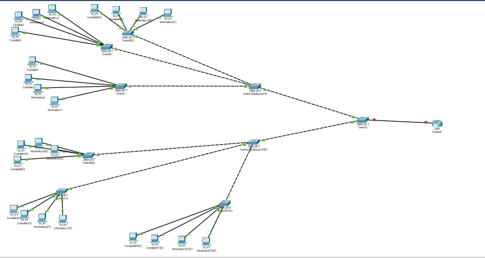

Tema 4: Configuración de redes virtuales VLAN
====================================================

Introducción
--------------------
Las VLAN intentan dar solución a un problema consistente en que a veces ordenadores de una misma sala no forman parte de la misma red.

Es decir, queremos una red virtual formada por ordenadores que están en sitios distintos. La solución a este problema son las VLANs (Virtual Local Area Network).

El diseño de redes locales a tres capas (núcleo, distribución y acceso).
----------------------------------------------------------------------------
En general, para diseñar redes grandes se utiliza una topología llamada de tres niveles. Cada nivel va a cumplir funciones distintas del anterior. Estos niveles son núcleo, distribución y acceso.

* Se llama "switches de acceso" a aquellos switches que dan servicio directo a terminales como PCs, impresoras o similares.

* Se llama "switches de distribución" a *switches que interconectan switches de acceso*.

* Se llama "switches de núcleo" a *switches que interconectan switches de distribución y que están más cerca del punto de salida (router)*

En la figura puede verse una organización típica con tres capas.

Implantación y configuración de redes virtuales.
----------------------------------------------------------------------------

Implantación
~~~~~~~~~~~~~~~~~~~~
En primer lugar es IMPRESCINDIBLE disponer de hardware que soporte VLANs y a ser posible usando el protocolo estándar 802.1q.

1) Se debe entrar en el switch y crear las distintas VLANs (con un número).

2) Se deben asignar puertos del switch a esas VLAN. Estos puertos se denominan "puertos de acceso". Es importante recordar que las VLAN están unidas a los puertos del switch. Si tiramos del cable y se conectar ese cable de ordenador a otro puertos, habremos sacado al ordenador de su VLAN.

3) A menudo las VLAN deben pasar por varios switches. Habrá puertos que transporten tráfico de varias VLANs. Estos puertos se denominan "troncos" o "puertos troncales". Se debe avisar al switch de los puertos que actuarán como troncales.

Configuración
~~~~~~~~~~~~~~~~~~~~~~~~
Al crear la arquitectura de redes es **fundamental** que los usuarios no tengan acceso al cableado del switch. Una vez se les asigne una VLAN, dicha VLAN quedará asociada a la interfaz del switch. Si alguien tira del cable del switch y lo conecta a otra interfaz *el usuario quedará fuera de la VLAN*.

Para configurar dispositivos Cisco se usan comandos como estos::

    #Permiten convertirse en 
    #administrador y pasar al modo
    #de configuración global.
    enable
    configure terminal 

Para poner una interfaz del switch en modo acceso solo tenemos que hacer cuatro cosas:

1. Entrar en la interfaz correcta (recuérdese que es **fundamental** tomar nota correcta de la interfaz a la que va conectado cada terminal)
2. Poner la interfaz en modo acceso.
3. Asignar una ID de VLAN a ese interfaz.
4. Activar la conexión. En realidad no tiene por qué ser necesario pero debe recordarse que podríamos tener dispositivos en los que las interfaces no se encienden por defecto.

Así, los comandos necesarios serían estos::

    #Entramos en la interfaz
    interface fastethernet 0/1
    #Activamos el modo acceso
    switchport mode access
    #Indicamos la VLAN
    switchport access vlan 10
    #Activamos la tarjeta.
    no shutdown 
    #Salimos de esta tarjeta
    exit 
    #Entramos en la siguiente 
    #y configuramos el resto de
    #interfaces...
    interface fastethernet .. 

Definición de enlaces troncales en los conmutadores y routers.
----------------------------------------------------------------------------

Para configurar el acceso troncal, el proceso es parecido.

1. Entrar en la tarjeta
2. Activar el modo "trunk".
3. Indicar las VLANs que se autorizan
4. Encender la tarjeta
5. Hacer lo mismo en los dos lados del cable.

Los comandos serían::

    #Para entrar en la tarjeta
    interface fastethernet 0/1
    #Activar el modo troncal
    switchport mode trunk
    #Autorizamos la 10 y la 20
    switchport trunk allowed vlan 10,20
    
    #Activamos la conexión 
    no shutdown

En algunos dispositivos se pueden configurar muchas interfaces a la vez, haciendo esto::

    interface fastethernet 0/1-12
    switchport mode access
    switchport access vlan 30
    no shutdown

.. WARNING:: 
   Al construir VLANs y enlaces troncales se debe tener cuidado al "copiar y pegar configuraciones" de unos switches a otros. Podría ocurrir que sin querer autorizásemos VLANs en enlaces troncales que no debían permitir ese paso.

Reflexión sobre ciclos en switches con VLANs
~~~~~~~~~~~~~~~~~~~~~~~~~~~~~~~~~~~~~~~~~~~~~~

Observa la figura siguiente

.. figure:: img/03-stp-ciclos.png

¿Por qué no se han deshabilitado puertos? En realidad sí se deshabilitan, pero cuando tenemos ciclos en switches que forman parte de VLANs puede ocurrir que **un puerto esté bloqueado dentro de una VLAN, pero esté activo dentro de otra VLAN distinta**. En realidad lo que ejecutan los switches modernos es PVST (Per-VLAN Spanning Tree)

    
Protocolos para la administración centralizada de redes virtuales; el protocolo VTP
----------------------------------------------------------------------------------------
En realidad **las VLAN no se crean "sobre la marcha" a medida que definimos los interfaces**. En redes grandes se establecen muy claramente dos cosas:

* El identificador de VLAN al que van a pertenecer un grupo de usuarios. 
* El *nombre de dicha VLAN*. Aunque los nombres no son estrictamente obligatorios **sí son muy recomendables**. En redes grandes pueden ser fundamentales para no perdernos en la asignación de interfaces a VLANs.

Este último punto es el que nos interesa. Para crear una VLAN y asociarle un nombre tenemos que dar estos pasos:

.. code-block: bash

    Switch1>enable
    Switch1#configure terminal
    Switch1(config)#vlan 10
    Switch1(config-vlan)#name Contabilidad
    Switch1(config-vlan)#exit
    Switch1(config)#vlan 20
    Switch1(config-vlan)#name Investigación
    Switch1(config-vlan)#exit
    

¿Qué ocurre si tenemos una red grande con varias decenas de VLANs? ¿Y si además de vez en cuando algunos nombres cambian o se crean otros nuevos? Evidentemente, conectarse a tantos switches tecleando una y otra vez los mismos comandos y/o cambiar los números o nombres correspondientes no solo es muy tedioso, sino propenso a errores. Para evitar esto tenemos un protocolo llamado VTP (VLAN Trunking Protocol) que nos va a facilitar la operativa.

Modos VTP
~~~~~~~~~

1. Servidor.
2. Cliente.
3. Transparente

Proceso básico
~~~~~~~~~~~~~~~
En el modo de configuración global tenemos que hacer esto:

1. Configurar dominio con el comando ``vtp domain acme.com``.
2. Configurar la clave con ``vtp password abcd1234``.
3. Configurar el modo con ``vtp mode client`` o ``vtp mode server``
4. Habilitar los interfaces troncales correspondientes.

El protocolo IEEE802.1Q
----------------------------------------------------------------------------

Diagnóstico de incidencias en redes virtuales.
----------------------------------------------------------------------------

