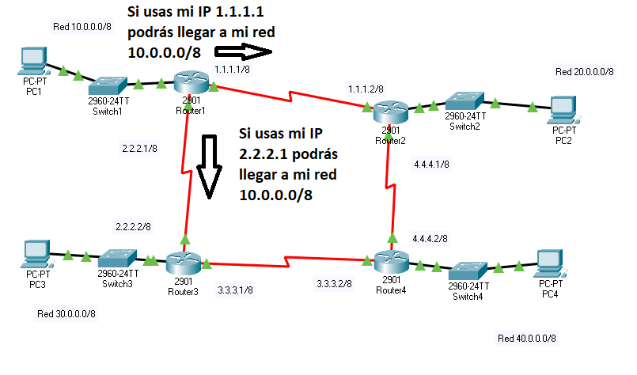
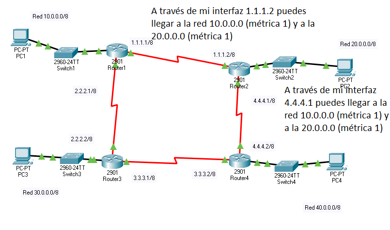
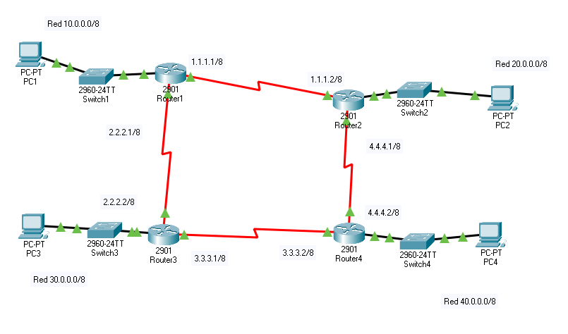

Tema 6:Configuración y administración de protocolos dinámicos
==============================================================

Protocolos enrutables y protocolos de enrutamiento.
----------------------------------------------------------------------------

En las redes hemos usado muy a menudo el concepto de protocolo:

* Por ejemplo IP establece que las direcciones tienen que tener un cierto formato, que tienen que tener una máscara y que no debe haber dos nodos con la misma IP (aparte de muchas otras reglas).
* Protocolos como HTTP dicen que para descargar un archivo se debe enviar la cadena ``GET /archivo.html``

En principio tendemos a pensar que un protocolo nos permite comunicar *con cualquier máquina* pero esto no es así: no todos los protocolos están pensados para comunicar con máquinas más alla de nuestro router. A estos protocolos se les llama **protocolos no enrutables**.

Un buen ejemplo de esto es el protocolo para carpetas compartidas en Windows o para descubrir otros equipos en la red (lo que usamos al "explorar la red de Windows").

Por supuesto, los protocolos de nivel de enlace (también llamado de capa 2 o L2) no son enrutados por los routers. De hecho, si lo fueran, el más minimo ``ping`` podría generar difusiones que alcanzarían a todo Internet (lo cual es un buen motivo para no enrutarlos).

En suma, cuando trabajamos con redes, especialmente con redes "Windows" debemos tener presente que en principio no podremos contactar con otras redes remotas Windows.

Funcionamiento de los protocolos de enrutamiento dinámico.
------------------------------------------------------------
Este punto no es estrictamente parte del temario. Sin embargo, se incluye para entender mejor como funcionan los procesos por los cuales un router puede "aprender" rutas a redes remotas.

En primer lugar, todos los router anuncian todo lo que saben. Normalmente, al principio solo conocen a las redes con las que tienen conexión directa. En la figura ponemos solo un router, pero esto ocurre con *la mayor parte* de procesos de enrutamiento dinámico (de hecho hay pequeños casos en los que un router configurado con enrutamiento dinámico no haría nada)

Esta información llega a los router "Router 2" y "Router 3", los cuales se apuntan la información en sus tablas de rutas. Ahora "Router 2" tiene esto

+----------+-----------+-----------------+---------+
| Red      | Máscara   | Siguiente salto | Métrica |
+==========+===========+=================+=========+
| 10.0.0.0 | 255.0.0.0 | 1.1.1.1         | 1       |
+----------+-----------+-----------------+---------+

Y "Router 3" tiene esto:

+----------+-----------+-----------------+---------+
| Red      | Máscara   | Siguiente salto | Métrica |
+==========+===========+=================+=========+
| 10.0.0.0 | 255.0.0.0 | 2.2.2.1         | 1       |
+----------+-----------+-----------------+---------+

Es evidente que en el primer paso, todos los router aprenderán como llegar a redes que estén **a un "salto" de distancia**. Pasado un cierto tiempo, todos los router vuelven a anunciar todo lo que saben. Fijémenos en lo que anuncia "Router 2"

Sin embargo, ahora "Router 1" recibe una información que no necesitaba:

.. figure:: img/dinamico-paso-03.png

Por el contrario "Router 4" recibe información nueva que no tenía, cosa de la que tomará nota en su tabla de rutas

.. figure:: img/dinamico-paso-04.png

De hecho, en solo dos pasos, la tabla de "Router 4" será más o menos así. En la tabla siguiente NO PONEMOS todas las rutas a todos los sitios, ya que algunas eran "peores". Recalcamos sin embargo, que ahora hay dos caminos para la 10.0.0.0:

+----------+-----------+-----------------+---------+--------------------+
| Red      | Máscara   | Siguiente salto | Métrica | Aprendida mediante |
+==========+===========+=================+=========+====================+
| 10.0.0.0 | 255.0.0.0 | 3.3.3.1         | 2       | Router3            |
+----------+-----------+-----------------+---------+--------------------+
| 10.0.0.0 | 255.0.0.0 | 4.4.4.1         | 2       | Router2            |
+----------+-----------+-----------------+---------+--------------------+
| 20.0.0.0 | 255.0.0.0 | 4.4.4.1         | 1       | Router2            |
+----------+-----------+-----------------+---------+--------------------+
| 30.0.0.0 | 255.0.0.0 | 3.3.3.1         | 1       | Router3            |
+----------+-----------+-----------------+---------+--------------------+

Protocolos de enrutamiento interior y exterior.
----------------------------------------------------------------------------

Concepto de sistema autónomo
~~~~~~~~~~~~~~~~~~~~~~~~~~~~~~~

El RFC 1930 define un sistema autónomo como:

.. pull-quote::
   An AS is a connected group of one or more IP prefixes run by one
   or more network operators which has a SINGLE and CLEARLY DEFINED
   routing policy.

Que más o menos sería:

.. pull-quote::
   Un sistema autónomo AS es un grupo de uno o más prefijos de red controlados
   por uno o más operadores de red que tiene una ÚNICA política de enrutamiento
   que además está CLARAMENTE DEFINIDA.

Una definición más simple sería "una empresa u organización que tiene un conjunto de redes".

Los sistemas autónomos suelen tener asignado un número por parte del IANA que se utiliza en muchas operaciones administrativas y que (lógicamente) se llama *número de sistema autónomo*. Estos números tienen 32 bits y se escriben como un solo número decimal, el cual puede ir de 0 a (2 a la 32)-1.

Protocolos de enrutamiento interno
~~~~~~~~~~~~~~~~~~~~~~~~~~~~~~~~~~~~~

Son protocolos dinámicos, es decir, que configuran automáticamente todas las rutas liberando al administrador del trabajo. Los protocolos de enrutamiento interno están pensados **para usarse dentro de un sistema autónomo**. Esto es así porque están pensados para entornos en los que conocemos toda la red, precisamente por ser nuestra red.

Estos protocolos suelen llamarse a veces IGPs (Interior Gateway Protocols)

Protocolos de enrutamiento externo
~~~~~~~~~~~~~~~~~~~~~~~~~~~~~~~~~~~~~
También son dinámicos pero están pensados para **interconectar nuestro AS con otros AS**.Estos protocolos suelen llamarse a veces EGPs (Exterior Gateway Protocols)

El enrutamiento sin clase.
----------------------------------------------------------------------------

Se llama enrutamiento sin clase o CIDR (Classless InterDomain Routing) al enrutamiento que no tiene en cuenta para nada si una dirección es de clase A, B o C. Durante todo este curso no le hemos dado ninguna importancia y de hecho hemos trabajado con máscaras como /18 o /23. Sin embargo, en el pasado las clases A,B o C tenían muchísima importancia, por lo que a veces en los temarios se resalta esta diferencia, pero esto es solo por motivos históricos. Los protocolos modernos de enrutamiento no tienen en cuenta para nada la clase de una IP y podemos tener direcciones como 10.65.128.0/28 (a esta forma de escribir la IP, la barra y los bits de la máscara se le denomina "notación CIDR").

La subdivisión de redes y el uso de máscaras de longitud variable (VLSM).
----------------------------------------------------------------------------
Este proceso de construcción de redes IP surgió por la necesidad de aprovechar al máximo las direcciones IP. Hoy en día se consideran algo a extinguir aunque en su momento fue una técnica utilizadísima para aprovechar al máximo las asignaciones.

Observemos la figura siguiente:

.. figure:: img/vlsm.png

Supongamos que queremos comprobar un bloque de direcciones IP y que además queremos hacer dos subredes separadas, tal y como indica la figura. Si además resulta que no hay muchas direcciones IP y queremos ahorrar resulta que ocurre lo siguiente (nótese que en el ejemplo todo está ajustadísimo):

* Supongamos que compramos el prefijo 161.1.1.0/24. Tenemos 8 bits de host y podemos direccionar 254 equipos.
* Dividimos en subredes y entonces a la izquierda tendremos 161.1.1.<01>xxxxxx/26 y la derecha 161.1.1<10>xxxxxx/26. Obsérvese que el último byte lo hemos puesto en binario y hemos asignado 01 a la subred izquierda y 10 a la subred derecha.
* Al hacer la división en la parte izquierda tenemos 6 bits que nos da para direccionar hasta 2 a la 6 (-2) o sea 62 equipos, que es más que suficiente.
* Al hacer la división ocurre que en la parte derecha también tenemos hasta 62 posibles equipos, sin embargo **nos sobran muchísimas direcciones**. Si necesitásemos más equipos no tendríamos mucho margen para meterlos en la subred izquierda y es posible que no nos interese ponerlos en la subred derecha. Conclusión: se desperdician direcciones en la zona derecha.

El protocolo RIPv2; comparación con RIPv1.
----------------------------------------------------------------------------
RIPv1 y RIPv2 se caracterizan por:

* Ambos son protocolos de enrutamiento interior.
* Se basan en un mecanismo llamado "vector distancia" que básicamente cuenta la cantidad de saltos para llegar a una ruta. 
* En los protocolos basados en vector distancia ocurre lo siguiente: si para ir a una red hay dos caminos y uno implica pasar por 3 router y otro camino implica pasar por 6 routers se asume que el segundo camino es peor por tener una "distancia" mayor. Sin embargo esto podría ser falso: imaginemos que el camino con métrica 3 está basado en líneas ADSL de 3Mb/s y el de métrica 6 pasa por fibras ópticas de 800Mb/s.

RIPv1 no soportaba subredes, lo que a día de hoy lo hace prácticamente inútil.  Además estaba pensado para usar clases A, B y C, y de hecho *no envía máscaras de red*.

Configuración y administración de RIPv1.
----------------------------------------------------------------------------
Debido al inminente final del curso, se ha decidido ignorar este punto para ahorrar tiempo y dedicarlo a puntos más actuales del temario.

Configuración y administración de RIPv2.
----------------------------------------------------------------------------
La operativa básica consiste en ejecutar dos cosas en cada uno de los router:

* El comando ``router rip``
* El comando ``network`` para cada una de las redes que el router va a anunciar a sus vecinos.

Observa la figura siguiente

Diagnóstico de incidencias en Ripv2.
----------------------------------------------------------------------------

Los protocolos de enrutamiento estado-enlace
----------------------------------------------------------------------------

Configuración y administración en OSPF.
----------------------------------------------------------------------------

Diagnóstico de incidencias en OSPF.
----------------------------------------------------------------------------

Configuración y administración de protocolos de enrutamiento propietarios.
----------------------------------------------------------------------------

